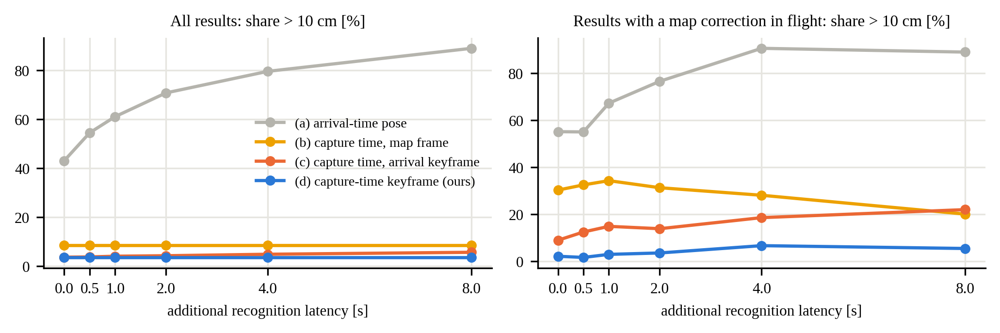
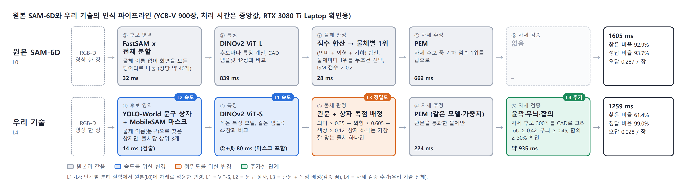

# 한장평가 YCB-V 900장

> 한 장 평가(YCB-V 900장·36장) — 기준 시스템 비교, 단계별 분해(L0→L4), 4090 확인 실행, 인식 방법 4가지, ViT-S 대 ViT-L, 개선안 3·군집 먼저 900장과 같은 물체끼리 ADD-S(16). 개별 문서 6개를 그대로 이어 붙인 묶음입니다(제목 단계만 한 칸 내림). 원문은 `개별문서/` 폴더에 있습니다. 생성 2026-10-08.

**이 묶음의 장**

- **04_비교실험_결과** — 비교 실험 결과 (2026-10-04)
- **06_단계별_분해실험** — 06. 단계별 분해 실험 — 원본 SAM-6D에서 우리 기술까지 한 번에 하나씩
- **09_4090_확인실행_261006** — 09. RTX 4090 확인 실행 — 노트북에서 못 끝낸 한 장 평가 (2026-10-06)
- **11_인식방법_비교표_261007** — 11. 객체 인식 방법 4가지 비교표 (YCB-V, 2026-10-07)
- **12_ViT-S_ViT-L_비교표_261007** — 12. 특징 모델 비교 — DINOv2 ViT-S 대 ViT-L, 인식 방법 4가지 (YCB-V, RTX 4090, 2026-10-07)
- **16_한장평가_개선안3_군집먼저_900장_261007** — 16. 한 장 평가 900장 — 원본 / 개선안 2 / 개선안 3 / 개선안 3 + 군집 먼저 / 배포, 같은 물체끼리 ADD-S (RTX 4090, 2026-10-07)

[TOC]


---

<a id="04_비교실험_결과"></a>

## 비교 실험 결과 (2026-10-04)

`01_추가실험_계획.md`와 비교표 논의에서 정한 실험을 순서대로 수행한 결과이다. 모든 수치는 이 PC와 Mac에서 실제로 실행한 결과이며, 재현 방법은 각 절 끝에 적었다.

| # | 실험 | 상태 |
|---|---|---|
| 1 | 기준 시스템: 한 장치 동기식, MaskFusion식 큐 | **완료** |
| 1+ | 지연 곡선 (등록 방식별, 결과 도착을 0~8초 추가 지연) | **완료** |
| 2 | YCB-Video 재현 (한 장 평가 + 실시간 재생 객체 지도) | **완료 (확인용, RTX 3080 Ti)**: 최종 수치는 RTX 5090에서 다시 측정 |
| 3 | 같은 GPU에서 처리 시간 재측정 | **완료** (원본 SAM-6D 대 제안 인식기; 다른 제로샷 방법은 미설치로 제외) |
| 4 | AprilTag 정답 주행 | **수행 불가**: 새 녹화와 측량이 필요 (사용자 작업) |

---

### 1. 기준 시스템 비교

#### 1.1 한 장치 대 두 장치 (같은 데이터, 같은 설정)

사무실 8자 주행(260915, 128초)을 세 구성으로 1배속 실시간 재생하였다. 한 장치 구성은 Mac용 SLAM 스트리머를 이 PC(i9-12900HK, RTX 3080 Ti Laptop)용으로 빌드해 SAM-6D와 같은 PC에서 돌렸다.

| 구성 | SLAM 위치 | 인식 | 처리 프레임 | 놓친 프레임 | 추적 시간 (평균) | 키프레임 | 최대 지도 보정 | 궤적 ATE* |
|---|---|---|---|---|---|---|---|---|
| **두 장치 (제안)** | Mac M4 Pro | PC GPU | 3844 / 3844 | **0** | 12.5 ms | 130 | 11.3 cm | 0.55 cm |
| 한 장치 (MaskFusion·Fusion++식) | PC | PC GPU (동시) | 2817 / 3844 | **1027 (26.7%)** | 28.9 ms | 116 | 18.0 cm | 0.56 cm |
| 대조: 한 장치에서 SLAM만 | PC | 없음 | 3837 / 3844 | 7 | 21.7 ms | 122 | 13.1 cm | 0.56 cm |

\* 기준 궤적: 같은 녹화를 Mac에서 오프라인으로 전 프레임 처리한 최종 궤적. 실시간 실행의 각 자세를 최종 키프레임 기준으로 보정한 뒤 SE(3) 정렬하여 RMSE를 구하였다.

| 구성 | 인식 처리 장수 | 등록된 결과 | 결과 도착 지연 (중앙) | 확정 물체 | 결과 대기 중 보정이 끼어든 결과 | 흩어짐 중앙 / 10 cm 초과 (지도 좌표 저장 b) | 같은 지표 (키프레임 고정 d) | 보정 끼어든 결과의 10 cm 초과 (b → d) |
|---|---|---|---|---|---|---|---|---|
| 두 장치 | 258 | 182 | 1.57 s | 8 (+후보 2) | 7 | 2.46 cm / 13.7% | 1.58 cm / 6.6% | 57.1% → 14.3% |
| 한 장치 | 241 | 158 | 1.93 s | 8 | 23 | 2.70 cm / 15.8% | 1.76 cm / 5.7% | 43.5% → 0.0% |

**해석**
- 인식과 같은 장치에서 돌리면 SLAM이 입력 프레임의 26.7%를 놓친다. 같은 PC에서 SLAM만 돌리면 0.2%이므로, 원인은 인식기와의 자원 경쟁이다.
- 이 녹화(밝은 사무실, 짧은 경로)에서는 프레임을 놓쳐도 최종 궤적 정확도(ATE)는 같았다. 대신 루프 보정이 더 커지고(18.0 대 11.3 cm), 인식 지연이 늘고(1.93 대 1.57 s), 결과를 기다리는 동안 보정이 끼어드는 경우가 3배로 늘었다(23 대 7건).
- 그래서 한 장치 구성에서는 키프레임 고정이 더 중요해진다. 지도 좌표에 저장하면 보정이 끼어든 결과의 43.5%가 10 cm 넘게 어긋나지만, 키프레임에 고정하면 0%였다.
- 논문에서는 "궤적 정확도가 나빠진다"고 주장하지 말고 **프레임 누락과 보정 증가**를 근거로 써야 한다. 이 데이터에서 ATE 차이는 없었다.

#### 1.2 MaskFusion식 큐 (SLAM을 인식 지연만큼 늦춰 맞추는 방식)

MaskFusion은 프레임을 큐(12장, 약 0.4초)에 넣어 SLAM을 인식 결과만큼 늦춘다. 이렇게 하면 결과를 기다리는 동안의 보정은 없어지지만, 물체는 지도 좌표에 저장되므로 이후 보정은 따라가지 못한다(방식 b와 같다). 실시간 실행 기록 73회(결과 10874건, 도착 지연 중앙 1.42초, 90% 1.91초, 최대 10.24초)에서, 큐 길이마다 큐 안에 들어오는 결과의 비율과 그 결과의 일관성을 계산하였다.

| 큐 길이 (SLAM 출력 지연) | 큐 안에 드는 결과 | 흩어짐 중앙 / 90% / 10 cm 초과 (큐 + 지도 좌표, MaskFusion식) | 같은 결과에 키프레임 고정 (제안) |
|---|---|---|---|
| 0.40 s (MaskFusion 원래 설정, 12프레임) | **0%** | — | — |
| 1.42 s (지연 중앙값, 43프레임) | 50.0% | 2.94 / 9.28 cm / 8.3% | 1.89 / 6.10 cm / 4.6% |
| 1.91 s (90%, 57프레임) | 90.0% | 2.98 / 9.42 cm / 8.5% | 1.58 / 5.22 cm / 3.2% |
| 2.22 s (99%, 67프레임) | 99.0% | 3.04 / 9.50 cm / 8.6% | 1.56 / 5.13 cm / 3.1% |
| 10.24 s (최대, 307프레임) | 100% | 3.05 / 9.52 cm / 8.7% | 1.55 / 5.11 cm / 3.1% |

**해석**
- 제로샷 인식기의 지연(1~2초)에서는 MaskFusion의 0.4초 큐에 들어오는 결과가 하나도 없다.
- 결과를 모두 받으려면 SLAM 출력을 10초 넘게 늦춰야 하므로, 로봇이 쓰는 실시간 자세가 그만큼 늦어진다.
- 큐를 충분히 길게 해도 물체를 지도 좌표에 저장하는 한 10 cm 초과 비율은 8.3~8.7%로, 키프레임 고정(3.1~4.6%)의 약 2.7배이다. 이후 루프 보정을 따라가지 못하기 때문이다.

#### 1.3 지연 곡선 (결과 도착을 인위적으로 늦춤)

루프 보정이 있는 실행 46회(큰 8자 40회, 어두운 실내 8자 6회; 결과 7509건)를 다시 재생하면서 모든 결과의 도착을 0, 0.5, 1, 2, 4, 8초 더 늦추고 네 등록 방식을 비교하였다.



| 추가 지연 | 보정 끼어든 결과 | (a) 도착 시각 자세 | (b) 촬영 시각, 지도 좌표 | (c) 촬영 시각, 도착 시각 키프레임 | (d) 촬영 시각 키프레임 (제안) |
|---|---|---|---|---|---|
| 0 s | 89 | 43.1% / 55.1% | 8.6% / 30.3% | 3.7% / 9.0% | **3.6% / 2.2%** |
| 0.5 s | 120 | 54.5% / 55.0% | 8.6% / 32.5% | 3.8% / 12.5% | **3.6% / 1.7%** |
| 1 s | 134 | 61.1% / 67.2% | 8.6% / 34.3% | 4.1% / 14.9% | **3.6% / 3.0%** |
| 2 s | 166 | 70.8% / 76.5% | 8.6% / 31.3% | 4.3% / 13.9% | **3.6% / 3.6%** |
| 4 s | 253 | 79.6% / 90.5% | 8.6% / 28.1% | 4.9% / 18.6% | **3.6% / 6.7%** |
| 8 s | 487 | 89.0% / 88.9% | 8.6% / 20.1% | 5.7% / 22.0% | **3.6% / 5.5%** |

각 칸: 전체 결과 중 10 cm 초과 비율 / 결과 대기 중 보정이 끼어든 결과 중 10 cm 초과 비율.

**해석**
- 지연이 길수록 보정이 끼어드는 결과가 늘어난다(89 → 487건).
- 받은 시점의 키프레임에 붙이는 방식(c, DSP-SLAM++처럼 결과를 받은 시점 기준)은 지연이 늘수록 나빠진다. 보정이 끼어든 결과에서 9.0%가 22.0%로 늘었다.
- 제안 방식(d)은 전체 비율이 지연과 무관하게 3.6%로 같고, 보정이 끼어든 결과에서도 1.7~6.7%에 머문다.
- (a)는 지연이 곧 오차가 되어 1초만 늦어도 61%가 10 cm를 넘는다.

#### 재현

```bash
# 한 장치 실행 (Linux용 SLAM 빌드: objpose/pc_slam/CMakeLists.txt → ~/objpose_pc)
bash objpose/pc/run_single_device.sh live_260915_eightcircle_single
bash objpose/pc/run_single_device.sh live_260915_eightcircle_pcslam_only --no-sam6d
# 등록 방식 비교, 지연 곡선: objpose/pc/anchor_ablation.py (run_one(run, extra_delay_s))
```

실행 결과: `objpose/output/live_260915_eightcircle_{orbslam3,single,pcslam_only}`.

---

### 2. YCB-Video 재현 (확인용, RTX 3080 Ti Laptop)

원래 YCB 실험은 RTX 5090 장비에서 했고 그 장비가 지금 없어, 이 PC에서 처음부터 다시 구성하여 파이프라인과 경향을 확인하였다. **논문 최종 수치는 RTX 5090에서 같은 스크립트로 다시 낸다.**

준비: BOP 공식 YCB-V(모델, 평가 목록 900장, 테스트 영상 12개 20,738장)를 내려받고, 물체 21종의 42방향 템플릿을 BlenderProc으로 렌더링하여 특징·색 분포·자세 추정 자산을 만들었다. 텍스트 프롬프트는 발표자료와 같고, 수렴 기준은 0.3이다. 스크립트: `src/ycbv/`(한 장 평가), `src/ycbv_live/`(실시간 재생). 다른 장비에서 다시 돌리는 방법은 `src/ycbv/README.md`.

#### 2.1 한 장 평가 (BOP 평가 목록 900장, SLAM 없음)

| 방식 | 찾은 비율 | 맞는 답 | 장당 틀린 답 | ADD-S AUC | BOP AR | 장당 시간 (중앙) | 이전 (RTX 5090) AR |
|---|---|---|---|---|---|---|---|
| 원본 SAM-6D | 92.9% | 93.7% | 0.287 | 92.4 | **84.1** | 1573 ms | 78.7 |
| 제안 (텍스트) | 61.4% | 99.0% | 0.028 | 60.3 | **56.2** | 1235 ms | 57.8 |
| 제안 (정답 상자, 배정 다시 고름) | 64.1% | 99.1% | 0.028 | 62.9 | 59.1 | 1240 ms | — |
| 제안 (정답 상자, 배정 고정) | 78.0% | 100.0% | 0.000 | 76.4 | **71.1** | 1575 ms | 74.5 |

- **경향은 재현됨:** 제안 방식은 맞는 답 99~100%, 틀린 답이 원본의 약 1/10이다. 텍스트 검출기가 물체를 놓쳐 찾은 비율과 AR은 원본보다 낮다(이전과 같은 결론).
- **원본 SAM-6D는 이전보다 높다:** 84.1(이전 78.7). SAM-6D 논문 값(83.4)과 비슷하다.
- **정답 상자 결과의 차이 원인:** 정답 상자를 넣어도 인식기가 "상자가 어느 물체인지"를 다시 고르는 단계(배타 배정)가 남아, 정답 상자 4123개 중 937개가 다른 물체로 배정되었다. 상자를 그 물체에 고정하면 78.0% / AR 71.1로 이전(80.9% / 74.5)과 가깝다. 이전 실험도 고정 방식이었던 것으로 보이며, 논문에는 "정답 상자, 배정 고정"을 쓴다.
- **물체별 찾은 비율 (제안 텍스트 / 원본):** 푸딩 상자 0/72, 마커 0/100, 그릇 4/99, 나무 블록 7/97, 큰 집게 11/65처럼 텍스트 검출기가 거의 못 찾는 물체가 있다. 머스터드 100/100, 젤라틴 100/100, 머그 99/97은 잘 찾는다.

#### 2.2 실시간 재생 → 최종 객체 지도 (테스트 영상 12개, 20,738장, 30 fps)

SLAM(이 PC용 ORB-SLAM3 빌드)과 제안 인식기(텍스트 프롬프트, 21종 전부 대상)를 **한 PC에서 함께** 1배속으로 돌리고, 공간 객체 상태 지도의 최종 결과를 BOP 정답과 비교하였다. SLAM 지도 원점은 SLAM이 처음 추적한 프레임(9번)의 카메라이다.

| 지표 | 이번 (RTX 3080 Ti, 한 PC) | 이전 (RTX 5090) |
|---|---|---|
| 인식 처리 프레임 | 471 / 20,738 (2.3%) | — |
| 결과 도착 지연 (영상별 중앙값) | 1.0~2.1 s | — |
| SLAM 놓친 프레임 | 12~23% (영상별) | — |
| 화면 일치율 | 60.3% | 74.1% |
| 잘못 그린 상자 / 프레임 | 0.799 | 0.001 |
| 지도 등록 / 정답 물체 | 42 / 55 | 42 / 55 |
| 같은 물체 중복 | **0** | 0 |
| 위치 오차 중앙 / 90% / 최대 | 8.8 / 17.9 / 543 mm | 5.4 / 9.3 / 76.6 mm |
| 지도 ADD-S AUC (0–10 cm) | **68.6** | (없음) |

- **같은 결과:** 등록 물체 수(42/55)와 중복 0건은 이전과 같다.
- **나빠진 점과 원인:**
  - 이 PC에서는 인식이 영상당 25~62장(약 1 Hz)만 처리하고, SLAM과 같은 GPU 노트북을 나눠 써 SLAM도 프레임을 12~23% 놓쳤다. 위치 오차가 커진 주원인으로 보인다.
  - **장면에 없는 물체가 지도에 12건 등록되었다**(예: 토마토 수프 캔이 6개 장면에서). 실시간 재생은 21종을 모두 찾게 했고 한 장 평가는 그 장면의 물체만 찾게 한다. 이렇게 한 번 잘못 등록된 물체가 매 프레임 그려져 "잘못 그린 상자/프레임"이 0.8로 커졌다. 위치 오차 최대 543 mm도 잘못 연결된 물체 하나에서 나왔다.
- **확인 필요:** 이전 RTX 5090 실험이 21종 전체를 찾게 했는지, 장면 물체만 찾게 했는지 기록이 없다. 장면 물체만 찾게 하면 잘못 그린 상자가 크게 줄 것으로 예상된다. 5090 재측정 때 두 설정을 모두 돌려 표에 조건을 밝혀야 한다.
- **아직 돌리지 않은 것:** 이전 표의 "원본 SAM-6D"와 "정답 상자" 실시간 재생 행. 같은 스크립트(`src/ycbv_live/run_live.sh`)에 인식기 설정만 바꿔 돌리면 된다.

#### 2.3 지도 ADD-S AUC와 다른 연구 비교 (참고)

| 방법 | YCB-V ADD-S AUC | 조건 |
|---|---|---|
| CosyPose (ECCV20) | 89.8 (1뷰) / 93.4 (5뷰) | 물체별 학습, 다시점 |
| Merrill 외 (CVPR22) | 90.3 | 물체별 키포인트 학습, 객체 SLAM |
| PoseRBPF (RSS19) | 93.3 (RGB-D) | 물체별 학습, 추적 |
| 제안 (이번 확인용) | 68.6 (최종 지도) | 학습 없음(CAD만), 늦게 오는 결과, SLAM 실행 중 지도 생성 |

조건이 크게 다르므로(학습 여부, 정답 상자 미사용, 인식 처리 2.3%) 같은 줄에서 우열을 말할 수 없고, 표에는 조건을 함께 적어야 한다. 5090에서 인식 처리율이 오르면 값도 오를 것으로 예상되나 확인이 필요하다.

#### 재현

```bash
cd paper_etrij_261003/src/ycbv && bash run_all.sh                       # 한 장 평가 (세 방식 + BOP AR)
$PY run_ours.py --mode gtbox_locked && $PY evaluate.py --methods ours_gtbox_locked
cd ../ycbv_live && $PY make_bags.py && bash run_live.sh v2              # 실시간 재생 12개
$PY eval_live.py --runs '<repo>/objpose/output/ycbv_live_v2_0*[0-9]' --out results_v2.json
```

v1 실시간 재생은 다른 GPU 평가 작업과 겹쳐 무효이다(각 폴더에 `INVALID.txt`).

### 3. 같은 GPU에서 처리 시간

이 PC의 RTX 3080 Ti Laptop에서 사무실 주행(260915) 인식 카메라 프레임 31장(300~3500번에서 30장 + 1808번)을 두 인식기로 처리하였다. 물체는 논문의 8종이며, 프레임을 미리 읽어 두고 단계마다 GPU 동기화를 하였다. 각 3장으로 예열한 뒤 측정하였고, 두 번 반복해 거의 같은 값을 얻었다.

| | 원본 SAM-6D | 제안 인식기 |
|---|---|---|
| 장당 시간 중앙 / 90% | **2336 / 2632 ms** (반복 2269 / 2663) | **1432 / 1929 ms** (반복 1405 / 1917) |
| 후보 생성 | FastSAM-x 34 ms | YOLO-World 13 ms |
| 후보 특징·판정 | DINOv2 ViT-L 1593 ms + 점수 38 ms | DINOv2 ViT-S + MobileSAM + 관문 87 ms |
| 자세 추정 | 673 ms (물체당 약 132 ms) | 1335 ms, 검증 포함 (물체당 약 386 ms) |
| 장당 출력 물체 (중앙) | 1등 후보 6개, 자세 출력 5개 | 관문 통과 3개, 검증 통과 3개 (평균 2.3) |
| GPU 메모리 최대 (할당/예약) | 3392 / 6206 MiB | 5977 / 14788 MiB |

**해석**
- 같은 GPU에서 제안 인식기가 장당 약 0.9초 빠르다(1.6배). 발표자료의 3.7~5.6배는 RTX 5090에서 잰 값이고 장면·설정이 달라 그대로 비교할 수 없다.
- 원본의 시간은 큰 특징 추출기(DINOv2 ViT-L)가 대부분이다. 원본에서 이를 작은 ViT-S로 바꾸면 1109 / 1222 ms로 오히려 제안보다 빠르다. 제안의 시간은 자세 추정과 검증이 대부분이다.
- 원본은 대상이 없어도 물체마다 1등 후보를 내므로 출력이 많다(장당 5개). 제안은 검증을 통과한 것만 낸다(장당 2.3개). 정확성 비교는 표 4(한 장 비교)를 함께 봐야 한다.
- 논문에는 "같은 GPU에서 1.6배 빠르고, 속도 이점의 대부분은 후보 생성·판정 단계(1631 → 100 ms)에서 나오며, 대신 자세 검증에 시간을 쓴다"고 쓰는 것이 정확하다.

**원본 실행 방식**: 원래 설정(FastSAM-x, DINOv2 ViT-L)으로 되돌려 실행하였다. 설치된 ultralytics 버전 차이로 원본의 FastSAM 감싸기 코드 대신 같은 설정으로 FastSAM을 직접 호출하였다. 측정에 쓰이지 않는 패키지 몇 개는 빈 대체 모듈로 두었다. 세부: `src/same_gpu/README.md`, 결과 `src/same_gpu/results.json`.

### 4. AprilTag 정답 주행 — 사용자 작업 필요

`apriltag_gt/GT_APRILTAG_GUIDE.md`대로 태그 인쇄·측량, 물체 바닥 태그 부착, 같은 경로 2~3회 녹화가 필요하다. 녹화가 끝나면 1.1~1.3절과 같은 방법으로 정답 대비 절대 오차를 계산한다.

---

### 논문에 넣을 표 (제안)

**표 A. 다른 비동기 방식 대비 (같은 데이터에서 직접 실행·재계산)**

| 방식 | 대표 연구 | SLAM 프레임 누락 | SLAM 출력 지연 | 10 cm 초과 (전체) | 10 cm 초과 (보정 끼어든 결과) |
|---|---|---|---|---|---|
| 한 장치 동기식 | Fusion++, MaskFusion (GPU 2장) | 26.7% | 0 | 15.8% (b) | 43.5% (b) |
| 큐로 SLAM 지연 | MaskFusion | 0% | 0.4 s → 받는 결과 0%, 10.2 s → 100% | 8.7% | 해당 없음 (보정 이후 미추종) |
| 받은 시점 키프레임 | DSP-SLAM++ 방식 | 0% | 0 | 3.2% (c) | 5.8% (c), 지연 8 s에서 22.0% |
| **두 장치 + 촬영 시각 키프레임 (제안)** | — | **0%** | **0** | **3.1%** | **1.5%**, 지연 8 s에서 5.5% |

출처: 1.1절(사무실 주행), 1.2절과 (c)·제안 행은 73회 실행(10874건), 지연 8 s 값은 1.3절. 한 장치 행은 사무실 주행 1회 값이라 다른 행(73회)과 표본 크기가 다르므로, 각주로 밝혀야 한다.

---

### 원고 수치 갱신이 필요한 부분

원고 v0.2의 "61회, 8964건" 비교는 지금 기록 73회(10874건)로 다시 계산하면 다음과 같다. 경향은 같고 수치만 조금 다르다.

| 방식 | 중앙값 | 90% | 10 cm 초과 | 보정 끼어든 결과(206건) 10 cm 초과 |
|---|---|---|---|---|
| (a) | 9.83 cm | 34.16 cm | 49.2% | 62.6% |
| (b) | 3.05 cm | 9.52 cm | 8.7% | 31.1% |
| (c) | 1.66 cm | 5.28 cm | 3.2% | 5.8% |
| (d) | 1.55 cm | 5.11 cm | 3.1% | 1.5% |

61회 목록은 이번에 정확히 재구성하지 못했다. 원고에는 재현 가능한 73회 결과(실행 목록: `objpose/output`의 ORB-SLAM3 실시간 실행 전체)를 쓰는 것을 권한다. 도착 지연 최대값도 6.6초에서 10.24초로 바뀐다.

---

<a id="06_단계별_분해실험"></a>

## 06. 단계별 분해 실험 — 원본 SAM-6D에서 우리 기술까지 한 번에 하나씩

> **확인용 실행 (RTX 3080 Ti Laptop, 2026-10-05).** 같은 날, 같은 GPU에서 다른 작업 없이 차례로 실행했습니다. 논문 최종 수치는 RTX 5090에서 다시 측정합니다.
> **RTX 4090 재실행 (2026-10-06).** 같은 스크립트로 900장 전체 사다리를 4090 서버(GPU0 단독)에서 다시 돌렸습니다. 3.1절 두 번째 표가 4090 수치이고, 노트북과의 비교·해석은 8절에 있습니다. L2·B안·A안은 4090 에서 처음 900장을 채웠습니다.

### 0. 블록도: 원본 SAM-6D와 우리 기술



| 단계 | 원본 SAM-6D (L0) | 우리 기술 (L4) | 바꾼 이유 | 분해 단계 |
|---|---|---|---|---|
| ① 후보 영역 | FastSAM-x 전체 분할 (32 ms) | YOLO-World 문구 상자 + MobileSAM 마스크 (14 ms) | 찾을 물체만 보아 뒤 단계 부담 감소 | L2 |
| ② 특징 | DINOv2 ViT-L (839 ms) | DINOv2 ViT-S (②+③ 80 ms) | 원본 시간의 절반을 차지하는 특징 계산 단축 | L1 |
| ③ 물체 판정 | 점수 합산 → 물체별 1위, ISM > 0.2 (28 ms) | 의미·외형·색상 관문 + 상자 독점 배정 | 확실하지 않은 후보와 닮은 물체 혼동 제거 | L3 |
| ④ 자세 추정 | PEM (662 ms) | 같은 PEM, 관문 통과 물체만 (224 ms) | 변경 없음 (처리 물체 수만 감소) | – |
| ⑤ 자세 검증 | 없음 | 윤곽·무늬·합의 검증 (약 935 ms) | 틀린 자세가 지도에 남지 않도록 | L4 |
| 결과 | 1605 ms, 찾은 92.9%, 오답 0.287/장 | 1259 ms, 찾은 61.4%, 오답 0.028/장 | | |

**같은 표, RTX 4090 (2026-10-06, 900장, GPU0 단독)** — 단계별 시간은 중앙값(ms). 자세 검증 시간은 L4 의 PEM(+검증) 385 ms 에서 L3 의 PEM 94 ms 를 뺀 값입니다.

| 단계 | 원본 SAM-6D (L0) | 우리 기술 (L4) | 바꾼 이유 | 분해 단계 |
|---|---|---|---|---|
| ① 후보 영역 | FastSAM-x 전체 분할 (9 ms) | YOLO-World 문구 상자 + MobileSAM 마스크 (6 ms) | 찾을 물체만 보아 뒤 단계 부담 감소 | L2 |
| ② 특징 | DINOv2 ViT-L (181 ms) | DINOv2 ViT-S (②+③ 119 ms) | 특징 계산 단축 (4090 에서는 원본 시간의 1/3) | L1 |
| ③ 물체 판정 | 점수 합산 → 물체별 1위, ISM > 0.2 (6 ms) | 의미·외형·색상 관문 + 상자 독점 배정 | 확실하지 않은 후보와 닮은 물체 혼동 제거 | L3 |
| ④ 자세 추정 | PEM (320 ms) | 같은 PEM, 관문 통과 물체만 (94 ms) | 변경 없음 (처리 물체 수만 감소) | – |
| ⑤ 자세 검증 | 없음 | 윤곽·무늬·합의 검증 (약 290 ms) | 틀린 자세가 지도에 남지 않도록 | L4 |
| 결과 | 530 ms, 찾은 92.4%, 오답 0.308/장 | 514 ms, 찾은 60.9%, 오답 0.026/장 | | |

- 노트북(3080 Ti)에서는 원본 1605 ms 대 우리 1259 ms 로 우리 기술이 1.3배 빨랐지만, 4090 에서는 530 대 514 ms 로 거의 같습니다. ViT-L 특징 계산이 4090 에서 크게 빨라져(839 → 181 ms) 원본의 병목이 사라진 반면, 우리 기술의 자세 검증(약 290 ms)은 그대로 남기 때문입니다.
- 찾은 비율과 오답은 노트북과 같습니다(원본 92.9 → 92.4%, 0.287 → 0.308; 우리 61.4 → 60.9%, 0.028 → 0.026).

그림 원본: `src/fig_ladder_block.html` (Chrome으로 PNG 저장).

### 1. 요약

| 질문 | 답 |
|---|---|
| 900장 결과가 믿을 만한가 | **예.** 36장을 다시 돌려 같은 이미지끼리 비교하니 물체별 정답 여부가 96~99% 일치하고, 단계별 시간도 3% 안에서 같습니다. |
| 속도는 어디서 나오나 | **특징 모델 ViT-L → ViT-S.** 특징 계산이 839 → 99 ms가 되어 전체가 2배 빨라지고, 찾은 비율 손실은 2~3%p입니다. |
| 찾은 비율은 어디서 잃나 | **두 곳으로 나뉩니다.** 후보를 문구 상자로 바꿀 때 약 −15%p, 판정을 우리 관문으로 바꿀 때 약 −18%p입니다(36장 기준). |
| 자세 검증의 비용 | **약 900 ms.** 오답을 0.167 → 0.028로 줄이지만, 우리 기술 전체 시간(1.2초)의 대부분입니다. 그래서 우리 기술(L4)은 원본+ViT-S(L1)보다 느립니다. |
| B안 (원본 + ViT-S + 점수 기준) | 한 장 평가에서는 효과가 작습니다. 0.5에서 찾은 비율 −4%p, 오답 −30%, 시간 −5%입니다. |
| A안 (FastSAM 후보 + 우리 관문) | 찾은 비율이 유지되지 않습니다(68.5%, 검증을 켜면 61.2%). 관문 없이 1위만 고르는 원본 판정(L1, 93%)보다 크게 낮습니다. |

**이전 보고 정정**
- 앞서 보고한 L2 수치(찾은 비율 60.0%, 523 ms)는 900장 실행이 오류로 멈춘 뒤 남은 5장 시험 결과였습니다.
- 그 수치를 근거로 한 두 해석은 틀렸습니다.
  - "찾은 비율 손실의 주원인은 문구 상자"
  - "우리 관문은 찾은 비율을 깎지 않는다"
- 36장 확인 결과로는 문구 상자와 우리 관문이 **둘 다** 큰 손실을 냅니다(아래 3절).

### 2. 단계 구성

| 단계 | 구성 | 코드 |
|---|---|---|
| L0 | 원본 SAM-6D 그대로: FastSAM-x 후보, DINOv2 ViT-L, 점수 합산, 물체별 1위, ISM 점수 > 0.2이면 PEM | `ladder/run_ladder.py --level L0` |
| L1 | L0에서 특징 모델만 ViT-S로 | `--level L1` |
| L2 | L1에서 후보만 YOLO-World 문구 상자(상위 3개, 점수 ≥ 0.02) + MobileSAM 마스크로. 판정은 원본 그대로 | `--level L2` |
| L3 | 우리 ISM(의미·외형·색상 관문 + 상자 독점 배정) + PEM, 자세 검증 끔 | `run_ours.py --no-verify` |
| L4 | 우리 기술 전체 (자세 검증 켬) | `run_ours.py` |
| L5 | L4 + ① 새 문구 | `run_ours.py --proposer text:...:prompts_best_m.json` |
| B | L1 + ISM 점수 기준 0.4 / 0.5 | `--level L1 --thresh 0.4/0.5` |
| A | FastSAM-x 후보 상자를 모든 물체에 후보로 주고 우리 ISM + PEM (검증 끔/켬) | `run_ours.py --proposer fastsam --top-k 200 [--no-verify]` |

- **질의 물체:** 모든 단계에서 그 이미지의 대상 물체만 물어봅니다(BOP19 목록).
- **A안의 마스크:** FastSAM의 상자를 우리 ISM에 넣으므로, 마스크는 FastSAM 영역이 아니라 상자에서 MobileSAM으로 새로 만듭니다.

### 3. 결과

#### 3.1 900장 결과 (확정분)

| 단계 | 처리 시간 (중앙값) | 찾은 비율 | 정답 비율 | 오답/장 | ADD-S AUC | BOP AR |
|---|---|---|---|---|---|---|
| L0 원본 | 1605 ms | **92.9%** | 93.7% | 0.287 | 92.4 | **84.1** |
| L1 + ViT-S | 825 ms | 90.6% | 91.3% | 0.398 | 90.6 | 82.3 |
| L2 + 문구 상자 | (노트북 900장 중단 → 4090 에서 완료: 아래 3.1-b) | | | | | |
| L3 우리 ISM, 검증 끔 | **318 ms** | 63.5% | 96.2% | 0.114 | 62.9 | 57.8 |
| L4 우리 기술 전체 | 1259 ms | 61.4% | **99.0%** | **0.028** | 60.3 | 56.2 |
| L5 L4 + ① 문구 | 1343 ms | 66.3% | 99.1% | 0.029 | 65.1 | 60.7 |

L4와 L5는 이전 실행(우리 기술 기본, ① 문구)과 찾은 비율·오답·BOP AR이 소수점까지 같습니다.

**3.1-b. 900장 결과 — RTX 4090 (2026-10-06, GPU0 단독, 템플릿 새로 렌더, FastSAM-x 공식 배포본)**

| 단계 | 처리 시간 (중앙값) | 찾은 비율 | 정답 비율 | 오답/장 | ADD-S AUC | BOP AR | 답한 수 |
|---|---|---|---|---|---|---|---|
| L0 원본 | 530 ms | **92.4%** | 93.2% | 0.308 | 91.9 | **82.8** | 4062 |
| L1 + ViT-S | 374 ms | 90.6% | 91.2% | 0.399 | 90.3 | 81.2 | – |
| L2 + 문구 상자 | 283 ms | 80.6% | 94.2% | 0.226 | 79.9 | 73.0 | 3525 |
| L3 우리 ISM, 검증 끔 | **184 ms** | 63.2% | 96.1% | 0.118 | 62.6 | 57.9 | – |
| L4 우리 기술 전체 | 514 ms | 60.9% | **99.1%** | **0.026** | 59.7 | 56.2 | 2532 |
| L5 L4 + ① 문구 | 576 ms | 66.1% | 98.9% | 0.034 | 65.0 | 61.0 | – |
| B: L1 + 기준 0.4 | 374 ms | 90.2% | 91.8% | 0.370 | 89.9 | 80.9 | – |
| B: L1 + 기준 0.5 | 327 ms | 86.9% | 94.5% | 0.232 | 86.4 | 78.1 | – |
| A: FastSAM + 우리 관문, 검증 끔 | 360 ms | 73.4% | 88.5% | 0.436 | 75.1 | 65.1 | – |
| A: FastSAM + 우리 관문 + 검증 | 903 ms | 67.9% | 98.6% | 0.046 | 66.7 | 61.2 | – |

- 처리 시간 내역(4090, 중앙값 ms): L0 후보 9 / 특징 181 / 판정 6 / PEM 320 · L1 9 / 29 / 6 / 327 · L2 22 / 7 / 4 / 250 · L3 문구 상자 6 / ISM 82 / PEM 94 · L4 6 / 119 / 385(검증 포함) · L5 6 / 135 / 401 · A(검증 끔/켬) ISM 222/458, PEM 116/458.
- 단계 간 차이(900장, 4090): 후보를 FastSAM → 문구 상자 **−10.0%p**(L1 → L2), 판정을 원본 → 우리 관문 + 독점 배정 **−17.4%p**(L2 → L3), 자세 검증 **−2.3%p**(L3 → L4). 오답/장은 0.399 → 0.226 → 0.118 → 0.026.
- 노트북(3080 Ti) 수치와의 차이와 해석은 8절. 결과 파일 `src/ycbv/ladder/results_ladder_4090.json`, 예측 `src/ycbv/out_4090/pred_ladder_*.json`.

#### 3.2 36장 간략 확인 (900장 중 25장마다 1장, 영상 12개에서 3장씩, 물체 165개)

| 단계 | 처리 시간 | 후보 생성 | 특징 / ISM | 판정 | PEM (+검증) | 찾은 비율 | 오답/장 | 900장 실행과 일치 |
|---|---|---|---|---|---|---|---|---|
| L0 원본 | 1565 ms | 31 | 834 | 31 | 646 | **96.4%** | 0.139 | **99.4%** |
| L1 + ViT-S | 798 ms | 31 | 97 | 21 | 637 | 93.3% | 0.278 | **98.2%** |
| L2 + 문구 상자 | 597 ms | 59 | 17 | 11 | 505 | 78.2% | 0.222 | (900장 없음) |
| B: L1 + 기준 0.4 | 799 ms | 31 | 93 | 20 | 629 | 92.1% | 0.306 | – |
| B: L1 + 기준 0.5 | 760 ms | 31 | 98 | 21 | 534 | 89.1% | 0.194 | – |
| L3 우리 ISM, 검증 끔 | **303 ms** | 14 | 72 | – | 219 | 60.6% | 0.167 | **98.8%** |
| L4 우리 기술 전체 | 1211 ms | 13 | 78 | – | **1128** | 58.2% | **0.028** | **96.4%** |
| L5 L4 + ① 문구 | 1260 ms | 13 | 90 | – | 1127 | 66.7% | 0.056 | **97.6%** |
| A: FastSAM + 우리 ISM, 검증 끔 | 513 ms | 31 | 222 | – | 252 | 68.5% | 0.528 | – |
| A: FastSAM + 우리 ISM + 검증 | 1607 ms | 30 | 239 | – | 1346 | 61.2% | 0.111 | – |

- 단계별 시간 단위는 ms이고 모두 중앙값입니다.
- "900장 실행과 일치"는 같은 36장에서 물체별 정답 여부가 같은 비율입니다. PEM 안의 무작위 표본 때문에 100%는 아닙니다.
- 36장의 900장 기준 수치(같은 이미지)도 함께 계산했습니다. L0 97.0%, L1 92.7%, L3 61.8%, L4 57.0%, L5 66.7%로 36장 실행과 1%p 안팎입니다(`ladder/quick_compare.json`).
- 36장은 900장보다 쉬운 이미지가 조금 더 뽑혔습니다(L0 96.4% 대 92.9%). 그래서 절대값보다 단계 간 차이를 보는 것이 맞습니다.

### 4. 해석

**1. 900장 결과는 재현됩니다.** 다시 돌려도 같은 이미지에서 96~99%가 같은 결과이고, 시간도 단계별로 거의 같습니다. "결과가 이상하다"고 느껴진 부분은 실행 오류가 아니라 실제 특성입니다. 아래 2·3번이 그 특성입니다.

**2. 우리 기술(L4)이 원본+ViT-S(L1)보다 느린 이유는 자세 검증입니다.**
- L3(검증 끔)의 PEM은 219 ms인데, L4(검증 켬)는 1128 ms입니다.
- 검증은 PEM이 낸 자세 후보 300개를 모두 다시 그려 윤곽·무늬를 맞춰 보는 방식이라 약 900 ms가 듭니다.
- 원본 대비 우리 기술의 속도 이득(1605 → 1259 ms)은 ViT-S와 문구 상자에서 얻은 시간을 검증이 대부분 다시 쓴 결과입니다.
- 검증은 오답을 0.167 → 0.028(1/6)로 줄이는 대신 찾은 비율이 2~3%p 줄어듭니다.

**3. 찾은 비율은 후보 단계와 판정 단계 두 곳에서 잃습니다** (36장, L1 → L2 → L3)

| 변경 | 찾은 비율 | 오답/장 | 시간 |
|---|---|---|---|
| L1 → L2: FastSAM → 문구 상자 | 93.3 → 78.2% (**−15.1%p**) | 0.278 → 0.222 | 798 → 597 ms |
| L2 → L3: 원본 판정 → 우리 관문 + 독점 배정 | 78.2 → 60.6% (**−17.6%p**) | 0.222 → 0.167 | 597 → 303 ms |

- **문구 상자:** 검출기가 놓친 물체는 후보가 없어 다시 찾을 방법이 없습니다.
- **우리 관문과 독점 배정:** 상자가 있어도 기준을 못 넘거나 닮은 물체에 상자를 빼앗기면 빠집니다. 오답은 줄이지만, 그 대가로 찾은 비율을 크게 잃습니다.

**4. B안(점수 기준)은 한 장 평가에서는 효과가 작습니다.**
- 한 장 평가에서는 그 이미지에 실제로 있는 물체만 물어봅니다. 그래서 1위 후보의 점수가 대부분 0.4를 넘어 기준을 올려도 걸러지는 것이 적습니다.
- 0.5에서 찾은 비율 −4%p, 오답 −30%, 시간 −5%였습니다.
- 실시간 실험에서 효과가 컸던 것(0.39 → 0.57 Hz, 잘못된 물체 326 → 30개)은 실시간에서는 장면에 없는 물체까지 21개를 모두 물어보기 때문입니다. B안의 가치는 실시간 조건에서 판단해야 합니다.

**5. A안(FastSAM 후보 + 우리 관문)은 기대와 달랐습니다.**
- **검증을 끈 경우:** 찾은 비율 68.5%로 문구 상자(L3, 60.6%)보다 8%p 높습니다. 대신 오답이 0.528로 3배입니다. 후보가 장당 40개 안팎이라 우리 관문을 통과하는 엉뚱한 영역이 늘었습니다.
- **검증을 켠 경우:** 오답은 0.111로 줄지만, 찾은 비율이 61.2%로 L4(58.2%)와 비슷하고 시간은 1.6초로 가장 깁니다.
- 원본 판정(L1, 93.3%)과 비교하면, 같은 FastSAM 후보라도 **우리 관문과 독점 배정을 거치면 25%p가량 덜 찾습니다.** 마스크를 FastSAM 영역 대신 상자에서 MobileSAM으로 다시 만드는 차이도 영향이 있을 수 있습니다.

### 5. 정리: 무엇이 속도·정밀도·찾은 비율을 정하나

| 구성 요소 | 속도 | 정밀도 (오답) | 찾은 비율 |
|---|---|---|---|
| ViT-L → ViT-S | **크게 빨라짐** (−800 ms) | 약간 나빠짐 | −2~3%p |
| FastSAM → 문구 상자 | 빨라짐 (−200 ms) | 비슷 | **−15%p** |
| 원본 판정 → 우리 관문 + 독점 배정 | 빨라짐 (−300 ms, PEM 횟수 감소) | 좋아짐 | **−18%p** |
| 자세 검증 | **크게 느려짐** (+900 ms) | **크게 좋아짐** (1/6) | −2~3%p |

### 6. 논문과 다음 단계에 대한 의견

1. **속도 주장은 ViT-S 중심으로 다시 써야 합니다.**
   - 지금 구성(L4)은 원본 대비 1.3배 빠를 뿐이고, 원본+ViT-S(L1)보다는 느립니다.
   - 자세 검증을 빠르게 하는 것이 우선입니다. 예를 들어 후보 300개 → 30개, 또는 실시간에서는 지도에 이미 확정된 물체의 검증을 생략합니다.
2. **"원본 판정 + ViT-S + 점수 기준" 조합(L1 + B)이 실시간에서 강력한 비교 대상이자 대안입니다.**
   - 실시간 보강 실험에서 원본 기준 0.5는 우리보다 점수가 높았습니다.
   - 여기에 ViT-S까지 쓰면 더 빨라집니다.
   - 실시간으로 "L1 + 기준 0.5"를 돌려 우리 기술과 비교하는 것을 추천합니다.
3. **우리 관문의 장점(오답 감소)을 살리면서 찾은 비율을 덜 잃는 방법이 필요합니다.** 독점 배정을 완화하거나, 관문 기준을 물체 종류에 맞춰 조정하는 것이 후보입니다.
4. **남은 900장 실행:** L2, B안, A안은 36장 결과로 경향이 분명합니다. 논문 표에 넣을 때는 RTX 5090에서 900장으로 다시 측정합니다.

### 6-1. 관문 개선 실험 (2026-10-05 저녁)

4절에서 우리 관문이 찾은 비율을 많이 잃는 것을 확인하고 세 가지 개선을 시험했습니다. 세 개선 모두 기본값이 꺼진 옵션이며, 배포 설정은 바꾸지 않았습니다.

| 개선 | 내용 | 옵션 |
|---|---|---|
| 1. 배정 대안 | 상자를 1위 물체가 쓰지 못하면(관문 탈락, 이미 더 좋은 상자 보유) 2위·3위 물체에게 차례로 기회를 줍니다. 상자를 빼앗긴 물체는 다음 상자로 다시 판정받습니다. 상자 하나에 물체 하나라는 원칙은 유지합니다. | `assignment_fallback` (`run_ours.py --assign-fallback`) |
| 2. 크기 관문 | 마스크 영역의 실제 크기(깊이 점의 5~95% 범위)가 CAD 대각선의 1.3배를 넘으면 버립니다. 원본의 기하 점수(CAD 투영 모양 일치)를 가볍게 대신하는 것으로, 같은 계산은 아닙니다. | `size_gate_max` (`--size-gate 1.3`) |
| 3. 기준값 다시 맞추기 | 검증 프레임 188장(평가 900장과 겹치지 않음)에서 의미·외형·색상 기준과 배정 대안 켬/끔의 54조합을 비교했습니다. 정밀도가 배포 설정보다 1%p 이상 떨어지지 않는 조합 중 가장 많이 찾는 것을 골랐습니다. | `--gate-sem/--gate-appe/--gate-hsv` |

**기준값 탐색 결과 (검증 프레임, ISM 단계만)**

| 설정 | 의미 | 외형 | 색상 | 배정 대안 | 찾음 (재현율) | 정밀도 |
|---|---|---|---|---|---|---|
| 배포 설정 | 0.35 | 0.605 | 0.12 | 끔 | 61.7% | 92.3% |
| 배포 기준 + 배정 대안 | 0.35 | 0.605 | 0.12 | 켬 | 71.5% | 90.7% |
| 선택한 기준 (규칙상) | **0.25** | 0.605 | **0.06** | 끔 | 68.2% | 91.3% |
| 선택한 기준 + 배정 대안 | 0.25 | 0.605 | 0.06 | 켬 | **80.1%** | 90.3% |
| (참고) 외형 기준까지 낮춤 | 0.25 | 0.55 | 0.06 | 켬 | 84.1% | 84.0% |

- **배정 대안이 가장 효과가 큽니다.** 같은 기준에서 재현율이 +10%p 오르고, 정밀도는 1.6%p만 떨어집니다.
- **의미 기준과 색상 기준은 낮춰도 됩니다.** 0.35 → 0.25, 0.12 → 0.06으로 바꿔도 정밀도가 거의 그대로입니다.
- **외형 기준(0.605)은 유지해야 합니다.** 낮추면 정밀도가 크게 떨어집니다(84%).

**36장 확인 결과 (전체 파이프라인, 자세 검증 포함)**

| 설정 | 처리 시간 | 찾은 비율 | 오답/장 | ISM 관문 탈락 | 자세 검증 탈락 |
|---|---|---|---|---|---|
| L4 우리 기술 (배포 설정) | 1211 ms | 58.2% | **0.028** | 35.8% | 5.5% |
| G1: + 배정 대안 | 1443 ms | 66.1% | 0.083 | 26.7% | 5.5% |
| G2: + 크기 관문 | 1187 ms | 57.6% | 0.028 | 35.8% | 6.1% |
| G3: + 새 기준값 | 1341 ms | 60.6% | 0.056 | 29.1% | 9.1% |
| **G123: 세 개선 모두** | 1606 ms | 70.9% | 0.056 | 17.6% | 10.3% |
| **G123 + ① 문구** | 1620 ms | **76.4%** | 0.056 | **10.3%** | 12.1% |
| (참고) L1: FastSAM + ViT-S + 원본 판정 | **798 ms** | 93.3% | 0.278 | – | – |

- **세 개선과 ① 문구를 함께 쓰면 찾은 비율이 58.2% → 76.4%(+18%p)로 오릅니다.** 오답은 36장에서 1개 → 2개(0.028 → 0.056/장)로 늘었지만 여전히 원본 판정(0.278)의 1/5입니다.
- **크기 관문(개선 2)은 효과가 없었습니다.** 걸러낸 오답이 없고 맞는 물체 1개를 잘못 걸렀습니다. 1.3배 기준으로는 거를 대상이 거의 없다는 뜻입니다.
- **새 병목은 자세 검증과 속도입니다.**
  - 관문을 통과하는 물체가 늘자 자세 검증 탈락이 5.5% → 12.1%로 늘었습니다.
  - 검증할 물체가 많아져 처리 시간도 1.2초 → 1.6초로 늘었습니다.
- **다음 단계**
  1. 900장 전체와 실시간 재생으로 확인합니다. 원본 ViT-L 0.5의 실시간 점수 63.5%를 넘는지 봅니다.
  2. 자세 검증을 가볍게 합니다. 후보 수를 줄이고, 실시간에서는 확정된 물체의 검증을 생략합니다.

### 7. 파일

| 내용 | 위치 |
|---|---|
| 단계별 실행기 (L0~L2, B) | `src/ycbv/ladder/run_ladder.py` |
| 우리 기술 쪽 옵션 (검증 끔, 후보 공급기, top-k) | `src/ycbv/run_ours.py` (`--no-verify`, `--proposer fastsam`, `--top-k`) |
| FastSAM 후보 공급기 (A안) | `src/ycbv/det_study/proposers.py` (`fastsam`) |
| 900장 결과 | `src/ycbv/ladder/results_ladder.json`, `src/ycbv/out/pred_ladder_*.json` |
| 900장 결과 (RTX 4090, 2026-10-06) | `src/ycbv/ladder/results_ladder_4090.json`, `src/ycbv/out_4090/pred_ladder_*.json`, 실행 로그 `~/Dataset/bop/ycbv_work/logs/ladder_*.log`, 환경 `~/Dataset/bop/ycbv_work/env.sh` |
| 36장 확인 | `src/ycbv/ladder/quick.sh`, `quick_compare.py`, `quick_compare.json`, `src/ycbv/out/quick/` |
| 블록도 | `images/fig_ladder_block.png`, 원본 `src/fig_ladder_block.html` |
| 관문 개선 실험 | `src/ycbv/det_study/tune_gates.py`, `out/tune_gates.json`, `run_gate_study.sh`, `ladder/quick_gate.py`, `quick_gate.json`; 코드: `sam6d_realtime/yolo_ism_object_n.py` (`_assign_greedy_fallback`), `realtime/sam6d_core.py` (`size_gate_max`) |
| 부분 실행 옵션 | `src/ycbv/data.py` (`YCBV_SUBSET=k`: k장마다 1장) |

### 8. RTX 4090 에서 900장 전체 사다리 다시 실행 (2026-10-06) — 노트북 결과와 비교

> 같은 스크립트(`ladder/run_ladder.py`, `run_ours.py`), 같은 프로토콜(BOP19 900장, 대상 4,123개, ADD-S < 지름 10%)을 RTX 4090 ×4 서버의 GPU0 하나로 차례로 돌렸습니다. 노트북에서 36장만 했던 L2, B안, A안을 900장으로 채웠습니다.
> 다른 점: 템플릿은 `render_templates_bproc.py` 로 새로 렌더, FastSAM-x 는 Ultralytics 공식 배포본(md5 f1dc5b65, 노트북이 D: 드라이브 없을 때 쓴 것과 같은 파일), 인식기 코드는 이 서버 `old/CLI_environment/sam6d_realtime`(2026-08-24 판). 결과 `src/ycbv/ladder/results_ladder_4090.json`, 예측 `src/ycbv/out_4090/pred_ladder_*.json`, 로그 `~/Dataset/bop/ycbv_work/logs/ladder_*.log`.

#### 8.1 900장 결과 — 4090 (이번) 대 3080 Ti (노트북, 3.1절)

| 단계 | 처리 시간 4090 → 3080 Ti | 찾은 비율 4090 → 3080 Ti | 정답 비율 | 오답/장 4090 → 3080 Ti | ADD-S AUC | BOP AR 4090 → 3080 Ti |
|---|---|---|---|---|---|---|
| L0 원본 SAM-6D | **530** → 1605 ms | **92.4%** → 92.9% | 93.2% → 93.7% | 0.308 → 0.287 | 91.9 → 92.4 | **82.8** → 84.1 |
| L1 + ViT-S | 374 → 825 ms | 90.6% → 90.6% | 91.2% → 91.3% | 0.399 → 0.398 | 90.3 → 90.6 | 81.2 → 82.3 |
| L2 + 문구 상자 | 283 → (36장 597) ms | 80.6% → (36장 78.2%) | 94.2% | 0.226 → (36장 0.222) | 79.9 | 73.0 → – |
| L3 우리 ISM, 검증 끔 | **184** → 318 ms | 63.2% → 63.5% | 96.1% → 96.2% | 0.118 → 0.114 | 62.6 → 62.9 | 57.9 → 57.8 |
| L4 우리 기술 전체 | 514 → 1258 ms | 60.9% → 61.4% | **99.1%** → 99.0% | **0.026** → 0.028 | 59.7 → 60.3 | 56.2 → 56.2 |
| L5 L4 + ① 문구 | 576 → 1343 ms | 66.1% → 66.3% | 98.9% → 99.1% | 0.034 → 0.029 | 65.0 → 65.1 | 61.0 → 60.7 |
| B: L1 + 기준 0.4 | 374 → (36장 799) ms | 90.2% → (36장 92.1%) | 91.8% | 0.370 → (36장 0.306) | 89.9 | 80.9 → – |
| B: L1 + 기준 0.5 | 327 → (36장 760) ms | 86.9% → (36장 89.1%) | 94.5% | 0.232 → (36장 0.194) | 86.4 | 78.1 → – |
| A: FastSAM + 우리 관문, 검증 끔 | 360 → (36장 513) ms | 73.4% → (36장 68.5%) | 88.5% | 0.436 → (36장 0.528) | 75.1 | 65.1 → – |
| A: FastSAM + 우리 관문 + 검증 | 903 → (36장 1607) ms | 67.9% → (36장 61.2%) | 98.6% | 0.046 → (36장 0.111) | 66.7 | 61.2 → – |

#### 8.2 처리 시간 내역 (4090, 중앙값 ms) — 노트북 2.4절과 비교

| 단계 | 후보 생성 | 특징 | 판정 | PEM (+검증) | 합계 4090 | 합계 3080 Ti |
|---|---|---|---|---|---|---|
| L0 원본 | 9 | **181** (ViT-L) | 6 | 320 | 530 | 1605 (특징 839) |
| L1 + ViT-S | 9 | 29 | 6 | 327 | 374 | 825 (특징 99) |
| L2 + 문구 상자 | 22 | 7 | 4 | 250 | 283 | – |
| L3 우리 ISM, 검증 끔 | 6 | 82 (ISM 전체) | – | 94 | 184 | 318 |
| L4 우리 기술 | 6 | 119 (ISM 전체) | – | **385** (검증 포함) | 514 | 1258 (PEM+검증 약 1160) |
| L5 + ① 문구 | 6 | 135 | – | 401 | 576 | 1343 |
| A: 검증 끔 / 켬 | 9 / 9 | 222 / 458 (후보 약 40개) | – | 116 / 458 | 360 / 903 | – |

#### 8.3 해석

1. **정확도 수치는 GPU·템플릿·FastSAM 파일을 바꿔도 재현됩니다.** L1·L3·L4·L5 는 찾은 비율 0.5%p, 오답/장 0.005, BOP AR 1.1 안에서 같습니다. L0 만 찾은 비율 −0.5%p, BOP AR −1.3 으로 조금 낮은데, 새로 렌더한 템플릿과 FastSAM 파일 차이가 ViT-L 특징 매칭에 조금 더 민감하게 작용한 것으로 보입니다. 결론은 바뀌지 않습니다.
2. **속도 비율은 GPU 에 따라 달라집니다.** 4090 에서는 원본 ViT-L 특징 계산이 181 ms 로 노트북(839 ms)의 1/4.6 이라, "ViT-S 로 바꿔 2배 빨라진다"(1605 → 825)가 4090 에서는 1.4배(530 → 374)로 줄어듭니다. 반대로 우리 기술의 자세 검증은 4090 에서도 PEM 시간의 대부분(L3 94 ms → L4 385 ms)이어서, 우리 기술이 원본+ViT-S 보다 느리다는 점(514 대 374 ms)은 그대로입니다. 논문의 속도 수치는 GPU 를 명시해야 합니다.
3. **L2 가 900장으로 채워져 손실 분해가 완성됐습니다.** 후보를 FastSAM → 문구 상자로 바꾸면 90.6 → 80.6%(−10.0%p), 판정을 원본 → 우리 관문 + 독점 배정으로 바꾸면 80.6 → 63.2%(−17.4%p), 자세 검증을 켜면 63.2 → 60.9%(−2.3%p). 36장 추정(−15 / −18 / −2~3%p)과 같은 순서이고, 후보 단계 손실이 36장보다 조금 작습니다. 오답/장은 0.399 → 0.226 → 0.118 → 0.026 으로 단계마다 절반 이하로 줍니다.
4. **B안(원본 + ViT-S + 점수 기준) 900장:** 기준 0.5 에서 찾은 비율 −3.7%p(90.6 → 86.9), 오답 −42%(0.399 → 0.232), 시간 −13%. 36장 결론("효과가 작다")보다는 오답 감소가 뚜렷하지만, 오답 0.232 는 우리 기술(0.026)의 9배입니다.
5. **A안(FastSAM 후보 + 우리 관문) 900장:** 검증을 끄면 73.4% / 오답 0.436 으로 36장(68.5% / 0.528)보다 낫고, 검증을 켜면 67.9% / 0.046 입니다. 우리 기술(L4, 60.9% / 0.026)보다 7%p 더 찾지만 오답이 1.8배, 시간이 1.8배(903 ms)입니다. FastSAM 후보 약 40개를 모두 관문·검증에 넣는 비용 때문입니다. "많이 찾고 오답 적게"의 후보로는 개선안(G123 + ① 문구)이 더 유망합니다(900장 결과는 09 문서에 추가 예정).
6. **L5(① 문구)는 900장에서 L4 대비 +5.2%p, 오답 +0.008 로 노트북과 같습니다.**

### 9. RTX PRO 6000 Blackwell 에서 900장 전체 사다리 재실행 (2026-10-08)

> 같은 스크립트·같은 프로토콜(BOP19 900장, 대상 4,123개)을 **10.254.176.41 서버(RTX PRO 6000 Blackwell Max-Q ×4, GPU0 단독)** 에서 다시 돌렸습니다. 템플릿·FastSAM-x·DINOv2 가중치·코드(`CLI_env_paper`)는 4090 실행분을 그대로 복사해 썼고, 이번에는 L2 와 L4 도 체인 안에서 직접 실행했습니다. 체인 `~/Dataset/bop/ycbv_work/run_ladder_blackwell41.sh`(41분), 결과 `src/ycbv/ladder/results_ladder_41.json`, 예측 `src/ycbv/out_41/`.
> 채점 환경 메모: `bop_venv` 는 anaconda 기본 python 을 가리키므로 3.12 로 재연결이 필요했고, VSD 렌더러는 EGL 이 Mesa 를 잡아 실패 → `__EGL_VENDOR_LIBRARY_FILENAMES=/usr/share/glvnd/egl_vendor.d/10_nvidia.json` 으로 NVIDIA 를 강제해 해결.

#### 9.1 900장 결과 — Blackwell (이번) 대 4090 (8.1절)

| 단계 | 처리 시간 4090 → Blackwell | 찾은 비율 | 정답 비율 | 오답/장 | ADD-S AUC | BOP AR |
|---|---|---|---|---|---|---|
| L0 원본 SAM-6D | 530 → 457 ms (1.2배) | 92.4 → 92.2% | 93.2 → 93.0% | 0.308 → 0.319 | 91.9 → 91.8 | 82.8 → 82.7 |
| L1 + ViT-S | 374 → 292 ms | 90.6 → 90.3% | 91.2 → 90.9% | 0.399 → 0.412 | 90.3 → 90.3 | 81.2 → 81.1 |
| L2 + 문구 상자 | 283 → 226 ms | 80.6 → 80.7% | 94.2 → 94.4% | 0.226 → 0.220 | 79.9 → 80.0 | 73.0 → 73.1 |
| L3 우리 ISM, 검증 끔 | 184 → 103 ms (1.8배) | 63.2 → 63.2% | 96.1 → 96.2% | 0.118 → 0.114 | 62.6 → 62.6 | 57.9 → 58.0 |
| L4 우리 기술 전체 | **514 → 180 ms (2.9배)** | 60.9 → 61.0% | 99.1 → 99.1% | 0.026 → 0.026 | 59.7 → 59.9 | 56.2 → 56.4 |
| L5 L4 + ① 문구 | 576 → 188 ms (3.1배) | 66.1 → 66.2% | 98.9 → 99.0% | 0.034 → 0.030 | 65.0 → 65.0 | 61.0 → 61.0 |
| B: L1 + 기준 0.4 | 374 → 291 ms | 90.2 → 90.1% | 91.8 → 91.7% | 0.370 → 0.372 | 89.9 → 89.9 | 80.9 → 80.8 |
| B: L1 + 기준 0.5 | 327 → 257 ms | 86.9 → 87.0% | 94.5 → 94.6% | 0.232 → 0.228 | 86.4 → 86.3 | 78.1 → 78.4 |
| A: 검증 끔 | 360 → 175 ms (2.1배) | 73.4 → 73.3% | 88.5 → 88.4% | 0.436 → 0.441 | 75.1 → 75.1 | 65.1 → 64.8 |
| A: 검증 켬 | **903 → 268 ms (3.4배)** | 67.9 → 67.9% | 98.6 → 98.6% | 0.046 → 0.043 | 66.7 → 66.7 | 61.2 → 61.2 |

#### 9.2 해석

1. **정확도는 세 번째 GPU 에서도 재현됩니다.** 열 단계 모두 찾은 비율 ±0.3%p, 오답/장 ±0.013, BOP AR ±0.3 안쪽 — 8.3절 1항(노트북 대 4090)보다도 좁습니다. 같은 템플릿·가중치를 복사해 썼기 때문입니다.
2. **속도 이득은 PEM·자세 검증 비중에 비례합니다.** 검증이 시간의 대부분인 L4(2.9배)·L5(3.1배)·A 검증 켬(3.4배)이 가장 크고, FastSAM 후보 후처리가 남는 L0·L1·B 는 1.2~1.3배에 그칩니다. 8.3절 2항의 "속도 비율은 GPU 에 따라 달라진다"가 한 번 더 확인됐습니다.
3. **우리 기술(L4)이 원본(L0)보다 빨라졌습니다.** 4090 에서는 514 대 530 ms 로 비슷했지만, Blackwell 에서는 **180 대 457 ms 로 2.5배 빠릅니다**. 검증 포함 전체가 200 ms 아래로 내려오므로, 실시간(10 Hz 공급) 기준으로도 여유가 생깁니다(18 문서의 실시간 재실행과 같은 방향).

---

<a id="09_4090_확인실행_261006"></a>

## 09. RTX 4090 확인 실행 — 노트북에서 못 끝낸 한 장 평가 (2026-10-06)

> **확인용 실행 (RTX 4090 ×4 서버, GPU0 단독).** `src/ycbv` 의 같은 스크립트·같은 프로토콜(BOP19 목록 900장, 대상 4,123개, ADD-S < 지름 10%)로 돌렸습니다. 출력은 `src/ycbv/out_4090/`, 채점은 `src/ycbv/results_4090.json` 으로 노트북 결과(`out/`, `results.json`)와 분리했습니다. 실행 환경은 `~/Dataset/bop/ycbv_work/env.sh`, 체인 스크립트 `run_paper_4090.sh`, 로그 `logs/`.
> 템플릿은 논문 스크립트 `render_templates_bproc.py` 로 새로 렌더했고(21 물체, 31분), 인식기 코드는 이 서버의 `old/CLI_environment/sam6d_realtime`(2026-08-24 판)입니다. 개선안 옵션(배정 대안, 크기 관문, 검증 후보 수)은 노트북 인식기에만 있어 여기서는 돌릴 수 없었습니다(4절).

### 1. 한 장 평가 900장 — 이번에 채운 것

| 구성 | GPU | 처리 시간(중앙값) | 찾은 비율 | 정답 비율 | 오답/장 | ADD-S AUC | 답한 수 | BOP AR |
|---|---|---|---|---|---|---|---|---|
| **L2 문구 상자 + MobileSAM + ViT-S + 원본 판정** | 4090 | **283 ms** | **80.6%** | 94.2% | 0.226 | 79.9 | 3525 | **73.0** (72.2/75.4/71.5) |
| L4 우리 기술 (배포) | 4090 | 514 ms | 60.9% | 99.1% | 0.026 | 59.7 | 2532 | 56.2 (56.1/57.7/54.9) |
| (참고) L4 우리 기술, 노트북 07 표 | 3080 Ti | 1235 ms | 61.4% | 99.0% | 0.028 | 60.3 | 2556 | 56.2 (56.4/57.5/54.8) |
| (참고) L1 FastSAM + ViT-S + 원본 판정, 노트북 07 표 | 3080 Ti | 825 ms | 90.6% | 91.3% | 0.398 | 90.6 | 82.3 |
| (참고) L3 우리 ISM, 검증 끔, 노트북 07 표 | 3080 Ti | 318 ms | 63.5% | 96.2% | 0.114 | 62.9 | 57.8 |

처리 시간 내역 (중앙값, ms, 4090):

| 구성 | 후보 생성 | 특징 / ISM | 판정 | PEM | 합계 |
|---|---|---|---|---|---|
| L2 | 22 (문구 상자 + MobileSAM) | 7 | 4 | 250 | 283 |
| L4 우리 기술 | 6 (문구 상자) | 119 (관문 포함 ISM 전체) | – | 385 (자세 검증 포함) | 514 |

**해석**
1. **L2 900장이 처음으로 끝났습니다.** 노트북에서는 후보가 1개뿐인 장에서 원본 특징 추출기가 차원을 줄여 멈췄는데(`avg_pool2d IndexError`), 코드에 들어 있던 "후보 1개면 복제" 우회로 900장이 오류 없이 돌았습니다. 36장 결과(78.2%, 0.222)와 900장(80.6%, 0.226)이 잘 맞습니다.
2. **L1 → L2 → L3 손실이 900장에서도 확인됩니다.** 후보를 FastSAM 전체 분할에서 문구 상자로 바꾸면 90.6 → 80.6%(−10%p), 판정을 원본에서 우리 관문 + 독점 배정으로 바꾸면 80.6 → 63.5%(−17%p)입니다. 36장 추정(−15%p, −18%p)과 같은 그림입니다. 오답은 0.398 → 0.226 → 0.114 로 단계마다 절반쯤 줍니다.
3. **L2 는 "빠르면서 많이 찾기" 후보입니다.** 4090 에서 283 ms 로 우리 기술의 55% 시간에 찾은 비율이 20%p 높습니다. 대신 오답이 9배(0.226 대 0.026)입니다. 여기에 우리 자세 검증을 붙인 구성(원본 판정 + 우리 검증)은 36장에서만 확인했습니다(07 표 3.2절, ViT-S 0.5 + 검증 82.4%, 0.056).
4. **우리 기술은 GPU·템플릿을 바꿔도 같은 수치가 나옵니다.** 4090 에서 60.9 / 99.1 / 0.026 / BOP AR 56.2, 노트북에서 61.4 / 99.0 / 0.028 / BOP AR 56.2. 템플릿을 새로 렌더하고 인식기 사본이 달라도 0.5%p 안에서 재현됩니다. 처리 시간은 4090 이 2.4배 빠릅니다(514 대 1235 ms).

### 1-1. 사다리 전체 (L0~L5, B안, A안) 900장

같은 날 15:49 에 사다리 전체를 4090 에서 끝냈습니다. 표와 해석은 `06_단계별_분해실험.md` 8절에 있습니다(노트북 결과와 나란히 비교).

### 2. 같은 날 다른 도구로 한 설정 탐색 (참고)

`CLI_environment/sam6d_realtime/_ycbv_eval_2026_10_06` 에서 배포 설정의 ISM 옵션을 바꿔 가며 900장을 돌렸습니다. 채점 도구와 설정(수렴 비율 0.5, 템플릿 1/지름 스케일)이 `src/ycbv` 와 달라 **절대값은 이 문서의 표와 섞지 않습니다.** 자세한 표와 용어 대응은 그 폴더의 `runs/SUMMARY_261006.md` 에 있습니다.

| 구성 (배포 설정 기준) | 처리 시간(평균) | 찾은 비율 | 정답 비율 | 오답/장 |
|---|---|---|---|---|
| 배포 설정 | 624 ms | 42.2% | 85.1% | 0.338 |
| 색상 동률 판정 끔 | 644 ms | 62.5% | 93.7% | 0.193 |
| 색상 동률 판정 끔 + 색상 관문 끔 | 672 ms | **66.3%** | **93.8%** | 0.201 |
| 색상 동률 판정 끔 + PEM 관측 점 1024 | **582 ms** | 62.2% | 93.5% | 0.198 |

- **색상 동률 판정**(`color_tiebreak_template_sim`, 배포값 0.60)은 의미 점수가 비슷한 두 물체를 색으로 가르는 판정으로, 인형 3종을 위해 넣은 옵션입니다. 07 표의 관문 실험(의미·외형·색상 기준값, 배정 대안)에는 들어 있지 않습니다. YCB-V 에서는 이 판정이 찾은 비율을 20%p 깎고 다른 물체로 답하는 오답을 늘립니다(mustard_bottle 158건 → 0건). 단 sugar_box 는 반대로 58 → 35% 로 나빠져, 상자류에는 남기는 물체별 설정이 후보입니다.
- **PEM 관측 점 2048 → 1024** 는 정확도 손실 없이 PEM 시간 12% 절감입니다. 검증 후보 50개(07 표 3.4절, −28%)와 결합할 수 있습니다.
- 다음 확인: 이 두 옵션을 `src/ycbv` 프로토콜(`run_ours.py`)에서도 재는 것. 현재 `run_ours.py` 에는 색상 동률 판정·관측 점 수를 바꾸는 인자가 없어 추가가 필요합니다.

### 3. 사용한 경로

- 환경: `~/Dataset/bop/ycbv_work/env.sh` (OBJPOSE_REPO=old/CLI_environment, SAM6D_ORIG, YCBV_DIR=~/Dataset/bop/ycbv, DINOV2_VITL_DIR=ViT-S 체크포인트 폴더, CUDA_VISIBLE_DEVICES=0)
- 자산: `~/Dataset/bop/ycbv_work/{templates,features,core_repo,ycbv_objects.yaml,predefined_poses}` (`build_assets.py`, 1분)
- 실행: `ladder/run_ladder.py --level L2` 5.0분, `run_ours.py --mode text` 8.2분
- 채점: `evaluate.py --skip_bop --methods ladder_L2,ours_text --results results_4090.json`; BOP AR 은 `bop_venv` + `bop_toolkit`(이 서버에 새로 설치) 으로 `evaluate.py --methods ladder_L2,ours_text` 재실행, 출력 `out_4090/bop/`

### 4. 이 서버에서 못 한 것과 이유

| 실험 (07·08 문서의 남은 일) | 이유 | 필요한 것 |
|---|---|---|
| 우리 개선안(G123 + ① 문구) 900장 | `assignment_fallback`(배정 대안), `size_gate_max`(크기 관문)가 노트북 `sam6d_realtime` 에만 있음 | 노트북의 `yolo_ism_object_n.py`, `realtime/sam6d_core.py` 수정분 복사 |
| 검증 후보 50개 900장 | `verify.candidate_topk` 와 반정밀도 검증 fp32 수정이 노트북 `Pose_Estimation_Model/utils/model_utils.py` 에만 있음 | 같은 파일 복사 |
| L0 원본 SAM-6D, L1 ViT-S 900장 재실행 | DINOv2 ViT-L 과 FastSAM-x 가중치가 이 서버에 없음(Google Drive 차단) | 가중치 파일 반입 |
| YCB 실시간(원본 판정 + ViT-S 0.6·0.7, 개선안, 후보 50개), 실제 데이터 실시간 | Mac(ORB-SLAM3) 두 장치 구성이 필요 | Mac 연결 |
| RTX 5090 3회 반복 | 다른 장비 | – |

---

<a id="11_인식방법_비교표_261007"></a>

## 11. 객체 인식 방법 4가지 비교표 (YCB-V, 2026-10-07)

> 수치는 `07_전체_비교표.md` 3.11절(마스크 생성 방식 비교)과 3.12절(판정 방식 비교)에서 가져왔습니다. 모두 RTX 3080 Ti Laptop 1회 측정입니다. 최종 수치는 RTX 5090 에서 다시 잽니다.
> 네 구성은 마스크를 만드는 방법(1 대 2·3·4)과 물체를 판정하는 방법(2 대 3 대 4)이 다릅니다. 그 밖의 조건(YCB-V 900장 BOP19 목록, 정답 물체 4,123개, 36장 165개)은 같습니다.

### 1. 구성 정의

| # | 후보 영역 (상자·마스크) | 특징 모델 | 물체 판정 | 07 에서의 이름 |
|---|---|---|---|---|
| **1** | FastSAM-x 전체 분할 — FastSAM 이 직접 낸 마스크, 장당 약 41개 | ViT-L | 원본 SAM-6D 판정: (의미 + 외형 + 기하 × 가시도) / (2 + 가시도), 물체마다 1위 마스크, **0.5** 초과면 답 | 원본 0.5 (3.11절 1번 ViT-L) |
| **2** | YOLO-World 문구 상자(YCB 문구 ①, 물체마다 상위 3개, 점수 0.02 이상) + MobileSAM 마스크, 장당 약 7개 | ViT-S | 원본 SAM-6D 판정, **0.5** | 개선안 1 의 앞단 + 원본 판정 (3.11절 3번 ViT-S) |
| **3** | 2 와 같음 | ViT-S | **우리 관문**(의미 0.25, 외형 0.605, 색상 0.06) + **상자 독점 배정**: 상자는 의미 점수 1위 물체에게만 주고, 그 물체가 관문에서 떨어지면 상자를 버림 | 3.12절 B. 우리 판정 |
| **4** | 2 와 같음 | ViT-S | 3 과 같은 관문 + 상자 독점 배정에 **배정 대안**: 1위 물체가 떨어지면 2위·3위 물체에게 차례로 상자를 줌 | 3.12절 B1. 우리 판정 + 배정 대안 (= 개선안 1 의 판정) |

- 3·4 의 관문 기준값은 새 기준값(의미 0.35 → 0.25, 색상 0.12 → 0.06)이고 문구는 ① 새 문구입니다. 배포 중인 우리 기술(L4: 배포 문구, 의미 0.35, 색상 0.12)과는 조건이 다릅니다. L4 의 900장 수치는 4절에 참고로 적었습니다.
- 1 의 FastSAM 설정은 원본 SAM-6D 그대로입니다(iou 0.9, conf 0.25, max_det 200, imgsz 640).

### 2. 인식까지 — YCB-V 900장, 정답 물체 4,123개 (자세 추정 없음)

맞음 = 그 물체 이름으로 답했고 마스크가 정답 마스크와 IoU 0.5 이상. 오답 = 답했지만 다른 물체이거나 마스크가 틀림.

| 지표 | 1. FastSAM-x → ViT-L → 판정 0.5 | 2. 문구 상자 + MobileSAM → ViT-S → 판정 0.5 | 3. … → ViT-S → 관문 + 독점 (1순위) | 4. … → ViT-S → 관문 + 독점 (배정 대안) |
|---|---|---|---|---|
| **찾은 비율** | **87.6%** (3,610) | 82.7% (3,408) | 72.3% (2,982) | 80.6% (3,323) |
| 답한 수 | 3,774 | 3,577 | 3,220 | 3,713 |
| 오답 수 | 164 | 169 | 238 | 390 |
| **오답 / 장** | 0.182 | 0.188 | 0.264 | 0.433 |
| 정밀도 (답 가운데 맞은 비율) | 95.7% | 95.3% | 92.6% | 89.5% |
| 맞은 답의 평균 마스크 IoU | 0.861 | 0.859 | 0.856 | 0.853 |
| 장당 후보 수 | 41.0 | 7.0 | 7.0 | 7.0 |
| **장당 시간 (중앙값)** | 925 ms | 103 ms | 95 ms | **93 ms** |
| ㄴ 마스크 / 특징 / 판정 | 35 / 857 / 32 | 68 / 22 / 13 | (내역 없음) | (내역 없음) |
| 잘 못 찾는 물체 | (ViT-L 은 물체별 집계 없음. ViT-S 로는 가위 12.0%, 특대 집게 48.0%, 푸딩 상자 58.7%) | 가위 22.7%, 대형 집게 38.0%, 특대 집게 44.7%, 푸딩 상자 52.0% | **푸딩 상자 0.0%**, 나무 블록 13.3%, 대형 집게 27.3%, 특대 집게 32.7%, 크래커 상자 40.9%, 그릇 44.0% | 푸딩 상자 12.0%, 나무 블록 17.3%, 특대 집게 32.7%, 대형 집게 38.0%, 젤라틴 상자 49.3% |

- 1 의 답한 수(3,774)와 2 의 답한 수(3,577)는 맞은 수 + 오답 수로 계산한 값입니다. 3·4 는 07 에 적힌 값입니다.
- 1 과 2 의 특징 모델이 다릅니다. 1 을 ViT-S 로 바꾸면 85.5% / 0.292 / 157 ms, 2 를 ViT-L 로 바꾸면 82.8% / 0.166 / 248 ms 입니다(3.11절). 즉 FastSAM-x 마스크는 ViT-L 의 덕을 보지만(+2.1%p, 오답 −38%), 문구 상자는 ViT-L 로 바꿔도 거의 그대로입니다.
- 2 와 같은 앞단에 ViT-L + 원본 판정 0.5 를 붙인 3.12절 A 는 82.7% / 0.167 / 246 ms 로, 2 와 사실상 같습니다.

#### 2.1 판정 기준값을 바꿀 때 (1·2 만 해당, 찾은 비율 / 오답 / 장)

| 기준 | 1. FastSAM-x → ViT-L | 2. 문구 상자 → ViT-S |
|---|---|---|
| 0.2 (원본 기본값) | 93.3% / 0.282 | 87.4% / 0.287 |
| 0.4 | 91.8% / 0.222 | 86.9% / 0.249 |
| **0.5** | 87.6% / 0.182 | 82.7% / 0.188 |
| 0.6 | 73.0% / 0.120 | 70.9% / 0.102 |

3·4 는 점수 기준값 대신 관문 세 개(의미·외형·색상)를 쓰므로 이 표에 들어가지 않습니다. 관문 기준값 탐색은 07 의 2.6절에 있습니다.

### 3. 자세까지 — YCB-V 36장, 물체 165개 (PEM + 자세 검증)

2·3·4 는 뒷단이 모두 PEM → 우리 자세 검증입니다. 1 은 원본 SAM-6D 그대로(자세 검증 없음)와, 우리 자세 검증을 붙인 것 둘을 적었습니다. 36장은 900장보다 쉬운 장이 조금 더 뽑혔으므로(원본 96.4% 대 92.9%) 절대값보다 구성 간 차이를 보는 것이 맞습니다.

| 지표 | 1. FastSAM-x → ViT-L → 0.5 (검증 없음) | 1 + 우리 자세 검증 | 2. 문구 상자 → ViT-S → 0.5 → PEM → 검증 | 3. … 관문 + 독점 (1순위) → PEM → 검증 | 4. … 관문 + 독점 (배정 대안) → PEM → 검증 |
|---|---|---|---|---|---|
| **찾은 비율 (정답 자세)** | **89.7%** (148) | 84.2% (139) | 75.8% (125) | 69.1% (114) | 77.6% (128) |
| 답한 수 | 150 | 140 | 125 | 115 | 130 |
| 찾았지만 자세 틀림 | 2 | 1 | **0** | 1 | 2 |
| **오답 / 장** | 0.056 | 0.028 | **0** | 0.028 | 0.056 |
| **장당 전체 시간 (중앙값)** | 1448 ms | 2661 ms | 1566 ms | **1265 ms** | 1679 ms |
| ㄴ 판정까지 / 자세 추정 + 검증 | – | – | 109 / 1460 | 100 / 1167 | 94 / 1582 |

- 1 의 답한 수와 자세 틀림 수는 07 의 3.2절 표(답한 수 150·140)에서 맞은 수를 뺀 값입니다.
- 2 의 36장 수치는 3.11절 2단계(마스크 방식 3번), 3·4 는 3.12절 2단계(B·B1)입니다. 두 실험 모두 같은 36장을 썼고, 1 의 36장 결과가 이전 측정과 동일하게 나와 측정 방식이 바뀌지 않았음을 확인했습니다.

### 4. 참고 — 배포 중인 우리 기술과 L2 의 900장 끝까지 수치

3·4 와 앞단·판정 기준값이 다르므로 직접 비교하지 말고 참고만 해 주세요.

| 구성 | 측정 PC | 장당 시간 | 찾은 비율 | 정답 비율 | 오답 / 장 | BOP AR | 출처 |
|---|---|---|---|---|---|---|---|
| L0 원본 SAM-6D (FastSAM-x → ViT-L → 판정 **0.2**, 검증 없음) | 3080 Ti | 1605 ms | 92.9% | 93.7% | 0.287 | 84.1 | 07 §2.1 |
| L2 (문구 상자 + MobileSAM → ViT-S → 원본 판정 **0.2**, 검증 없음) | **4090** | 283 ms | 80.6% | 94.2% | 0.226 | 73.0 | 09 |
| L3 (배포 문구, 배포 관문 + 독점 1순위, 검증 끔) | 3080 Ti | 318 ms | 63.5% | 96.2% | 0.114 | 57.8 | 07 §2.1 |
| L4 우리 기술 배포 (L3 + 자세 검증) | 3080 Ti | 1258 ms | 61.4% | 99.0% | 0.028 | 56.2 | 07 §2.1 |
| L4 우리 기술 배포 | **4090** | 514 ms | 60.9% | 99.1% | 0.026 | – | 09 |

### 5. 정리

1. **가장 많이 찾는 것은 1(FastSAM-x → ViT-L → 0.5)입니다.** 인식 87.6%, 자세까지 89.7%. 후보 41개를 모두 ViT-L 로 계산하므로 인식까지 장당 925 ms 로 가장 느립니다(2·3·4 의 9~10배).
2. **2(문구 상자 → ViT-S → 0.5)는 1 보다 4.9%p 덜 찾는 대신 9배 빠르고 오답은 비슷합니다**(0.188 대 0.182). 자세까지 넣으면 36장에서 오답이 0 이었습니다. 놓치는 것은 문구로 잘 잡히지 않는 물체(집게, 가위, 푸딩 상자)입니다.
3. **3(관문 + 독점 1순위)은 2 와 속도가 같지만 10.4%p 덜 찾고 오답은 더 많습니다**(72.3%, 0.264). 원인은 상자 독점 배정입니다. 상자를 의미 1위 물체에게만 주는데 그 물체가 관문에서 떨어지면 상자를 버려서, 푸딩 상자는 900장에서 한 번도 맞히지 못했습니다. 다만 자세까지 넣으면 전체 시간이 가장 짧습니다(1265 ms). 검증으로 넘기는 후보가 적기 때문입니다.
4. **4(배정 대안)는 3 의 손실을 8.3%p 되살려 2 와 2.1%p 차이로 좁히지만, 인식 단계 오답이 1.6배(0.433 / 장)로 넷 가운데 가장 많습니다.** 2·3위 물체에게 상자를 넘기면서 다른 물체 이름이 붙는 경우가 늘기 때문입니다. 그 오답은 자세 검증이 대부분 걸러서, 36장 끝까지 보면 네 구성 가운데 1 다음으로 많이 찾고(77.6%) 오답은 2개입니다.
5. **고르는 기준:** 처음 보는 물체까지 많이 찾아야 하면 1, 정해진 물체를 빠르고 오답 적게 찾아야 하면 2, 속도가 최우선이고 자세 검증을 반드시 붙인다면 3, 2 의 속도에서 우리 관문을 유지해야 하면 4 입니다. 4 는 반드시 자세 검증과 함께 써야 합니다.

- 원 데이터: `src/ycbv/det_study/out/mask_recog_900_vitl.json`(1), `mask_recog_900_vits.json`·`mask_e2e.json`(2), `decision_900_B.json`·`decision_900_B1.json`·`decision_e2e.json`(3·4). 코드는 노트북 브랜치 `objpose/memory-dup-suppression` 커밋 f8946b1·144a2ff 에 있고, 이 PC 의 `~/DeepLearning/CLI_env_paper` 작업 트리에도 들어왔습니다(결과 json 은 커밋되지 않아 노트북에만 있음).

---

<a id="12_ViT-S_ViT-L_비교표_261007"></a>

## 12. 특징 모델 비교 — DINOv2 ViT-S 대 ViT-L, 인식 방법 4가지 (YCB-V, RTX 4090, 2026-10-07)

> 2026-10-07 이 PC(RTX 4090, GPU0)에서 1회 측정. 네 구성 × 두 특징 모델 = 8개를 같은 코드(`run_ours.py`)와 같은 데이터로 돌렸습니다. 노트북(RTX 3080 Ti) 수치는 `07_전체_비교표.md` 3.11·3.12절에서 가져와 참고 열에 두었습니다. 구성 정의는 `11_인식방법_비교표_261007.md` 1절과 같습니다.

> **읽기 전에:** 구성 3·4 의 관문 기준값(의미 0.25, 외형 0.605, 색상 0.06)은 ViT-S 점수 분포에 맞춰 고른 값입니다. ViT-L 실험은 이 기준값을 **그대로 둔** 채 특징 모델만 바꾼 것이므로, 3·4 의 ViT-L 수치는 "ViT-L 에 맞춰 다시 조정하지 않은" 결과입니다. 1·2 의 원본 판정 0.5 는 원본 SAM-6D 가 ViT-L 기준으로 만든 판정이라 두 모델에 같은 뜻으로 적용됩니다.

### 1. 구성과 ViT-L 적용 방법

| # | 구성 | ViT-S 실행 | ViT-L 실행 |
|---|---|---|---|
| 1 | FastSAM-x 전체 분할 → 특징 → 원본 판정 0.5 | 원본 SAM-6D 코드, `--orig-desc dinov2_vits14` | 원본 SAM-6D 그대로 (`dinov2_vitl14`) |
| 2 | 문구 상자 + MobileSAM → 특징 → 원본 판정 0.5 | 원본 판정 코드에 앞단만 교체 (`--orig-seg text_msam`) | 같음, `dinov2_vitl14` |
| 3 | 문구 상자 + MobileSAM → 특징 → 관문 + 상자 독점 (1순위) | 우리 인식기 배포 코드, `ycbv_objects.yaml` | 우리 인식기 + `ycbv_objects_vitl.yaml`: ViT-L 가중치, 외형 점수 블록 [2,9]→[4,19]·[11]→[23] (12층→24층 비례), 템플릿 특징 캐시 별도(`features_vitl/`) |
| 4 | 3 + 배정 대안 (`--assign-fallback`) | 같음 | 같음 |

- 문구 상자는 YCB 문구 ①, 물체마다 상위 3개(점수 0.02 이상). 3·4 의 관문은 의미 0.25 / 외형 0.605 / 색상 0.06 (07 의 "새 기준값"). 1·2 의 FastSAM·판정 설정은 원본 SAM-6D 그대로.
- 우리 인식기가 ViT-L 을 받도록 `sam6d_realtime/yolo_ism.py` 의 DINOv2 생성을 체크포인트 이름(vits14/vitl14)으로 크기를 고르게 바꿨습니다(ViT-S 동작은 그대로). 설정 파일은 환경변수 `YCBV_OURS_CFG` 로 바꿉니다.

### 2. 인식까지 — YCB-V 900장, 정답 물체 4,123개 (자세 추정 없음)

맞음 = 그 물체 이름으로 답했고 마스크가 정답 마스크와 IoU 0.5 이상. 시간 = 마스크 생성 + 특징 + 판정의 장당 중앙값(이 PC).

장당 실제 물체는 평균 4.58개(3~6개, 장면마다 고정: 3개 2장면·4개 3장면·5개 5장면·6개 2장면, 같은 물체 중복 없음). 후보는 문구 상자 장당 7개, FastSAM-x 전체 분할 장당 41개입니다.

| # | 구성 | 모델 | 찾은 비율 | 답한 수 | 오답 수 | 오답 / 장 | 정밀도 | 맞은 답 IoU | 장당 시간 | ViT-L − ViT-S | 노트북 (찾음 / 오답 / ms) |
|---|---|---|---|---|---|---|---|---|---|---|---|
| 1 | FastSAM-x 전체 분할 → 원본 판정 0.5 | ViT-S | 85.3% (3,516) | 3,794 | 278 | 0.309 | 92.7% | 0.865 | 48 ms |  | 85.5% / 0.292 / 157 |
| 1 |  | ViT-L | **86.6%** (3,572) | 3,753 | 181 | 0.201 | 95.2% | 0.862 | 200 ms | +1.3%p 찾음, 오답 ×0.65, 시간 ×4.2 | 87.6% / 0.182 / 925 |
| 2 | YOLO-World 문구 상자 + MobileSAM → 원본 판정 0.5 | ViT-S | 82.8% (3,412) | 3,583 | 171 | 0.190 | 95.2% | 0.859 | **38 ms** |  | 82.7% / 0.188 / 103 |
| 2 |  | ViT-L | 82.7% (3,410) | 3,561 | 151 | 0.168 | 95.8% | 0.857 | 72 ms | -0.1%p 찾음, 오답 ×0.88, 시간 ×1.9 | 82.7% / 0.167 / 246 |
| 3 | YOLO-World 문구 상자 + MobileSAM → 관문 + 상자 독점 (1순위) | ViT-S | 72.2% (2,975) | 3,212 | 237 | 0.263 | 92.6% | 0.857 | 57 ms |  | 72.3% / 0.264 / 95 |
| 3 |  | ViT-L | 43.8% (1,806) | 1,843 | 37 | **0.041** | 98.0% | 0.872 | 148 ms | -28.4%p 찾음, 오답 ×0.16, 시간 ×2.6 | – |
| 4 | YOLO-World 문구 상자 + MobileSAM → 관문 + 상자 독점 (배정 대안) | ViT-S | 80.7% (3,329) | 3,711 | 382 | 0.424 | 89.7% | 0.854 | 55 ms |  | 80.6% / 0.433 / 93 |
| 4 |  | ViT-L | 48.5% (1,998) | 2,057 | 59 | 0.066 | 97.1% | 0.872 | 131 ms | -32.2%p 찾음, 오답 ×0.16, 시간 ×2.4 | – |

**잘 못 찾는 물체 (900장, 찾은 비율 낮은 순 5개)**

| # | ViT-S | ViT-L |
|---|---|---|
| 1 | 가위 13.3%, 특대 집게 48.7%, 푸딩 상자 58.7%, 대형 집게 69.3%, 스팸 캔 69.8% | 나무 블록 52.0%, 그릇 53.3%, 대형 집게 55.3%, 특대 집게 60.0%, 푸딩 상자 72.0% |
| 2 | 가위 21.3%, 대형 집게 38.7%, 특대 집게 45.3%, 푸딩 상자 49.3%, 전동 드릴 72.3% | 대형 집게 32.0%, 특대 집게 51.3%, 푸딩 상자 52.0%, 그릇 52.0%, 가위 68.0% |
| 3 | 푸딩 상자 0.0%, 나무 블록 12.0%, 대형 집게 27.3%, 특대 집게 32.0%, 크래커 상자 40.9% | 푸딩 상자 0.0%, 젤라틴 상자 0.0%, 나무 블록 0.0%, 가위 0.0%, 전동 드릴 4.7% |
| 4 | 푸딩 상자 12.0%, 나무 블록 17.3%, 특대 집게 32.7%, 대형 집게 38.0%, 젤라틴 상자 49.3% | 푸딩 상자 0.0%, 젤라틴 상자 0.0%, 나무 블록 0.0%, 가위 0.0%, 전동 드릴 4.7% |

### 3. 자세까지 — YCB-V 36장, 물체 165개 (PEM + 우리 자세 검증)

여덟 구성 모두 뒷단은 PEM → 우리 자세 검증으로 같습니다(구성 1·2 도 원본 판정 뒤에 우리 검증을 붙인 것). 36장은 900장 중 25장마다 1장이며 900장보다 조금 쉬운 장이 뽑혔으므로 절대값보다 구성 간 차이를 보는 것이 맞습니다.

| # | 구성 | 모델 | 찾은 비율 (정답 자세) | 답한 수 | 자세 틀림 | 오답 / 장 | 장당 시간 | ㄴ 판정까지 / 자세 추정 + 검증 | 노트북 (찾음 / 오답 / ms) |
|---|---|---|---|---|---|---|---|---|---|
| 1 | FastSAM-x 전체 분할 → 원본 판정 0.5 | ViT-S | 81.8% (135) | 136 | 1 | 0.028 | 578 ms | 55 / 500 | 82.4% / 0.056 / 1908 |
| 1 |  | ViT-L | **83.0%** (137) | 138 | 1 | 0.028 | 696 ms | 202 / 494 | 84.2% / 0.028 / 2661 |
| 2 | YOLO-World 문구 상자 + MobileSAM → 원본 판정 0.5 | ViT-S | 76.4% (126) | 126 | 0 | 0.000 | 494 ms | 48 / 450 | 75.8% / 0.0 / 1566 |
| 2 |  | ViT-L | 77.0% (127) | 128 | 1 | 0.028 | 557 ms | 82 / 476 | 75.8% / 0.028 / 1747 |
| 3 | YOLO-World 문구 상자 + MobileSAM → 관문 + 상자 독점 (1순위) | ViT-S | 70.9% (117) | 119 | 2 | 0.056 | 633 ms | 180 / 405 | 69.1% / 0.028 / 1265 |
| 3 |  | ViT-L | 38.2% (63) | 63 | 0 | 0.000 | **374 ms** | 148 / 254 | – |
| 4 | YOLO-World 문구 상자 + MobileSAM → 관문 + 상자 독점 (배정 대안) | ViT-S | 77.6% (128) | 130 | 2 | 0.056 | 659 ms | 154 / 506 | 77.6% / 0.056 / 1679 |
| 4 |  | ViT-L | 43.6% (72) | 72 | 0 | 0.000 | 479 ms | 136 / 266 | – |

### 4. 정리

1. **구성 1(FastSAM-x 전체 분할)은 ViT-L 의 덕을 봅니다.** 찾은 비율 85.3% → 86.6%, 오답 0.309 → 0.201 / 장. 후보 41개를 모두 ViT-L 로 계산하므로 시간은 48 → 200 ms 입니다. 36장 자세까지는 81.8% → 83.0%.
2. **구성 2(문구 상자 + 원본 판정)는 ViT-L 로 바꿔도 거의 그대로입니다.** 찾은 비율 82.8% → 82.7%, 오답 0.19 → 0.168 / 장, 시간 38 → 72 ms. 문구가 후보를 7개로 좁혀 놓아 특징 모델이 가를 것이 적습니다. 36장 자세까지 76.4% → 77.0%.
3. **구성 3·4(우리 관문 + 독점 배정)는 기준값을 그대로 둔 채 ViT-L 을 넣으면 크게 나빠집니다.** 찾은 비율 3: 72.2% → 43.8%, 4: 80.7% → 48.5%. 오답은 3: 0.263 → 0.041, 4: 0.424 → 0.066 / 장으로 6분의 1 수준이 되어 정밀도는 98.0·97.1% 까지 오릅니다. 즉 같은 기준값이 ViT-L 점수 분포에서는 훨씬 엄격한 동작점이 됩니다. ViT-L 에서는 젤라틴 상자·나무 블록·가위·푸딩 상자가 900장에서 한 번도 통과하지 못했고 전동 드릴은 5% 미만입니다.
   - 36장 자세까지도 같은 그림입니다: 3: 70.9% → 38.2%, 4: 77.6% → 43.6%. 오답은 ViT-L 에서 0 입니다. 관문을 통과하는 후보가 적어 자세 추정 부담이 줄어 전체 시간은 오히려 짧습니다(3: 633 → 374 ms).
4. **속도:** 인식까지 ViT-L 은 구성 2 에서 ×1.9, 구성 3·4 에서 ×2.6·×2.4 느립니다. 4090 에서는 모두 150 ms 안이지만, 노트북(3080 Ti)에서는 구성 2 가 103 → 246 ms 였습니다.
5. **결론:** 지금 설정에서 ViT-L 로 바꿀 이유가 있는 것은 구성 1 뿐입니다. 구성 2 는 효과가 없고, 구성 3·4 는 ViT-L 을 쓰려면 관문 기준값(특히 외형 0.605 와 블록 선택)을 ViT-L 점수 분포로 다시 고르는 탐색(07 의 2.6절과 같은 방식, 검증 프레임 188장)이 먼저 필요합니다. 그 전까지의 3·4 ViT-L 수치는 "오답을 극단적으로 줄인 동작점"으로만 읽어야 합니다.

- 재현: `~/Dataset/bop/ycbv_work/run_decision_vitl_4090.sh`(1부: 3·4 ViT-L, 기준값 ViT-S·구성 2), `_part2.sh`(구성 1 ViT-L), `_part3.sh`(구성 1 ViT-S). 결과 `src/ycbv/det_study/out_4090/decision_900_{O,A,B,B1}_{S,L}.json`, `decision_e2e_4090.json`, 로그 `ycbv_work/logs/decision_vitl_4090.log`. ViT-S 수치는 노트북 07 §3.12 와 1%p 안에서 일치(구성 3: 72.2 대 72.3%, 구성 4: 80.7 대 80.6%).
- 이 문서는 `src/ycbv/det_study/make_vit_table.py` 가 결과 json 에서 생성합니다.

---

<a id="16_한장평가_개선안3_군집먼저_900장_261007"></a>

## 16. 한 장 평가 900장 — 원본 / 개선안 2 / 개선안 3 / 개선안 3 + 군집 먼저 / 배포, 같은 물체끼리 ADD-S (RTX 4090, 2026-10-07)

> YCB-V 900장(BOP19 목록, 정답 물체 4,123개). 원본(L0)·개선안 2·배포(L4)는 2026-10-06 4090 사다리 실행(09 문서), 개선안 3 두 가지는 2026-10-07 15:4x GPU1 실행. 코드는 모두 검증 기록 벡터화 뒤의 `CLI_env_paper`. 채점 `evaluate.py`(ADD-S < 지름 10%, VOCap 0~10 cm), 같은 물체끼리 비교 `ladder/same_object_adds.py`. 결과 `src/ycbv/out_4090/results_main_4090.json`, `same_object_adds_4090.json`.

### 1. 전체 (900장)

| 구성 | 장당 시간 (중앙값) | 찾은 비율 | 답한 수 | 정답 비율 | 오답 / 장 | ADD-S AUC |
|---|---|---|---|---|---|---|
| 원본 SAM-6D (L0: FastSAM-x → ViT-L → 판정 0.2 → PEM 기하 1위) | 530 ms | **92.4%** | 4,087 | 93.2% | 0.308 | **91.9** |
| 개선안 2 (FastSAM-x → ViT-S → 판정 0.5 → PEM, 검증 끔) | 327 ms | 86.9% | 3,790 | 94.5% | 0.232 | 86.4 |
| **개선안 3** (= 개선안 2 + 자세 검증) | 342 ms | 80.8% | 3,376 | **98.7%** | **0.049** | 79.2 |
| **개선안 3 + 군집 먼저** | **240 ms** | 80.9% | 3,380 | 98.6% | 0.051 | 79.3 |
| 우리 기술 배포 (L4) | 513 ms | 60.9% | 2,532 | **99.1%** | **0.026** | 59.7 |

- **자세 검증의 효과(개선안 2 → 3, 같은 앞단):** 오답 0.232 → 0.049/장(−79%), 정답 비율 94.5 → 98.7%, 찾은 비율 86.9 → 80.8%(−6.1%p). 검증이 버린 414개 답 가운데 165개가 오답, 249개가 맞는 답이었습니다.
- **군집 먼저:** 개선안 3 과 찾은 수·오답이 같고(3,334 대 3,332, 46 대 44) 장당 시간은 342 → 240 ms(−30%). 자세 단계 274 → 180 ms.
- **원본 대비(개선안 3 + 군집 먼저):** 찾은 비율 −11.5%p, 오답 6분의 1, 정답 비율 +5.4%p, 시간 55%. 전체 ADD-S AUC 는 찾은 비율에 끌려 낮아 보이므로(놓친 물체는 0), 자세 자체의 정확도는 2절처럼 같은 물체끼리 비교해야 합니다.

### 2. 같은 물체끼리 자세 정확도 (두 방법이 모두 답한 물체만)

| 비교 | 공통 물체 수 | ADD-S AUC (앞 / 뒤) | 자세 오차 중앙값 mm (앞 / 뒤) | 뒤가 더 정확한 비율 |
|---|---|---|---|---|
| 원본 L0 → **개선안 3** | 3,374 | 94.6 → **96.8** | 1.79 → **1.73** | 56.5% |
| 원본 L0 → 개선안 3 + 군집 먼저 | 3,378 | 94.6 → 96.7 | 1.79 → 1.73 | 56.3% |
| 개선안 2 → 개선안 3 (검증만 켬) | 3,376 | 96.4 → 96.8 | 1.78 → 1.73 | 55.3% |
| 개선안 3 → 개선안 3 + 군집 먼저 | 3,371 | 96.8 → 96.8 | 1.73 → 1.73 | 0.9% (= 거의 같은 자세) |
| 원본 L0 → 배포 L4 | 2,530 | 95.4 → 97.2 | 1.77 → 1.70 | 56.4% |

- 같은 물체에서 개선안 3 의 자세가 원본보다 정확합니다(AUC +2.2, 오차 중앙값 −0.06 mm, 56.5% 에서 더 좋음). 검증이 기하 1위 대신 윤곽·무늬·합의를 통과한 가설의 군집 중심을 고르기 때문입니다. 07 §2.3 의 L4 결과(97.2 대 95.8)와 같은 방향입니다.
- 개선안 2 → 3 비교에서 AUC 가 0.4 만 오르는 것은, 검증이 자세를 조금 고치기보다 **틀린 답을 통째로 빼는** 데서 주로 이득을 얻는다는 뜻입니다(1절의 오답 165개 제거).
- 군집 먼저는 99% 의 물체에서 개선안 3 과 같은 자세를 냅니다. 속도만 바뀌고 답은 바뀌지 않습니다.

### 3. 논문용 수치 요약 (개선안 3 + 군집 먼저 대 원본)

| 표현 | 수치 |
|---|---|
| 재현율 유지 | 찾은 비율 92.4 → 80.9% (−11.5%p) |
| 오답 억제 | 오답/장 0.308 → 0.051 (1/6), 정답 비율 93.2 → 98.6% |
| 같은 물체끼리 자세 | ADD-S AUC 94.6 → 96.7, 오차 중앙값 1.79 → 1.73 mm (3,378개) |
| 시간 | 장당 530 → 240 ms (4090) |
| 검증 켬/끔 대조 | 오답 0.232 → 0.051, 찾은 비율 86.9 → 80.9% |