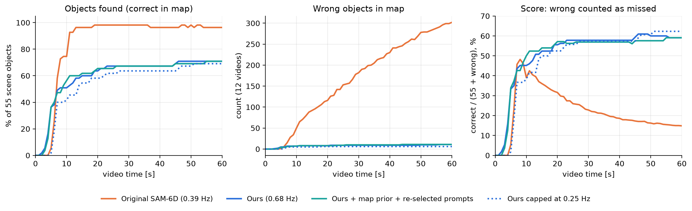
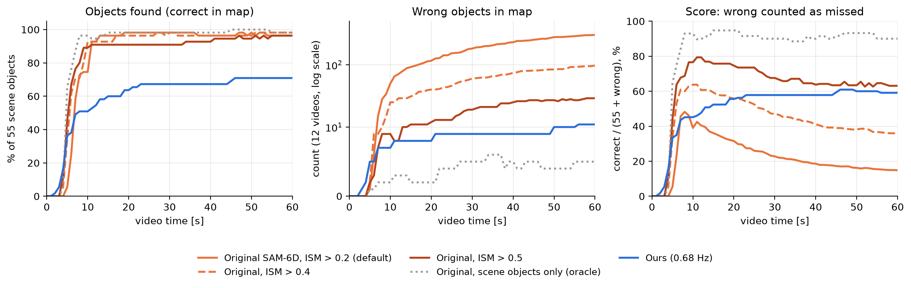

# 실시간 객체지도

> 실시간 객체 지도 — 실시간 비교 실험(05), 실시간 비교표(08), 4090 재측정(10), 원본 0.5 대 개선안 전 장면(13), 4090 여섯 구성·검증 수정·군집 먼저(15), 서버·클라이언트 분리 재실행(18). 개별 문서 6개를 그대로 이어 붙인 묶음입니다(제목 단계만 한 칸 내림). 원문은 `개별문서/` 폴더에 있습니다. 생성 2026-10-08.

**이 묶음의 장**

- **05_실시간_지도_비교실험** — 05. 실시간 객체 지도 비교 실험 — "같은 영상에서 더 빨리, 틀리지 않게 지도에 올린다"
- **08_실시간_비교표** — 08. 실시간 객체 위치 찾기 비교표 — 원본 SAM-6D 0.5, 개선안, 기술 조합 (2026-10-06)
- **10_실시간_비교표_261006** — 10. 실시간 비교표 — 원본 0.5 / 개선안(자세 검증 켬) / 개선안(자세 검증 끔) (2026-10-06)
- **13_실시간_원본_개선안_비교표_261007** — 13. 실시간 객체 위치 찾기 비교표 — 원본 0.5 대 개선안(자세 검증 켬), 실제 영상 5개 + YCB-V (2026-10-07 정리)
- **15_실시간_기술조합_4090_261007** — 15. 실시간 기술 조합 비교 — 4090, 여섯 구성 + 검증 코드 수정·군집 먼저 (2026-10-07)
- **18_실시간_서버클라이언트_41서버_192슬램_261008** — 18. 실시간 기술 조합 — 서버·클라이언트 분리 재실행: .41 인식 서버 + .192 SLAM (2026-10-08)

[TOC]

---

## 05. 실시간 객체 지도 비교 실험 — "같은 영상에서 더 빨리, 틀리지 않게 지도에 올린다"

> **확인용 실행 (RTX 3080 Ti Laptop, 2026-10-05).** 경향 확인용입니다. 논문 최종 수치는 RTX 5090 장비에서 같은 스크립트로 다시 측정합니다.

### 1. 요약

| 질문 | 결과 |
|---|---|
| 한 장 평가(BOP)에서 원본 SAM-6D보다 점수가 낮은 이유 | 답을 덜 내서입니다. 우리는 62%, 원본은 99%에 답합니다. 둘 다 답한 물체끼리는 우리가 더 정확합니다(ADD-S AUC 97.2 대 95.8). |
| 같은 SAM-6D 기반인데 결과가 다른 이유 | 자세 추정(PEM)은 같습니다. 앞단 물체 찾기(ISM)를 "가장 닮은 것 1개를 무조건 고르기"에서 "관문을 통과할 때만 답하기"로 바꿨기 때문입니다. |
| 검출기를 개선하면 찾은 비율이 오르나 | 조금 오릅니다. 문구 다시 고르기로 61.4% → 66.3%가 됩니다. 검출기 재현율을 96%까지 올려도 66%에서 멈춥니다. 병목은 ISM 관문입니다. |
| 실시간에서 원본 SAM-6D와 비교하면 | **원본 기본값(점수 기준 0.2)과 비교하면** 우리가 앞섭니다(점수 59.1% 대 14.4%). **원본의 점수 기준을 0.5로 올리면 원본이 앞섭니다**(63.5% 대 59.1%, 모든 프레임 평균 64.6% 대 52.4%). 우리가 앞서는 것은 잘못 올라간 물체 수(11 대 30)와 인식 속도(0.68 대 0.57 Hz)입니다. 찾은 비율이 낮은 것(71% 대 98%)이 약점입니다. 4.4절 참고. |
| 인식 빈도의 효과 | 처음 10초 안의 발견 속도를 좌우합니다. 5초 안에 찾은 비율은 0.25 Hz에서 1.8%, 0.68 Hz에서 36.4%입니다. 시간이 지나면 비슷해집니다. |

### 2. 왜 원본 SAM-6D와 결과가 다른가

| 단계 | 원본 SAM-6D | 우리 | 영향 |
|---|---|---|---|
| 후보 영역 | FastSAM-x로 화면 전체 분할 | YOLO-World 문구 검출 상자 | 검출기가 놓치면 후보가 없음 |
| 마스크 | FastSAM 영역 | 상자 안 MobileSAM | 가볍고 빠름 |
| 특징 | DINOv2 ViT-L | DINOv2 ViT-S | 빠르지만 구분력이 약간 낮음 |
| **물체 결정** | 점수 합산 후 **가장 높은 1개를 무조건 선택** | 의미·외형·색상 **관문 통과**, 닮은 물체끼리 **상자 독점 배정** | **결과 차이의 주원인** |
| 자세 추정 (PEM) | 원본 | **같은 모델·가중치** | 차이 없음 |
| 자세 검증 | 없음 | 윤곽·무늬·합의 검증 | 오답 감소 |

**같은 물체끼리 비교한 결과 (YCB-V 900장)**

| | SAM-6D | 우리 |
|---|---|---|
| 답을 낸 물체 (4,123개 중) | 4,089 (99%) | 2,556 (62%) |
| ADD-S AUC, 전체 기준 (논문 지표) | 92.3 | 60.2 |
| ADD-S AUC, 둘 다 답한 2,555개 | 95.8 | **97.2** |
| 위 2,555개의 오차 중앙값 | 1.8 mm | **1.7 mm** |
| 정답 비율 | 93.7% | **99.0%** |
| 오답 / 장 | 0.287 | **0.028** |

**답을 못 낸 원인 (우리, 4,123개 기준)**

| 단계 | 비율 | 내용 |
|---|---|---|
| 후보 상자 없음 | 21.7% | 검출기 놓침, 또는 닮은 물체에게 상자를 빼앗김. 정답 상자를 줘도 937건이 남으므로 **배정 단계가 주원인**입니다(푸딩 75/75, 크래커 168/225, 참치 146/300). |
| 의미 관문 | 6.7% | 마커, 푸딩, 폼 블록, 그릇 |
| 외형 관문 | 3.4% | 토마토 캔, 설탕 상자, 가위 |
| 색상 관문 | 2.2% | 마커(가늘고 검은 물체) |
| 자세 검증 | 4.1% | 윤곽·무늬·합의 기준 미달 |

### 3. 검출기 개선 실험 (한 장 평가, YCB-V 900장)

문구는 평가에 쓰지 않는 검증 프레임에서 골랐습니다. 검증 프레임은 12개 테스트 영상에서 평가 목록과 5프레임 이상 떨어진 563장입니다. 검증 재현율(82.9%)과 테스트 재현율(83.9%)이 비슷하므로 테스트에 맞춘 효과는 없습니다.

| 방법 | 검출기 재현율 | 찾은 비율 | 정답 비율 | 오답/장 | ADD-S AUC | BOP AR | 처리 시간 |
|---|---|---|---|---|---|---|---|
| 기준 (YOLO-World m, 원래 문구) | 71.0% | 61.4% | 99.0% | 0.028 | 60.3 | 56.2 | 1235 ms |
| ① 문구 다시 고르기 | 83.9% | **66.3%** | 99.1% | 0.029 | 65.1 | **60.7** | 1310 ms |
| ② 물체당 문구 3개 | 81.9% | **66.6%** | 99.0% | 0.030 | 65.4 | **60.7** | 1465 ms |
| ③ 큰 모델 (YOLO-World x) | 81.1% | 64.9% | 98.7% | 0.038 | 63.6 | 59.5 | 1297 ms |
| ④ CAD 이미지 프롬프트 (YOLOE-11L) | 76.1% | 62.7% | 97.9% | 0.062 | 61.7 | 57.6 | 1271 ms |
| ①+③+④ 조합 | **95.9%** | 66.2% | 97.9% | 0.064 | 65.1 | 60.4 | 1450 ms |
| (참고) 정답 상자, 배정 고정 | 100% | 78.0% | 100% | 0.000 | 76.4 | – | – |
| (참고) 원본 SAM-6D | – | 92.9% | 93.7% | 0.287 | 92.4 | 84.1 | 1573 ms |

- **① 문구 다시 고르기가 가장 효율적입니다.** 비용이 거의 없고 오답이 늘지 않습니다. 바뀐 문구는 `src/ycbv/det_study/out/prompts_best_m.json`에 있습니다. 예: 폼 블록 "red brick" → "red rectangular block", 설탕 상자 → "yellow box", 토마토 캔 → "red can".
- **검출기 재현율 96%로도 찾은 비율이 66%에서 멈춥니다.** 늘어난 후보는 ISM 관문에서 걸러지거나, 걸러지지 않으면 오답이 됩니다.
- 검증 프레임 기준 모델별 재현율(문구 그대로): YOLO-World m 70.5%, l 81.6%, x 81.8%, YOLOE-11L 73.3%, YOLOE-26L 77.6%, YOLOE-26X 79.1%. 시각 프롬프트는 YOLOE-11L 75.0%, YOLOE-26L 28.8~37.9%였습니다.

### 4. 실시간 비교 실험 (핵심)

#### 4.1 설정

- **영상:** YCB-V 테스트 영상 12개(48~59번), 20,738프레임, 장면 물체 합계 55개입니다. rosbag으로 변환해 1배속으로 재생합니다.
- **시스템:** 같은 지도 시스템을 씁니다. 허브, ORB-SLAM3 Linux 빌드, 객체 지도, 화면 표시가 모두 같고 GPU 한 장(RTX 3080 Ti Laptop)을 씁니다.
- **인식기만 교체:**
  - 우리: 배포 인식기
  - 원본 SAM-6D: `run_orig.run_frame` 그대로 사용(FastSAM-x + ViT-L, 물체별 1위, ISM 점수 > 0.2이면 PEM)
- **질의 물체:** 두 인식기 모두 21개 전체입니다. 실제 운용처럼 장면에 어떤 물체가 있는지 모르는 조건입니다.
- **추가 설정:**
  - ⑤ 지도 기반 후보: 지도의 물체를 현재 프레임에 투영해 후보 상자로 추가합니다(hub `--map-prior`).
  - ⑤ + ① 문구
  - 인식 빈도 제한: 0.25 Hz, 0.5 Hz(hub `--sam-feed-hz`)

#### 4.2 지표

| 지표 | 정의 |
|---|---|
| 지도에 올라간 시간 | 장면 물체가 지도에서 처음 **맞게** 그려진 영상 시각입니다. 맞음의 기준은 ADD-S < 지름의 10%입니다. |
| t초 안에 찾은 비율 | 55개 중 t초까지 맞게 올라간 물체의 비율 |
| 잘못 올라간 물체 | 장면에 없는 물체, 위치가 틀린 물체, 같은 물체의 중복 |
| **점수 (잘못 = 못 찾음)** | 맞게 올라간 물체 ÷ (55 + 잘못 올라간 물체). 잘못 올린 물체 1개를 못 찾은 물체 1개와 같은 손해로 봅니다. 검출 문헌의 TP / (TP + FN + FP)와 같은 형태입니다. |
| 화면 일치율, 프레임당 잘못된 상자 | 매 표시 프레임에서 보이는 GT 물체 중 맞게 그려진 비율, 그리고 잘못 그려진 상자 수 |

#### 4.3 결과

**표 A. 잘못 올라간 물체를 못 찾은 것으로 계산한 점수**

| 시점 | 원본 SAM-6D | **우리** | 우리 + ⑤ | 우리 + ⑤ + ① | 우리 0.5 Hz | 우리 0.25 Hz |
|---|---|---|---|---|---|---|
| 5초 | 5.4% (3/1) | **33.3%** (20/5) | 21.7% (13/5) | **33.9%** (20/4) | **33.9%** (20/4) | 1.8% (1/0) |
| 10초 | 39.0% (41/50) | 45.2% (28/7) | 44.4% (28/8) | **50.0%** (31/7) | 46.8% (29/7) | 38.3% (23/5) |
| 20초 | 31.6% (54/116) | 55.6% (35/8) | 53.8% (35/10) | **57.1%** (36/8) | 56.5% (35/7) | 52.5% (32/6) |
| 30초 | 22.8% (54/182) | **57.8%** (37/9) | 57.6% (38/11) | 56.9% (37/10) | **57.8%** (37/9) | 57.4% (35/6) |
| 영상 끝 | 14.4% (55/326) | 59.1% (39/11) | 59.7% (40/12) | 60.6% (40/11) | 61.5% (40/10) | **62.3%** (38/6) |
| 모든 프레임 평균 | 21.7% | 52.4% | 52.1% | 52.1% | **52.8%** | 50.7% |

괄호는 (맞게 올라간 물체 / 잘못 올라간 물체), 12개 영상 합계입니다.

**표 B. 찾은 속도와 오류 (잘못 올린 물체를 따로 셈)**

| | 원본 SAM-6D | **우리** | 우리 + ⑤ | 우리 + ⑤ + ① | 우리 0.5 Hz | 우리 0.25 Hz |
|---|---|---|---|---|---|---|
| 인식 빈도 | 0.39 Hz | **0.68 Hz** | 0.62 Hz | 0.61 Hz | 0.49 Hz | 0.26 Hz |
| 지도에 올라간 시간 중앙값 | 6.9초 | **4.6초** | 6.2초 | 5.1초 | 5.3초 | 6.4초 |
| 5초 안에 찾은 비율 | 5.5% | **36.4%** | 23.6% | **36.4%** | **36.4%** | 1.8% |
| 10초 안에 찾은 비율 | **74.5%** | 50.9% | 50.9% | 56.4% | 52.7% | 41.8% |
| 영상 끝까지 찾은 비율 | **100%** | 70.9% | 72.7% | 72.7% | 72.7% | 69.1% |
| 최종 지도의 잘못된 물체 / 전체 | 153 / 204 | 14 / 54 | 15 / 55 | 17 / 57 | 16 / 56 | **9 / 48** |
| 프레임당 잘못된 상자 | 16.2 | 0.80 | 0.87 | 0.85 | 0.77 | **0.50** |
| 화면 일치율 | **86.2%** | 60.3% | 61.1% | 60.2% | 60.3% | 56.0% |
| 지도 위치 오차 중앙값 | 9.0 mm | 8.8 mm | 7.8 mm | 7.9 mm | 7.3 mm | 7.3 mm |
| 지도 ADD-S AUC | **87.8** | 68.6 | 68.8 | 68.6 | 68.8 | 67.1 |

"최종 지도의 잘못된 물체"는 최종 지도(summary) 기준이고, 표 A의 잘못된 물체는 화면에 그려진 지도 기준입니다. 화면 기준에는 중복 등록도 포함되므로 원본에서 수가 더 큽니다.

**표 C. 오류 유형 분석 (영상 끝 시점의 지도, 12개 영상 합계, 장면 물체 55개)**

| 구분 | 원본 SAM-6D (기준 0.2) | 우리 방법 | 우리 + ⑤ + ① 문구 |
|---|---|---|---|
| **맞게 올라간 물체** | **55** | 39 | 40 |
| **못 찾은 물체** | **0** | 16 | 15 |
| ㄴ 지도에 아예 없음 | 0 | 15 | 14 |
| ㄴ 잘못된 위치로만 있음 | 0 | 1 | 1 |
| **잘못 올라간 물체** | 326 | **11** | **11** |
| ㄴ 장면에 없는 물체 | 320 | 8 | 8 |
| ㄴ 장면에 있지만 위치가 틀림 | 0 | 1 | 1 |
| ㄴ 같은 물체 중복 | 6 | 2 | 2 |
| **손실 합계** (못 찾음 + 잘못 올라감) | 326 | **27** | **26** |
| 잘못 올라간 물체 ÷ 맞게 올라간 물체 | 5.9배 | **0.28배** | **0.28배** |
| 점수: 맞음 ÷ (55 + 잘못) | 14.4% | 59.1% | **60.6%** |

원본이 장면에 없는데 가장 많이 올린 물체는 폼 블록 51, 가위 47, 큰 집게 45, 작은 집게 40, 젤라틴 상자 20, 나무 블록 18입니다. 단색이거나 모양이 단순한 물체입니다. 우리 방법은 머스터드병 4건이 가장 많았습니다.

- **원본의 손실:** 거의 전부(320/326) **"없는 물체를 있다고 함"**입니다. 21개 물체 모두에 대해 가장 닮은 영역을 무조건 하나씩 고르므로, 장면에 없는 물체도 다른 물체나 배경에 붙여서 지도에 올립니다. 위치를 바꿔 가며 반복해서 쌓입니다.
- **우리 방법의 손실:** 주로(15/27) **"있는 물체를 못 찾음"**입니다. 관문에서 걸러진 경우로, 한 장 평가의 원인과 같습니다.
- **손실 합계:** 우리가 12배 적습니다(27 대 326).

**표 D. 엄격한 기준의 찾은 비율** (잘못 올라간 물체가 찾은 비율을 부풀리지 않는지 확인)

| 시점 | 원본 SAM-6D: 기준 A → C | 우리 방법: A → C | 우리 + ⑤ + ①: A → C |
|---|---|---|---|
| 5초 안 | 5.5% → 5.5% | 36.4% → 36.4% | 36.4% → 36.4% |
| 10초 안 | 74.5% → 74.5% | 50.9% → 50.9% | 56.4% → 56.4% |
| 20초 안 | 98.2% → 94.5% | 63.6% → 63.6% | 65.5% → 65.5% |
| 30초 안 | 98.2% → 92.7% | 67.3% → 67.3% | 67.3% → 67.3% |
| 영상 끝 | 100% → 90.9% | 70.9% → 69.1% | 72.7% → 70.9% |

- **기준 A (표 B):** t초까지 한 번이라도 맞게 올라감. 잘못 올라간 것은 원래 세지 않습니다.
- **기준 B:** t초 시점의 지도에 맞게 있음. 결과는 모든 설정에서 A와 같았습니다.
- **기준 C:** B를 만족하고, 같은 물체의 잘못된 복사본도 없음.
- 엄격하게 세도 결론은 같습니다. 원본의 잘못된 물체는 대부분 장면에 없는 물체라서 찾은 비율에는 영향이 없고, 지도만 더럽힙니다. 그래서 핵심 지표는 표 A의 점수(잘못 = 못 찾음)입니다.

#### 4.4 보강 실험: 원본 SAM-6D의 점수 기준 높이기, 장면 물체만 질의

원본도 "확실할 때만 답하기"를 하면 어떻게 되는지 확인했습니다. ISM 점수 기준을 0.2(기본값)에서 0.3·0.4·0.5로 올렸습니다. 원본에 정답 물체 목록을 알려주는 상한선 설정(장면 물체만 질의)도 돌렸습니다. 시스템과 영상은 같습니다.

**표 E. 원본 SAM-6D 설정별 실시간 결과** (영상 12개, 장면 물체 55개)

| | 원본 0.2 (기본) | 원본 0.3 | 원본 0.4 | **원본 0.5** | 원본, 장면 물체만 (상한선) | **우리** |
|---|---|---|---|---|---|---|
| 인식 빈도 | 0.39 Hz | 0.41 Hz | 0.51 Hz | 0.57 Hz | 0.58 Hz | **0.68 Hz** |
| 지도에 올라간 시간 중앙값 | 6.9초 | 7.0초 | 5.6초 | 5.2초 | 5.0초 | **4.6초** |
| 5초 안에 찾은 비율 | 5.5% | 10.9% | 34.5% | **45.5%** | 65.5% | 36.4% |
| 10초 안에 찾은 비율 | 74.5% | 90.9% | 92.7% | **90.9%** | 96.4% | 50.9% |
| 영상 끝까지 찾은 비율 | 100% | 100% | 100% | **98.2%** | 100% | 70.9% |
| 엄격한 기준 (C), 영상 끝 | 90.9% | 89.1% | 92.7% | **92.7%** | 90.9% | 69.1% |
| 잘못 올라간 물체 (화면 지도, 영상 끝) | 326 | 289 | 105 | **30** | 5 | **11** |
| ㄴ 장면에 없는 물체 | 320 | 281 | 101 | 26 | 0 | 8 |
| 프레임당 잘못된 상자 | 16.2 | 14.1 | 5.5 | 1.8 | 0.38 | **0.80** |
| 화면 일치율 | 86.2% | 85.9% | 87.9% | **85.8%** | 90.1% | 60.3% |
| **점수 (잘못 = 못 찾음), 10초** | 39.0% | 46.7% | 63.8% | **76.6%** | 93.0% | 45.2% |
| **점수, 영상 끝** | 14.4% | 15.7% | 34.4% | **63.5%** | 90.0% | 59.1% |
| **점수, 모든 프레임 평균** | 21.7% | 23.4% | 44.0% | **64.6%** | 84.7% | 52.4% |
| 지도 위치 오차 중앙값 | 9.0 mm | 9.4 mm | 9.6 mm | 9.0 mm | 8.1 mm | 8.8 mm |

**보강 실험의 결론 (이전 결론을 고쳐야 함)**

1. **원본도 점수 기준을 0.5로 올리면 우리보다 점수가 높습니다.**
   - 영상 끝 63.5% 대 59.1%, 모든 프레임 평균 64.6% 대 52.4%입니다.
   - 잘못 올라간 물체는 30개로 우리(11개)의 약 3배지만, 맞게 찾은 물체가 54개 대 39개로 훨씬 많습니다.
   - 따라서 "원본은 지도를 오염시키고 우리는 깨끗하다"는 비교는 **원본 기본값(0.2)에만 성립**합니다. 원본의 기준을 조절하면 성립하지 않습니다.
2. **기준을 올리면 원본도 빨라집니다.** PEM을 돌릴 물체가 줄어서 0.39 → 0.57 Hz가 됩니다. 우리(0.68 Hz)와의 속도 차이는 1.2배로 줄어듭니다.
3. **우리가 여전히 앞서는 지표**
   - 잘못 올라간 물체가 가장 적습니다(11개 대 원본 0.5의 30개). 장면 물체만 질의하는 상한선은 제외한 비교입니다.
   - 프레임당 잘못된 상자가 적습니다(0.80 대 1.8).
   - 인식이 가장 빠릅니다(0.68 Hz).
4. **우리가 뒤지는 지표:** 찾은 비율(70.9% 대 98.2%). 이것이 점수를 끌어내립니다. 원인은 앞서 분석한 대로 우리 ISM의 상자 독점 배정과 관문 기준입니다.
5. **장면 물체만 질의(상한선):** 물체 목록을 알면 원본은 점수 90%입니다. 원본의 잘못된 물체는 거의 전부 "장면에 없는 물체를 물어봐서" 생깁니다.

**표 F. 원본 판정 + ViT-S (단계별 분해의 L1) 실시간 결과** (영상 12개, 장면 물체 55개)

| | 원본 ViT-L 0.5 | **원본 판정 + ViT-S 0.5** | 원본 판정 + ViT-S 0.4 | 우리 |
|---|---|---|---|---|
| 인식 빈도 | 0.57 Hz | **0.96 Hz** | 0.65 Hz | 0.68 Hz |
| 지도에 올라간 시간 중앙값 | 5.2초 | **4.0초** | 5.0초 | 4.6초 |
| 5초 안에 찾은 비율 | 45.5% | **76.4%** | 47.3% | 36.4% |
| 10초 안에 찾은 비율 | 89.1% | **92.7%** | 90.9% | 50.9% |
| 영상 끝까지 찾은 비율 (기준 C) | 92.7% | 92.7% | 89.1% | 69.1% |
| 잘못 올라간 물체 (화면 지도, 영상 끝) | 30 | 143 | 376 | **11** |
| 프레임당 잘못된 상자 | 1.8 | 8.1 | 20.2 | **0.80** |
| 점수 (잘못 = 못 찾음), 5초 | 43.9% | **58.3%** | 35.6% | 33.3% |
| 점수, 10초 | **76.6%** | 57.3% | 35.5% | 45.2% |
| 점수, 영상 끝 | **63.5%** | 27.3% | 12.5% | 59.1% |
| 점수, 모든 프레임 평균 | **64.6%** | 37.0% | 19.0% | 52.4% |
| 지도 위치 오차 중앙값 | 9.0 mm | 7.7 mm | 7.8 mm | 8.8 mm |

- **ViT-S로 바꾸면 매우 빨라집니다.** 0.96 Hz로 우리(0.68 Hz)보다 빠르고, 5초 안에 76%를 찾습니다.
- **그러나 잘못된 물체가 크게 늘어납니다.** 같은 기준 0.5에서 30개 → 143개입니다. ViT-S는 물체 구분력이 낮아, 장면에 없는 물체도 0.5를 넘는 경우가 많습니다. 그래서 종합 점수는 영상 끝 27.3%로 원본 ViT-L 0.5(63.5%)와 우리(59.1%)보다 낮습니다.
- **ViT-S에는 더 높은 기준이 필요합니다.** 0.4로 낮추면 오히려 오답이 376개로 폭증합니다.

#### 4.5 해석 (보강 실험 전, 원본 기본값 기준)

1. **잘못 올린 물체를 손해로 치면 원본보다 2.4~4배 높습니다.**
   - 원본은 확실하지 않아도 21개 물체 모두에 답합니다.
   - 그래서 잘못된 물체가 계속 쌓이고(10초 50개 → 끝 326개), 점수가 8초 무렵 최고(약 48%)를 찍은 뒤 끝까지 떨어집니다(14%).
   - 우리는 잘못된 물체가 10개 안팎에서 멈추고, 점수가 꾸준히 오릅니다(59~62%).
2. **처음 몇 초는 우리가 더 빨리 지도에 올립니다.** 인식이 1.7배 빨라서 5초에 36% 대 5.5%입니다. 다만 우위 구간은 약 5~8초로 짧습니다. 10초 이후 "찾은 비율"만 보면 원본이 앞섭니다.
3. **인식 빈도는 초기 발견 속도를 좌우합니다.** 0.25 Hz로 제한하면 5초 안에 찾은 비율이 1.8%로 떨어집니다. 30초가 지나면 빈도와 관계없이 비슷해집니다. 따라서 빠른 인식의 가치는 처음 몇 초 안에 지도를 채우는 데 있습니다.
4. **⑤ 지도 기반 후보는 효과가 거의 없습니다.** 투영 후보도 관문에서 걸러지고 인식 빈도가 조금 떨어집니다. ⑤ + ① 문구 조합이 10~20초 구간에서 약간 높습니다(+3~5%p).
5. **한계:** 장면 물체를 다 찾는 완성도는 원본이 앞섭니다(100% 대 71%). 원인은 ISM 관문, 특히 닮은 물체 간 상자 독점 배정입니다.

### 5. 논문 실험으로 쓸 때의 의견

> **보강 실험(4.4절) 뒤 수정:** 원본의 점수 기준을 0.5로 올리면 종합 점수에서 원본이 앞섭니다. 따라서 아래 원래 의견 중 "틀리지 않게 지도에 올린다"를 종합 점수로 주장하는 부분은 그대로 쓸 수 없습니다. 바꿀 방향은 다음과 같습니다.
> 1. 비교는 원본 기본값만이 아니라 **점수 기준별 곡선 전체**(0.2~0.5)와 함께 제시합니다(심사 대비 필수).
> 2. 우리의 주장 범위를 줄입니다. 가장 적은 잘못된 물체, 가장 빠른 인식, 시스템 기여(키프레임 앵커링·지연 보정)를 주장합니다.
> 3. 찾은 비율을 올리는 개선을 함께 진행합니다. 상자 독점 배정을 완화하고 ① 문구를 적용합니다. 개선 뒤 같은 실시간 비교로 원본 0.5보다 높은 점수를 얻는지 확인해야 합니다.
> 4. 단계별 변경 실험(E1, `src/ycbv/ladder/`)으로 어떤 변경이 속도와 정밀도를 만들고, 어떤 변경이 찾은 비율을 깎았는지 보여줍니다.

**(보강 실험 전 의견)**

**결론: 논문 실험으로 쓰는 것을 추천합니다.** 다만 다음을 함께 넣어야 심사를 통과하기 쉽습니다.

**쓸 수 있는 근거**
- 같은 영상, 같은 GPU, 같은 지도 시스템에서 인식기만 바꾼 비교라서 공정성 설명이 쉽습니다.
- 객체 지도를 목표로 하는 시스템에서는 "잘못 올린 물체"가 실제 비용입니다. 이 지표는 그 비용을 그대로 반영합니다.
- 한 장 평가(BOP)에서 지는 이유(답을 덜 냄)와 실시간에서 이기는 이유(오답이 쌓이지 않음)가 같은 설계 선택에서 나온다는 일관된 이야기가 됩니다.

**보완이 필요한 점 (심사 예상 지적)**

| 예상 지적 | 대응 |
|---|---|
| "원본 SAM-6D에 불리한 설정이다" (21개 전체 질의, 점수 기준 없음) | 원본에 **점수 기준을 높인 설정**(예: 0.3, 0.4, 0.5)과 **장면 물체만 질의하는 설정**을 추가합니다. 기준을 높이면 오답이 줄고 찾은 비율도 줄어듭니다. 두 방법을 같은 그래프에 놓으면 공정한 비교가 됩니다. |
| "새로 만든 점수 지표다" | TP / (TP + FN + FP) 형태임을 밝히고, 찾은 비율(재현율)과 잘못된 물체 수(정밀도)를 따로도 보고합니다(표 B). |
| "한 번 실행 결과다" | 장면별로 3회 반복해 평균과 편차를 보고합니다. 실시간 실행은 타이밍에 따라 결과가 달라집니다. |
| "YCB-V는 정적이고 짧은 영상이다" | 우리 실측 데이터(260915 eightcircle 등)를 정성 결과로 함께 제시합니다. 정답 자세가 없으므로 표에는 넣지 않습니다. |
| "완성도가 낮다" | 한계로 명시합니다. 관문 완화(배정 고정 등) 설정을 추가해 완성도와 오답의 맞교환 곡선을 함께 보여주면 더 좋습니다. |
| "속도는 GPU에 따라 다르다" | 최종 수치는 RTX 5090에서 측정합니다. 이 PC 결과는 확인용입니다. |

**논문 구성안**
- **Table:** 표 A의 5초·10초·30초·영상 끝 점수 + 표 B의 핵심 행(인식 빈도, 시간 중앙값, 끝까지 찾은 비율, 잘못된 물체, 위치 오차)
- **Figure:** 시간에 따른 찾은 비율 / 잘못된 물체 / 점수 3칸 그림(위 그림)
- **문장 예:** "On the same videos and GPU, the proposed system places objects in the map earlier (36% vs 5% within 5 s) and keeps wrong map entries at 11 vs 326, so its map score with wrong entries counted as misses is 59% vs 14% at the end of the video. The original SAM-6D eventually finds all objects, at the cost of a map dominated by wrong entries."

### 6. 남은 일 (RTX 5090)

1. 위 실시간 실험 전체 재측정, 장면별 3회 반복
2. 원본 SAM-6D 추가 설정: 점수 기준 0.3·0.4·0.5, 장면 물체만 질의
3. 우리 관문 완화 설정: 배정 고정, 의미 기준 완화
4. ① 문구 다시 고르기를 기본값으로 채택할지 결정

### 7. 파일

| 내용 | 위치 |
|---|---|
| 검출기 공급기 (①~④) | `src/ycbv/det_study/proposers.py` |
| 검증·테스트 재현율 | `src/ycbv/det_study/det_recall.py`, `out/val_*.json`, `out/test_detector.json` |
| 문구 선택 결과 | `src/ycbv/det_study/out/prompt_selection_m.json`, `prompts_best_m.json`, `prompts_ensemble_m.json` |
| 900장 결과 | `src/ycbv/det_study/results_det.json`, 단계별 손실 `out/loss_stages.json` |
| 원본 SAM-6D 실시간 연결 | `src/ycbv_live/orig_live_core.py` (hub `--recognizer`) |
| 지도 기반 후보 | `objpose/pc/hub.py --map-prior`, `sam6d_realtime/realtime/sam6d_core.py` (`extra_proposals`) |
| 실시간 채점 | `src/ycbv_live/eval_live.py` (시간·잘못된 물체 추가), `eval_penalized.py`, `eval_breakdown.py` (오류 유형), `eval_strict_found.py` (엄격한 찾은 비율) |
| 실시간 결과 | `src/ycbv_live/results_{v2,m5,m15,orig,hz05,hz025}.json`, `results_penalized.json`, `results_breakdown.json`, `results_strict_found.json` |
| 실행 출력 | `objpose/output/ycbv_live_{v2,m5,m15,orig,hz05,hz025}_0000NN` |
| 그림 | `images/fig_live_time_to_map.png`, `images/fig_live_orig_thresholds.png` |

---

## 08. 실시간 객체 위치 찾기 비교표 — 원본 SAM-6D 0.5, 개선안, 기술 조합 (2026-10-06)

영상을 실시간 속도(1배속)로 재생하면서 SLAM 지도 위에 물체 위치를 올리는 실험입니다. 같은 영상, 같은 SLAM(ORB-SLAM3, 특징점 2000), 같은 PC(RTX 3080 Ti Laptop)에서 인식기만 바꿨습니다.

| 이름 | 조합 | 후보 영역 | 특징 모델 | 물체 판정 | 자세 답 고르기 | 결과 태그 (YCB / 실제 데이터) |
|---|---|---|---|---|---|---|
| **원본 0.5** | FastSAM-x → DINOv2 ViT-L → 물체 판정 0.5 → PEM (기하 점수 1위를 답으로) | FastSAM-x 전체 분할 | ViT-L | 원본 판정, 기준 0.5 | 기하 점수 1위 (검증 없음) | orig_th05 / origL05 |
| **개선안 1** (본문의 "개선안") | YOLO-World 문구 상자 + MobileSAM → DINOv2 ViT-S → 의미·외형·색상 관문(새 기준값) + 배정 대안 → PEM → 자세 검증 켬 | YOLO-World 문구 상자 + MobileSAM | ViT-S | 우리 관문 + 상자 배정(대안 허용) | 자세 검증 켬 | g13p / g13 |
| **개선안 2** | FastSAM-x → DINOv2 ViT-S → 물체 판정 0.5 → PEM (기하 점수 1위를 답으로) | FastSAM-x 전체 분할 | ViT-S | 원본 판정, 기준 0.5 | 기하 점수 1위 (검증 없음) | origS_th05 / origS05 |
| **개선안 3** | FastSAM-x → DINOv2 ViT-S → 물체 판정 0.5 → PEM (같은 모델 가중치) → 자세 검증 켬 | FastSAM-x 전체 분할 | ViT-S | 원본 판정, 기준 0.5 | 자세 검증 켬 | hybS05 / hybS05 |
| 개선안 4 | FastSAM-x → DINOv2 ViT-S → 물체 판정 0.5 → PEM (같은 모델 가중치) → 자세 검증 끔 | FastSAM-x 전체 분할 | ViT-S | 원본 판정, 기준 0.5 | 우리 PEM 코드, 검증 끔 | hybS05_nover / hybS05_nover |
| A안 | FastSAM-x → DINOv2 ViT-S → 의미·외형·색상 관문 + 상자 독점 배정 → PEM → 자세 검증 켬 | FastSAM-x 상자 (마스크는 MobileSAM으로 다시 만듦) | ViT-S | 우리 관문(배포 기준값) + 상자 독점 배정 | 자세 검증 켬 | gateA / gateA |

- 모든 구성의 PEM은 같은 모델 가중치를 씁니다.
- 원본 0.5와 개선안 2의 PEM은 원본 SAM-6D 코드입니다. 개선안 1·3·4와 A안은 우리 PEM 코드입니다.
- YCB-V에서 개선안 1은 YCB용 문구(g13p)를, 실제 데이터에서는 기존 문구(g13)를 씁니다.
- 본문 표의 "개선안"은 개선안 1입니다. 개선안 3은 07 문서 3.5·3.7절의 "혼합 S"와 같은 구성입니다.

**용어**
- **찾은 객체:** 영상 끝 지도에 맞는 위치로 올라간 물체. YCB는 정답 자세로 채점(ADD-S가 지름의 10% 미만)하고, 실제 데이터는 기준 위치에서 20 cm 이내면 맞음으로 봅니다.
- **찾지 못한 객체:** 끝까지 맞는 항목이 없는 물체. 틀린 위치로만 올라간 물체도 여기에 넣습니다.
- **오답률:** 지도에 올라간 항목 중 잘못된 항목의 비율 = 잘못 / (맞음 + 잘못). 잘못은 장면에 없는 물체, 위치 틀림, 같은 물체 중복입니다.
- **프레임당 처리 시간:** 인식기가 한 프레임을 처리하는 데 걸린 시간(첫 프레임 제외). 실제 데이터는 물체가 없는 프레임이 많아 전체 중앙값과 물체가 검출된 프레임의 중앙값을 함께 적었습니다.

### 1. 실제 영상 (260901_cbnu_bigeightcircle, 314초, 선반 두 개의 물체 8개)

| 구분 | 지표 | 원본 0.5 | 개선안 (검증 켬) |
|---|---|---|---|
| **시간** | 인식 빈도 | 0.89 Hz | **3.68 Hz** |
| | 프레임당 처리 시간 (전체 중앙값) | 1094 ms | **72 ms** |
| | 프레임당 처리 시간 (물체 검출 프레임 중앙값) | 1392 ms | **491 ms** |
| | 처음 찾기까지 시간 (중앙값) | **52.3초** | 69.2초 |
| | 8개를 모두 찾은 시점 | 끝까지 못 찾음 | **91.1초** |
| **찾은 객체** | 최종 지도 (8개 중) | 5 | **8** |
| | 목록 | 페브리즈, 곰 인형, 초코 헤이즐넛, 머그컵, 식혜 | 8개 모두 |
| **찾지 못한 객체** | 개수 | 3 | **0** |
| | 목록 (위치 오차) | 세제 21 cm, 공룡 인형 34 cm, 우유 3.4 m (모두 틀린 위치로만 올라감) | 없음 |
| **오답** | 최종 지도 잘못된 항목 | 4 (위치 틀림 3, 장면에 없는 소스 1) | **0** |
| | **오답률 (최종 지도)** | **44.4%** (4 / 9) | **0%** (0 / 8) |
| | 영상 끝 화면: 맞음 / 잘못 | 7 / 3 (중복 1, 위치 틀림 1, 소스 1) | **8 / 0** |
| | 오답률 (영상 끝 화면) | 30.0% (3 / 10) | **0%** |
| **기존 점수** | 120초 점수 | 63.6% | **100%** |
| | 영상 끝 점수 (맞음 / (8 + 잘못)) | 63.6% | **100%** |
| | 평균 점수 | 53.6% | **79.2%** |

물체별 처음 찾은 시간 (초)

| 물체 | 원본 0.5 | 개선안 |
|---|---|---|
| 우유 | 29.8 (최종 지도에서는 3.4 m 틀림) | **28.0** |
| 머그컵 | **51.1** | 51.3 |
| 초코 헤이즐넛 | 52.3 | **52.1** |
| 식혜 | 52.3 | **52.1** |
| 곰 인형 | **78.7** | 89.4 |
| 세제 | **85.8** (최종 지도에서는 21 cm 틀림) | 91.1 |
| 페브리즈 | **90.3** | 91.1 |
| 공룡 인형 | 못 찾음 | **86.2** |

### 2. YCB-V (영상 12개, 20,738프레임, 장면 물체 55개)

| 구분 | 지표 | 원본 0.5 | 개선안 (검증 켬) |
|---|---|---|---|
| **시간** | 인식 빈도 | **0.57 Hz** | 0.29 Hz |
| | 프레임당 처리 시간 (중앙값) | **1643 ms** | 2764 ms |
| | ㄴ 단계별 (후보 / 판정 / 자세) | 34 / 867 / 704 ms | 16 / 198 / 2541 ms |
| | 처음 찾기까지 시간 (중앙값) | **5.2초** | 8.6초 |
| | 10초 / 20초 / 30초 안에 찾음 | **90.9% / 92.7% / 92.7%** | 56.4% / 76.4% / 81.8% |
| **찾은 객체** | 영상 끝 지도 (55개 중) | **54 (98.2%)** | 49 (89.1%) |
| **찾지 못한 객체** | 개수 | **1** | 6 |
| | 목록 (장면 번호) | 설탕 상자(55, 틀린 위치로만 올라감) | 머그(48), 대형 집게(48, 틀린 위치로만), 그릇(49), 참치 캔(49), 그릇(53), 토마토 수프 캔(55) |
| **오답** | 영상 끝 지도 잘못된 항목 | 30 | **12** |
| | ㄴ 장면에 없는 물체 | 26 | **11** |
| | ㄴ 위치 틀림 | 1 | 1 |
| | ㄴ 같은 물체 중복 | 3 | **0** |
| | **오답률 (영상 끝 지도)** | 35.7% (30 / 84) | **19.7%** (12 / 61) |
| | 프레임당 잘못된 상자 | 1.80 | **0.75** |
| | 장면에 없는데 자주 올린 물체 | 푸딩 상자 8, 폼 블록 6, 젤라틴 상자 6 | 머스터드 병 4, 특대 집게 2 |
| **기존 점수** | 영상 끝 점수 (맞음 / (55 + 잘못)) | 63.5% | **73.1%** |
| | 평균 점수 | **64.6%** | 60.4% |
| | 지도 자세 정확도 (ADD-S AUC) | **87.9** | 87.8 |

### 3. 정리

- **실제 영상:** 개선안이 모든 핵심 지표에서 앞섭니다. 4.1배 빠르고(3.68 대 0.89 Hz), 91초에 8개를 모두 찾았으며 오답률 0%입니다. 원본은 8개 중 5개만 맞는 위치에 남았고, 최종 지도 오답률이 44.4%입니다. 원본이 못 찾은 세 물체는 종류는 맞게 골랐지만 위치가 21 cm~3.4 m 틀렸습니다.
- **YCB-V:** 원본이 더 빨리, 더 많이 찾습니다(54 대 49). 개선안은 오답률이 절반 수준(19.7% 대 35.7%)이라 오답을 감점하는 영상 끝 점수는 더 높습니다. 개선안이 놓친 물체는 닮은 캔과 무늬 없는 그릇처럼 문구로 구별하기 어려운 물체입니다. 개선안이 YCB에서 느린 것은 물체 21종을 모두 질의해 자세 검증할 후보가 많기 때문입니다(자세 단계 2541 ms).
- 두 데이터에서 결과가 엇갈리는 이유는 07 문서 3.6절에 있습니다.

**주의:** 모두 1회 측정입니다. 실제 영상은 자세 정답이 없어 기준 위치를 우리 기술 실행 결과에서 가져왔고, 이 점이 개선안에 유리하게 작용했을 수 있습니다. YCB-V는 정답 자세로 채점합니다.

### 4. 기술 조합 비교 — 5개 구성 (2026-10-06)

새 개선안을 만들기 위해 앞단과 뒷단을 바꿔 가며 비교했습니다. 개선안 2·3·4는 앞단(FastSAM-x → DINOv2 ViT-S → 원본 물체 판정 0.5)이 같고 뒷단만 다릅니다.

| 이름 | 구성 |
|---|---|
| **원본 0.5** | FastSAM-x → ViT-L → 물체 판정 0.5 → PEM (자세 후보 중 기하 점수 1위를 답으로) |
| **개선안** | YOLO-World 문구 상자 + MobileSAM → ViT-S → 우리 관문 + 배정 대안 → PEM → 자세 검증 켬 |
| **개선안 2** | FastSAM-x → ViT-S → 물체 판정 0.5 → PEM (기하 점수 1위를 답으로) |
| **개선안 3** | FastSAM-x → ViT-S → 물체 판정 0.5 → PEM (같은 모델 가중치) → 자세 검증 켬 |
| **개선안 4** | FastSAM-x → ViT-S → 물체 판정 0.5 → PEM (같은 모델 가중치) → 자세 검증 끔 |

#### 4.1 실제 영상 (260901_cbnu_bigeightcircle, 314초, 물체 8개)

| 구분 | 지표 | 원본 0.5 | 개선안 | 개선안 2 | 개선안 3 | 개선안 4 |
|---|---|---|---|---|---|---|
| **시간** | 인식 빈도 | 0.89 Hz | 3.68 Hz | 3.70 Hz | 2.77 Hz | **3.98 Hz** |
| | 프레임당 처리 시간 (물체 검출 프레임 중앙값) | 1392 ms | 491 ms | 345 ms | 584 ms | **311 ms** |
| | 프레임당 처리 시간 (전체 중앙값) | 1094 ms | **72 ms** | 207 ms | 197 ms | 215 ms |
| | 처음 찾기까지 시간 (중앙값) | 52.3초 | 69.2초 | 50.6초 | 72.8초 | **50.0초** |
| | 8개를 모두 한 번 이상 찾은 시점 | 못 찾음 | 91.1초 | 90.2초 | 99.4초 | **88.5초** |
| **찾은 객체** | 최종 지도 (8개 중) | 5 | **8** | 4 | **8** | 3 |
| **찾지 못한 객체** | 개수 | 3 | **0** | 4 | **0** | 5 |
| | 목록 (위치 오차, 모두 틀린 위치로만 올라감) | 세제 21 cm, 공룡 34 cm, 우유 3.4 m | 없음 | 공룡 27 cm, 우유 31 cm, 초코 3.3 m, 식혜 3.3 m | 없음 | 세제 21 cm, 공룡 26 cm, 초코 3.3 m, 식혜 3.3 m, 우유 3.4 m |
| **오답** | 최종 지도 잘못된 항목 (위치 틀림 / 없는 물체) | 4 (3 / 1) | **0** | 5 (4 / 1) | **0** | 6 (5 / 1) |
| | **오답률 (최종 지도)** | 44.4% | **0%** | 55.6% | **0%** | 66.7% |
| | 영상 끝 화면: 맞음 / 잘못 | 7 / 3 | **8 / 0** | 8 / 22 | **8 / 0** | 8 / 22 |
| | ㄴ 잘못의 내역 | 중복 1, 위치 틀림 1, 소스 1 | 없음 | 중복 20 (초코 17), 소스 2 | 없음 | 중복 20 (초코 17), 소스 2 |
| | 오답률 (영상 끝 화면) | 30.0% | **0%** | 73.3% | **0%** | 73.3% |
| **기존 점수** | 120초 점수 | 63.6% | **100%** | 30.8% | **100%** | 36.4% |
| | 영상 끝 점수 | 63.6% | **100%** | 26.7% | **100%** | 26.7% |
| | 평균 점수 | 53.6% | **79.2%** | 25.0% | 77.3% | 24.4% |

#### 4.2 YCB-V (영상 12개, 20,738프레임, 장면 물체 55개)

| 구분 | 지표 | 원본 0.5 | 개선안 | 개선안 2 | 개선안 3 | 개선안 4 |
|---|---|---|---|---|---|---|
| **시간** | 인식 빈도 | 0.57 Hz | 0.29 Hz | 0.96 Hz | 0.37 Hz | **1.32 Hz** |
| | 프레임당 처리 시간 (중앙값) | 1643 ms | 2764 ms | 982 ms | 2513 ms | **610 ms** |
| | ㄴ 자세 단계 (중앙값) | 704 ms | 2541 ms | 813 ms | 2322 ms | **419 ms** |
| | 처음 찾기까지 시간 (중앙값) | 5.2초 | 8.6초 | 4.0초 | 8.0초 | **3.2초** |
| | 10초 / 20초 / 30초 안에 찾음 | 90.9 / 92.7 / 92.7% | 56.4 / 76.4 / 81.8% | **92.7 / 94.5 / 94.5%** | 60.0 / 90.9 / 94.5% | 90.9 / **94.5 / 94.5%** |
| **찾은 객체** | 영상 끝 지도 (55개 중) | 54 | 49 | 54 | 54 | **55** |
| **찾지 못한 객체** | 개수 | 1 | 6 | 1 | 1 | **0** |
| | 목록 (장면 번호) | 설탕 상자(55, 틀린 위치로만) | 머그(48), 대형 집게(48, 틀린 위치로만), 그릇(49), 참치 캔(49), 그릇(53), 토마토 수프 캔(55) | 특대 집게(48, 틀린 위치로만) | 특대 집게(48) | 없음 |
| **오답** | 영상 끝 지도 잘못된 항목 | 30 | **12** | 143 | 15 | 160 |
| | ㄴ 장면에 없는 물체 | 26 | **11** | 130 | 14 | 154 |
| | ㄴ 위치 틀림 | 1 | 1 | 1 | **0** | **0** |
| | ㄴ 같은 물체 중복 | 3 | **0** | 12 | 1 | 6 |
| | **오답률 (영상 끝 지도)** | 35.7% | **19.7%** | 72.6% | 21.7% | 74.4% |
| | 프레임당 잘못된 상자 | 1.80 | **0.75** | 8.14 | 0.92 | 9.35 |
| **기존 점수** | 영상 끝 점수 | 63.5% | 73.1% | 27.3% | **77.1%** | 25.6% |
| | 평균 점수 | 64.6% | 60.4% | 37.0% | **70.1%** | 34.2% |
| | 지도 자세 정확도 (ADD-S AUC) | 87.9 | 87.8 | 86.3 | **91.2** | 85.7 |

#### 4.3 해석

- **개선안 2 (원본에서 ViT-S만 바꿈):** 원본 0.5보다 빨라지고(YCB 0.57 → 0.96 Hz, 실제 0.89 → 3.70 Hz) 더 일찍 찾습니다. 하지만 ViT-S 특징으로는 원본 판정 0.5가 느슨해져 오답이 크게 늘었습니다(YCB 30 → 143개, 실제 데이터 최종 지도 맞음 5 → 4).
- **개선안 4 대 개선안 2 (PEM 코드만 다름, 둘 다 검증 없음):** 결과가 거의 같습니다(YCB 오답률 74.4% 대 72.6%, 실제 데이터 영상 끝 화면 둘 다 8 / 22). 우리 PEM 코드 자체가 오답을 줄이는 것은 아닙니다.
- **개선안 3 대 개선안 4 (자세 검증만 다름):** 검증을 켜면 YCB 잘못된 항목이 160 → 15개, 실제 데이터 최종 지도 오답이 6 → 0개로 줄고, 자세 정확도도 85.7 → 91.2로 오릅니다. 대가는 속도입니다(YCB 1.32 → 0.37 Hz, 실제 3.98 → 2.77 Hz). 찾은 수는 거의 그대로입니다(YCB 55 → 54, 실제 8 → 8).
- **실제 데이터의 같은 물체 중복:** 검증이 없는 개선안 2·4는 초코 헤이즐넛을 화면 지도에 17번 올렸습니다. 최종 지도에서는 초코·식혜·우유가 다른 선반(3.3 m 떨어진 곳)에 남았습니다.
- **두 데이터 모두에서 균형이 가장 좋은 구성은 개선안 3입니다.** YCB에서 원본만큼 찾고(54/55) 오답률은 21.7%(원본 35.7%)이며 자세 정확도가 가장 높습니다. 실제 데이터에서도 8/8, 오답 0입니다. 다만 실제 데이터에서 8개를 모두 찾은 시점은 99.4초로 개선안(91.1초)보다 늦고, 인식 빈도도 낮습니다(2.77 대 3.68 Hz).
- **개선안은 실제 데이터에서 여전히 가장 좋은 구성입니다**(평균 점수 79.2%). 그러나 YCB에서 문구로 구별하기 어려운 물체 6개를 놓칩니다.

**주의:** 모두 1회 측정이고 이 PC(RTX 3080 Ti Laptop)에서 쟀습니다. 실제 영상은 기준 위치를 우리 기술 실행 결과에서 가져왔습니다. 원본 0.5, 개선안, 개선안 3의 실제 영상과 개선안 2·3의 YCB 결과는 이전에 잰 것을 그대로 썼습니다.

### 5. 실제 영상 5개 구성 한 번에 측정 (2026-10-06 16:30~18:32)

4.1절은 측정 시간대가 다른 실행을 모은 것입니다. 측정 조건을 맞추려고 5개 구성을 같은 시간대에 연달아 다시 돌렸습니다(결과 폴더 `real5_260901_*`). 개선안 2의 첫 실행은 SLAM 루프 오연결로 지도가 최대 305 cm 보정돼 모든 물체가 0.4~0.6 m 밀렸습니다. 그래서 그 실행은 빼고(`real5_260901_origS05_slambad`) 다시 측정했습니다. 다시 잰 실행은 루프 보정 2번, 최대 보정 26.6 cm로 다른 실행(13~19 cm)과 비슷했습니다.

| 구분 | 지표 | 원본 0.5 | 개선안 | 개선안 2 | 개선안 3 | 개선안 4 |
|---|---|---|---|---|---|---|
| **시간** | 인식 빈도 | 0.89 Hz | 3.61 Hz | 3.71 Hz | 2.70 Hz | **3.91 Hz** |
| | 프레임당 처리 시간 (물체 검출 프레임 중앙값) | 1378 ms | 507 ms | 341 ms | 597 ms | **319 ms** |
| | 프레임당 처리 시간 (전체 중앙값) | 1107 ms | **74 ms** | 208 ms | 197 ms | 222 ms |
| | 처음 찾기까지 시간 (중앙값) | 52.0초 | 70.7초 | 63.6초 | 71.7초 | **50.4초** |
| | 8개를 모두 한 번 이상 찾은 시점 | 못 찾음 (공룡) | 94.8초 | 89.9초 | 96.0초 | **88.0초** |
| **찾은 객체** | 최종 지도 (8개 중) | 7 | **8** | 5 | **8** | 5 |
| **찾지 못한 객체** | 개수 | 1 | **0** | 3 | **0** | 3 |
| | 목록 (위치 오차, 모두 틀린 위치로만 올라감) | 공룡 23 cm | 없음 | 공룡 25 cm, 식혜 3.3 m, 초코 3.5 m | 없음 | 공룡 27 cm, 식혜 3.3 m, 초코 3.4 m |
| **오답** | 최종 지도 잘못된 항목 (위치 틀림 / 없는 물체) | 2 (1 / 1) | **0** | 4 (3 / 1) | **0** | 4 (3 / 1) |
| | **오답률 (최종 지도)** | 22.2% | **0%** | 44.4% | **0%** | 44.4% |
| | 영상 끝 화면: 맞음 / 잘못 | 7 / 3 | **8 / 0** | 8 / 25 | **8 / 0** | 8 / 23 |
| | ㄴ 잘못의 내역 | 중복 1, 위치 틀림 1, 소스 1 | 없음 | 중복 23, 소스 2 | 없음 | 중복 21, 소스 2 |
| | 오답률 (영상 끝 화면) | 30.0% | **0%** | 75.8% | **0%** | 74.2% |
| **기존 점수** | 120초 점수 | 63.6% | **100%** | 33.3% | **100%** | 42.1% |
| | 영상 끝 점수 | 63.6% | **100%** | 24.2% | **100%** | 25.8% |
| | 평균 점수 | 52.6% | **78.9%** | 25.0% | 77.8% | 28.6% |

**4.1절(따로 잰 실행)과 비교**
- 개선안, 개선안 2, 개선안 3, 개선안 4는 같은 결과가 다시 나왔습니다. 인식 빈도 차이는 3% 이내이고, 최종 지도 맞음 개수는 개선안 2만 4 → 5개로 1개 달라졌습니다.
- 원본 0.5는 실행마다 차이가 큽니다(최종 지도 5 / 4 → 7 / 2). 0.89 Hz로 처리하는 프레임이 적어, 어느 프레임에서 오판이 나오느냐에 결과가 크게 좌우됩니다.

**정리:** 자세 검증이 있는 두 구성(개선안, 개선안 3)만 8개를 모두 맞게 찾고 오답이 0입니다. 검증이 없는 개선안 2·4는 가장 빨리 8개를 한 번씩 찾지만, 영상 끝 화면에 같은 물체가 20개 넘게 중복되고 최종 지도의 오답률이 44%입니다.

### 6. 실제 영상 260915_eightcircle — 원본 0.5, 개선안, 개선안 3 (2026-10-06 19시)

128초 영상, 물체 8개(260901과 같은 물체), Mac ORB-SLAM3 특징점 2000. 세 실행 모두 SLAM이 정상이었습니다(루프 보정 2번, 최대 보정 9~16 cm). 기준 위치는 10월 4일에 우리 기술로 돌린 실행 `live_260915_eightcircle_orbslam3`(8 / 8, 오답 0) 한 개에서 가져왔습니다(260901은 3개). 채점은 `EVAL_REAL_SESSION=260915 python eval_real.py`로 합니다.

| 구분 | 지표 | 원본 0.5 | 개선안 | 개선안 3 |
|---|---|---|---|---|
| **시간** | 인식 빈도 | 0.60 Hz | 1.43 Hz | **1.44 Hz** |
| | 프레임당 처리 시간 (물체 검출 프레임 중앙값) | 1922 ms | **1214 ms** | 1449 ms |
| | 프레임당 처리 시간 (전체 중앙값) | 1808 ms | 460 ms | **197 ms** |
| | 처음 찾기까지 시간 (중앙값) | 47.5초 | **46.3초** | 48.0초 |
| | 8개를 모두 한 번 이상 찾은 시점 | 72.4초 | **71.0초** | 77.6초 |
| **찾은 객체** | 최종 지도 (8개 중) | 7 | 7 | **8** |
| **찾지 못한 객체** | 목록 | 곰 인형 (공룡 인형 위치에 곰 인형 이름이 붙음, 1.89 m 틀림) | 초코 헤이즐넛 (1.83 m 틀린 곳, 다른 물체와도 1.7 m 넘게 떨어짐) | **없음** |
| **오답** | 최종 지도 잘못된 항목 | 2 (위치 틀림 1, 장면에 없는 소스 1) | 1 (위치 틀림 1) | **0** |
| | **오답률 (최종 지도)** | 22.2% (2 / 9) | 12.5% (1 / 8) | **0%** |
| | 영상 끝 화면: 맞음 / 잘못 | 8 / 1 (곰 인형 중복) | 8 / 1 (초코 중복) | **8 / 0** |
| | 오답률 (영상 끝 화면) | 11.1% | 11.1% | **0%** |
| **기존 점수** | 60초 점수 | 55.6% | 66.7% | **75.0%** |
| | 120초 점수 | 88.9% | 88.9% | **100%** |
| | 영상 끝 점수 | 88.9% | 88.9% | **100%** |
| | 평균 점수 | 59.3% | 60.7% | **67.7%** |

**설명**
- **개선안 3만 8개를 모두 맞게 남기고 오답이 0입니다.** 원본 0.5와 개선안은 영상 끝 화면에서는 8개를 모두 맞게 보여 주지만, 같은 물체 사본이 하나씩 더 생겼습니다. 최종 지도에는 그 사본 쪽이 남아 한 물체씩 틀렸습니다.
- **원본 0.5의 오답은 이름 혼동입니다.** 공룡 인형 위치(0.01 m)에 곰 인형 이름이 붙었습니다. 260901에서 본 것과 같은 유형입니다.
- **개선안의 오답은 초코 헤이즐넛 사본입니다.** 자세 검증을 통과했지만 위치가 1.83 m 틀린 항목이 하나 남았습니다. 검증이 있어도 드물게 틀린 항목이 통과할 수 있습니다.
- **속도:** 이 영상에서는 개선안과 개선안 3이 같은 속도(1.4 Hz)입니다. 260901(3.6 Hz 대 2.7 Hz)보다 느린데, 물체가 보이는 프레임이 많아 자세 검증할 후보가 자주 생기기 때문입니다(물체 검출 프레임 1.2~1.4초). 원본 0.5는 0.60 Hz로 가장 느립니다.
- **세 구성 모두 8개를 처음 찾는 시점은 비슷합니다**(71~78초). 이 영상은 로봇이 선반 앞을 지나가는 시점이 정해져 있어서, 인식 속도보다 물체가 화면에 들어오는 시점이 찾는 시점을 결정합니다.

**주의:** 1회 측정이고, 기준 위치가 우리 기술의 실행 1개에서 왔습니다.

### 7. 실제 데이터 여러 개 — 원본 0.5, 개선안, 개선안 3 (2026-10-06 19~20시)

세 구성을 실제 녹화 4개에서 돌렸습니다. 물체는 모두 같은 8개이고, SLAM은 Mac ORB-SLAM3 특징점 2000입니다. 260901_cbnu_bigeightcircle(5절, 같은 날 측정)도 참고로 함께 적었습니다.

- **260901_cbnu_longcircle은 제외했습니다.** PC의 영상 파일 `SAM/SAM_0.db3`(4.1 GB)가 손상됐습니다(sqlite quick_check에서 페이지 오류 수십 개). Mac에는 이 데이터의 영상 폴더가 없습니다.
- **260826_etri_eightcircle_dark:** 영상 폴더에 0바이트 `SAM_0.db3`가 있어 hub가 시작하지 못했습니다. 빈 파일을 임시 폴더로 옮긴 뒤 다시 측정했습니다.
- **채점 기준 위치:** 모두 우리 기술의 실행에서 가져왔습니다.
  - dark: 이전 실행 3개
  - cbnu_eightcircle, 260915: 이전 실행 1개
  - 260910_object: 쓸 만한 이전 실행이 없어(ORB 실행은 지도 2 m 어긋남, 나머지는 LiDAR 좌표계) 오늘 배포 설정으로 기준 실행을 새로 만듦(`ref_260910_object_ours`, 8 / 8)
- **소스(Sauce_high):** 장면에 없는 물체로 채점했습니다. 260910에서 소스로 올라간 항목은 식혜 위치에서 3 cm였습니다. 식혜를 소스로 잘못 판정한 것입니다.
- **SLAM:** 모든 실행이 루프 보정 2번이었습니다. 다만 260910 개선안 실행은 도중 최대 보정이 219 cm로 컸습니다. 최종 지도는 8개 모두 기준 위치 20 cm 안이었습니다.

#### 7.1 데이터별 비교

| 데이터 (길이) | 지표 | 원본 0.5 | 개선안 | 개선안 3 |
|---|---|---|---|---|
| **260826_etri_eightcircle_dark** (284초, 어두움) | 인식 빈도 | 0.59 Hz | 0.91 Hz | **0.93 Hz** |
| | 프레임당 처리 시간 (물체 검출 프레임) | 1716 ms | **1019 ms** | 1102 ms |
| | 8개를 모두 한 번 이상 찾은 시점 | 188.7초 | 69.2초 | **66.5초** |
| | 찾은 객체 (최종 지도) | 7 | **8** | **8** |
| | 찾지 못한 객체 | 초코 헤이즐넛 (0.65 m 틀린 곳) | 없음 | 없음 |
| | 최종 지도 잘못된 항목 | 2 (위치 틀림 1, 소스 1) | 1 (소스) | **0** |
| | **오답률 (최종 지도)** | 22.2% | 11.1% | **0%** |
| | 영상 끝 화면: 맞음 / 잘못 | 8 / 2 (중복) | **8 / 0** | **8 / 0** |
| | 60초 / 120초 / 영상 끝 / 평균 점수 | 50.0 / 63.6 / 80.0 / 63.5% | 66.7 / 100 / 100 / 88.0% | **75.0 / 100 / 100 / 88.2%** |
| **260901_cbnu_eightcircle** (151초) | 인식 빈도 | 0.89 Hz | 1.99 Hz | **2.48 Hz** |
| | 프레임당 처리 시간 (물체 검출 프레임) | 1371 ms | 776 ms | **623 ms** |
| | 8개를 모두 한 번 이상 찾은 시점 | 못 찾음 | **41.8초** | 못 찾음 (머그컵) |
| | 찾은 객체 (최종 지도) | 6 | **8** | 7 |
| | 찾지 못한 객체 | 곰 인형 27 cm, 공룡 인형 21 cm (틀린 위치로만) | 없음 | 머그컵 (한 번도 못 올림) |
| | 최종 지도 잘못된 항목 | 3 (위치 틀림 2, 소스 1) | 1 (소스) | **0** |
| | **오답률 (최종 지도)** | 33.3% | 11.1% | **0%** |
| | 영상 끝 화면: 맞음 / 잘못 | 7 / 2 (중복 1, 소스 1) | **8 / 0** | 7 / 0 |
| | 60초 / 120초 / 영상 끝 / 평균 점수 | 77.8 / 70.0 / 70.0 / 62.3% | **100 / 100 / 100 / 80.1%** | 87.5 / 87.5 / 87.5 / 69.6% |
| **260910_object** (159초) | 인식 빈도 | 0.75 Hz | **4.03 Hz** | 2.08 Hz |
| | 프레임당 처리 시간 (물체 검출 프레임) | 2011 ms | **527 ms** | 646 ms |
| | 8개를 모두 한 번 이상 찾은 시점 | 138.1초 | 57.6초 | **49.8초** |
| | 찾은 객체 (최종 지도) | 7 | **8** | **8** |
| | 찾지 못한 객체 | 페브리즈 (0.72 m 틀린 곳) | 없음 | 없음 |
| | 최종 지도 잘못된 항목 | 1 (위치 틀림) | 1 (소스 = 식혜 오판) | **0** |
| | **오답률 (최종 지도)** | 12.5% | 11.1% | **0%** |
| | 영상 끝 화면: 맞음 / 잘못 | 8 / 1 (중복) | **8 / 0** | **8 / 0** |
| | 60초 / 120초 / 영상 끝 / 평균 점수 | 87.5 / 70.0 / 88.9 / 61.1% | **100 / 100 / 100 / 72.9%** | 88.9 / 100 / 100 / 71.0% |
| **260915_eightcircle** (128초, 6절) | 인식 빈도 | 0.60 Hz | 1.43 Hz | **1.44 Hz** |
| | 프레임당 처리 시간 (물체 검출 프레임) | 1922 ms | **1214 ms** | 1449 ms |
| | 8개를 모두 한 번 이상 찾은 시점 | 72.4초 | **71.0초** | 77.6초 |
| | 찾은 객체 (최종 지도) | 7 | 7 | **8** |
| | 찾지 못한 객체 | 곰 인형 (공룡 인형 위치에 곰 이름) | 초코 헤이즐넛 (1.83 m 틀린 곳) | 없음 |
| | 최종 지도 잘못된 항목 | 2 (위치 틀림 1, 소스 1) | 1 (위치 틀림) | **0** |
| | **오답률 (최종 지도)** | 22.2% | 12.5% | **0%** |
| | 영상 끝 화면: 맞음 / 잘못 | 8 / 1 | 8 / 1 | **8 / 0** |
| | 60초 / 120초 / 영상 끝 / 평균 점수 | 55.6 / 88.9 / 88.9 / 59.3% | 66.7 / 88.9 / 88.9 / 60.7% | **75.0 / 100 / 100 / 67.7%** |
| *참고: 260901_cbnu_bigeightcircle* (314초, 5절) | 인식 빈도 | 0.89 Hz | **3.61 Hz** | 2.70 Hz |
| | 찾은 객체 / 최종 지도 잘못된 항목 | 7 / 2 | **8 / 0** | **8 / 0** |
| | 오답률 (최종 지도) | 22.2% | **0%** | **0%** |

#### 7.2 합계 (요청한 4개 데이터, 물체 32개)

| 지표 | 원본 0.5 | 개선안 | 개선안 3 |
|---|---|---|---|
| 찾은 객체 (최종 지도) | 27 / 32 | **31 / 32** | **31 / 32** |
| 찾지 못한 객체 | 5 (모두 틀린 위치로만 올라감) | 1 (틀린 위치로만) | 1 (한 번도 못 올림) |
| 최종 지도 잘못된 항목 | 8 | 4 | **0** |
| **오답률 (최종 지도)** | 22.9% (8 / 35) | 11.4% (4 / 35) | **0%** (0 / 31) |
| 8개 모두 맞게 남긴 데이터 | 0 / 4 | 2 / 4 | **3 / 4** |
| 인식 빈도 범위 | 0.59~0.89 Hz | 0.91~4.03 Hz | 0.93~2.48 Hz |

260901_cbnu_bigeightcircle까지 더하면(물체 40개): 찾은 객체 원본 34, 개선안 39, 개선안 3 39. 잘못된 항목은 원본 10, 개선안 4, 개선안 3 0입니다.

#### 7.3 해석

- **개선안 3은 5개 데이터 모두에서 최종 지도 오답이 0입니다.** 놓친 물체는 260901_cbnu_eightcircle의 머그컵 하나뿐입니다. 이 머그컵은 틀린 위치로 올린 것이 아니라 한 번도 올리지 못했습니다.
- **개선안의 오답 4개 가운데 3개는 식혜를 소스로 잘못 판정한 것입니다**(dark, cbnu_eightcircle, 260910). 나머지 1개는 260915의 초코 헤이즐넛 사본입니다. 영상 끝 화면에는 오답이 거의 없지만, 한 번 지도에 올라간 오판이 최종 지도에 남습니다.
- **원본 0.5는 모든 데이터에서 가장 느리고**(0.59~0.89 Hz), 최종 지도에 이름 혼동과 위치 틀림이 남습니다. 놓친 5개는 모두 다른 물체 자리나 틀린 위치에 그 이름이 붙은 경우입니다.
- **속도는 데이터마다 순위가 바뀝니다.** 260910과 bigeightcircle에서는 개선안이 가장 빠르고(4.03, 3.61 Hz), cbnu_eightcircle에서는 개선안 3이 빠릅니다(2.48 대 1.99 Hz). dark와 260915에서는 비슷합니다. 물체가 보이는 프레임이 많을수록 자세 검증 비용이 커져 두 구성 모두 느려집니다(dark 0.9 Hz).
- **찾는 시점:** 개선안과 개선안 3이 8개를 모두 찾는 시점은 비슷합니다(차이 3~8초, cbnu_eightcircle 제외). 원본 0.5는 dark(189초)와 260910(138초)에서 크게 늦습니다.

**주의:** 모두 1회 측정입니다. 기준 위치가 우리 기술의 실행에서 왔고, 260910은 오늘 만든 기준 실행 1개(도중 보정 65 cm)에 기대고 있습니다.

### 8. A안 실시간 — FastSAM-x 후보 + 우리 관문 + 자세 검증 (2026-10-06 20:30~21:30)

A안: FastSAM-x → DINOv2 ViT-S → 의미·외형·색상 관문 + 상자 독점 배정 → PEM → 자세 검증 켬. FastSAM-x 상자(원본 SAM-6D 설정)를 모든 물체에 후보로 주고, 물체마다 상위 200개를 우리 ISM에 넣습니다. 마스크는 상자에서 MobileSAM으로 다시 만듭니다. 관문 기준값은 배포 설정(YCB `ycbv_objects.yaml`, 실제 데이터 `yolo_ism_objects.yaml`)이고, 새 기준값·배정 대안은 쓰지 않았습니다. 실시간 인식기 `src/realdata/live_cores.py`의 `OBJPOSE_LIVE_MODE=gateA`입니다.

#### YCB-V 실시간 (영상 12개, 장면 물체 55개, 영상 끝 지도)

| 지표 | 원본 0.5 | 개선안 1 | 개선안 3 | 개선안 3 재측정 | A안 |
|---|---|---|---|---|---|
| 인식 빈도 | **0.57 Hz** | 0.29 Hz | 0.37 Hz | 0.39 Hz | 0.41 Hz |
| 프레임당 처리 시간 (중앙값) | **1643 ms** | 2764 ms | 2513 ms | 2366 ms | 2225 ms |
| 처음 찾기까지 시간 (중앙값) | **5.2초** | 8.6초 | 8.0초 | 7.4초 | 9.8초 |
| 10초 / 20초 / 30초 안에 찾음 | **90.9 / 92.7 / 92.7%** | 56.4 / 76.4 / 81.8% | 60.0 / 90.9 / 94.5% | 69.1 / 89.1 / 89.1% | 36.4 / 60.0 / 63.6% |
| 찾은 객체 | **54** | 49 | **54** | 52 | 39 |
| 찾지 못한 객체 | **1** | 6 | **1** | 3 | 16 |
| 잘못된 항목 (장면에 없음 / 위치 틀림 / 중복) | 30 (26 / 1 / 3) | 12 (11 / 1 / 0) | 15 (14 / 0 / 1) | 16 (15 / 0 / 1) | **9 (7 / 1 / 1)** |
| **오답률** | 35.7% | 19.7% | 21.7% | 23.5% | **18.8%** |
| 영상 끝 점수 | 63.5% | 73.1% | **77.1%** | 73.2% | 60.9% |
| 평균 점수 | 64.6% | 60.4% | **70.1%** | 66.4% | 49.1% |
| 지도 자세 정확도 (ADD-S AUC) | 87.9 | 87.8 | **91.2** | 89.4 | 70.2 |

- A안이 놓친 16개: 참치 캔 4(장면 48·49·52·59), 특대 집게 2(48·57), 큰 마커 2(57·59), 표백제 2(51·54), 그릇(49), 크래커 상자(54), 토마토 수프 캔(55), 머그(55), 커피 캔(56), 푸딩 상자(58, 틀린 위치로만)
- A안이 장면에 없는데 올린 물체: 머스터드 병 4, 폼 블록 2, 대형 집게 1

#### 실제 데이터 5개 (물체 8개씩)

| 데이터 | 지표 | 원본 0.5 | 개선안 1 | 개선안 3 | A안 |
|---|---|---|---|---|---|
| **260901_cbnu_bigeightcircle** (314초) | 인식 빈도 | 0.89 Hz | **3.61 Hz** | 2.70 Hz | 1.70 Hz |
| | 프레임당 처리 시간 (물체 검출 프레임) | 1378 ms | **507 ms** | 597 ms | 702 ms |
| | 찾은 객체 / 최종 지도 잘못된 항목 | 7 / 2 | **8 / 0** | **8 / 0** | **8 / 0** ※ |
| | 오답률 (최종 지도) | 22.2% | **0%** | **0%** | **0%** |
| | 평균 점수 | 52.6% | **78.9%** | 77.8% | 68.5% |
| **260826_etri_eightcircle_dark** (284초) | 인식 빈도 | 0.59 Hz | 0.91 Hz | **0.93 Hz** | 0.71 Hz |
| | 프레임당 처리 시간 (물체 검출 프레임) | 1716 ms | **1019 ms** | 1102 ms | 1350 ms |
| | 8개를 모두 한 번 이상 찾은 시점 | 188.7초 | 69.2초 | **66.5초** | 69.9초 |
| | 찾은 객체 / 최종 지도 잘못된 항목 | 7 / 2 | 8 / 1 | **8 / 0** | **8 / 0** |
| | 오답률 (최종 지도) | 22.2% | 11.1% | **0%** | **0%** |
| | 평균 점수 | 63.5% | 88.0% | **88.2%** | 86.6% |
| **260901_cbnu_eightcircle** (151초) | 인식 빈도 | 0.89 Hz | 1.99 Hz | **2.48 Hz** | 1.27 Hz |
| | 프레임당 처리 시간 (물체 검출 프레임) | 1371 ms | 776 ms | **623 ms** | 716 ms |
| | 8개를 모두 한 번 이상 찾은 시점 | 못 찾음 | **41.8초** | 못 찾음 | 66.2초 |
| | 찾은 객체 / 최종 지도 잘못된 항목 | 6 / 3 | 8 / 1 | 7 / **0** | **8 / 0** |
| | 오답률 (최종 지도) | 33.3% | 11.1% | **0%** | **0%** |
| | 평균 점수 | 62.3% | **80.1%** | 69.6% | 77.7% |
| **260910_object** (159초) | 인식 빈도 | 0.75 Hz | **4.03 Hz** | 2.08 Hz | 1.17 Hz |
| | 프레임당 처리 시간 (물체 검출 프레임) | 2011 ms | **527 ms** | 646 ms | 629 ms |
| | 8개를 모두 한 번 이상 찾은 시점 | 138.1초 | 57.6초 | **49.8초** | 136.4초 |
| | 찾은 객체 / 최종 지도 잘못된 항목 | 7 / 1 | 8 / 1 | **8 / 0** | **8 / 0** |
| | 오답률 (최종 지도) | 12.5% | 11.1% | **0%** | **0%** |
| | 평균 점수 | 61.1% | **72.9%** | 71.0% | 56.0% |
| **260915_eightcircle** (128초) | 인식 빈도 | 0.60 Hz | 1.43 Hz | **1.44 Hz** | 0.69 Hz |
| | 프레임당 처리 시간 (물체 검출 프레임) | 1922 ms | **1214 ms** | 1449 ms | 1219 ms |
| | 8개를 모두 한 번 이상 찾은 시점 | 72.4초 | **71.0초** | 77.6초 | 77.2초 |
| | 찾은 객체 / 최종 지도 잘못된 항목 | 7 / 2 | 7 / 1 | **8 / 0** | **8 / 0** |
| | 오답률 (최종 지도) | 22.2% | 12.5% | **0%** | **0%** |
| | 평균 점수 | 59.3% | 60.7% | **67.7%** | 66.9% |

※ bigeightcircle에서 A안은 초코 헤이즐넛을 한 번만 관측했습니다. 최종 지도에는 맞는 위치로 남았지만 화면 지도에는 끝까지 나오지 않았습니다(영상 끝 화면 7 / 0).

**합계 (5개 데이터, 물체 40개)**

| 지표 | 원본 0.5 | 개선안 1 | 개선안 3 | A안 |
|---|---|---|---|---|
| 찾은 객체 (최종 지도) | 34 / 40 | 39 / 40 | 39 / 40 | **40 / 40** |
| 최종 지도 잘못된 항목 | 10 | 4 | **0** | **0** |
| **오답률** | 22.7% | 9.3% | **0%** | **0%** |
| 8개 모두 맞게 남긴 데이터 | 0 / 5 | 2 / 5 | 4 / 5 | **5 / 5** |
| 인식 빈도 범위 | 0.59~0.89 Hz | **0.91~4.03 Hz** | 0.93~2.70 Hz | 0.69~1.70 Hz |

**해석**
- **실제 데이터에서는 A안이 가장 정확합니다.** 5개 데이터 모두 8 / 8, 오답 0입니다. 개선안 3이 놓친 cbnu_eightcircle의 머그컵도 찾았습니다. FastSAM이 문구 없이 모든 덩어리를 후보로 내고, 실제 물체에 맞춰 둔 우리 관문과 자세 검증이 오답을 걸렀습니다.
- **대신 느립니다.** 실제 데이터에서 개선안 3보다 1.2~2.1배 느리고(예: 260910 1.17 대 2.08 Hz), 개선안 1보다 최대 3.4배 느립니다. FastSAM 상자 40개 안팎이 8개 물체 모두에 후보로 들어가 관문 계산이 늘기 때문입니다. 그래서 260910에서는 8개를 모두 찾는 데 136초가 걸렸습니다(개선안 3 50초).
- **YCB-V에서는 가장 적게 찾습니다**(39 / 55). 오답률은 가장 낮지만(18.8%), 우리 관문 기준값이 YCB 물체에서는 맞는 후보를 많이 거릅니다. 한 장 평가(06 문서)에서도 같은 경향이었습니다(A안 61.2%, 개선안 3 82.4%). 관문을 거치지 않고 원본 판정을 쓰는 개선안 3이 처음 보는 물체에는 더 강합니다.
- **정리:** 개발 대상 물체(실제 데이터)만 보면 A안 ≥ 개선안 3 > 개선안 1 > 원본 0.5 순으로 정확합니다. 처음 보는 물체(YCB)까지 보면 개선안 3이 가장 균형이 좋습니다. 속도는 개선안 1이 가장 빠릅니다.
- 260910에서 A안 실행은 SLAM 루프 보정이 4번(최대 138 cm) 있었지만, 최종 지도는 8개 모두 기준 위치 20 cm 안이었습니다.

모두 1회 측정입니다. 실제 데이터의 기준 위치는 우리 기술의 실행에서 가져왔습니다.

### 9. 마스크 생성 방식 비교 — YCB-V (2026-10-07)

마스크(물체 후보 영역)를 만드는 방식 세 가지를 비교했습니다. 측정은 두 단계입니다.

| # | 마스크 생성 | 어디에 쓰이나 |
|---|---|---|
| 1 | **FastSAM-x 전체 분할** — FastSAM이 직접 낸 마스크 | 원본 SAM-6D, 개선안 2·3·4 |
| 2 | **FastSAM-x 상자 + MobileSAM** — 같은 FastSAM 상자에서 MobileSAM으로 마스크를 다시 만듦 | A안 |
| 3 | **YOLO-World 문구 상자 + MobileSAM** — YCB용 문구(①)로 찾은 상자, 물체마다 상위 3개(점수 0.02 이상) | 개선안 1 |

FastSAM 설정은 원본 SAM-6D 그대로입니다(iou 0.9, conf 0.25, max_det 200, imgsz 640, 화면 변의 5 % 미만 상자와 화면의 3e-4 미만 마스크 제외).

#### 1단계: 마스크만 비교 (YCB-V 900장, 정답 물체 4,123개)

정답 물체마다 그 장의 후보 가운데 정답 마스크(mask_visib)와 가장 잘 겹치는 후보의 IoU를 셉니다. "좋은 마스크가 후보 안에 있는가"를 보는 지표입니다. 뒤 단계가 그 후보를 골라야 실제로 찾으므로, 최종 정확도의 상한에 해당합니다.

| 지표 | 1. FastSAM-x 마스크 | 2. FastSAM-x 상자 + MobileSAM | 3. YOLO-World 상자 + MobileSAM |
|---|---|---|---|
| IoU 0.5 이상으로 잡힌 비율 | **97.6%** | 96.8% | 91.3% (그 물체 이름의 상자만: 83.9%) |
| IoU 0.75 이상으로 잡힌 비율 | **88.0%** | 84.2% | 79.5% (72.7%) |
| 평균 최고 IoU | **0.851** | 0.833 | 0.792 (0.723) |
| 장당 후보 수 | 41.8 | 41.8 | **7.1** |
| 장당 시간 (중앙값): 상자 / 마스크 / 합계 | 32.9 / – / **32.9 ms** | 30.9 / 90.2 / 121.0 ms | 13.2 / 43.7 / 57.3 ms |
| 잘 못 잡는 물체 (IoU 0.5 기준) | 특대 집게 79.3%, 전동 드릴 86.7%, 가위 90.7% | 특대 집게 71.3%, 전동 드릴 83.7%, 가위 88.0% | 대형 집게 38.7%, 특대 집게 58.7%, 푸딩 상자 70.7%, 전동 드릴 73.3%, 젤라틴 상자 76.0% |

#### 1-2단계: 물체 판정 0.5 포함 (YCB-V 900장, 정답 물체 4,123개)

세 방식 모두 마스크 뒤에 같은 물체 판정을 붙였습니다. 순서는 원본 SAM-6D 후처리(작은 상자·마스크 제외) → DINOv2 특징 → 의미·외형·기하 점수 → 물체마다 1위 마스크이고, 점수가 0.5를 넘으면 답으로 냅니다. 자세 추정은 하지 않습니다(`det_study/mask_recog.py`).
- **맞음:** 그 물체 이름으로 답했고, 마스크가 그 물체의 정답 마스크와 IoU 0.5 이상
- **오답:** 답했지만 다른 물체를 가리키거나 마스크가 틀림
- **놓침:** 답하지 않음

특징 모델은 개선안 2·3과 같은 ViT-S와, 원본 0.5와 같은 ViT-L 두 가지로 쟀습니다.

| 지표 | 1. FastSAM-x 마스크 | 2. FastSAM-x 상자 + MobileSAM | 3. YOLO-World 상자 + MobileSAM |
|---|---|---|---|
| **ViT-S** 찾은 비율 | **85.5%** (3,525) | 84.3% (3,475) | 82.7% (3,408) |
| ViT-S 오답 / 장 | 0.292 (263) | 0.371 (334) | **0.188** (169) |
| ViT-S 정밀도 (답 가운데 맞은 비율) | 93.1% | 91.2% | **95.3%** |
| ViT-S 장당 시간: 마스크 / 특징 / 판정 / 합계 | 33 / 103 / 22 / 157 ms | 146 / 103 / 22 / 270 ms | 68 / 22 / 13 / **103 ms** |
| **ViT-L** 찾은 비율 | **87.6%** (3,610) | 85.4% (3,520) | 82.8% (3,413) |
| ViT-L 오답 / 장 | 0.182 (164) | 0.248 (223) | **0.166** (149) |
| ViT-L 정밀도 | 95.7% | 94.0% | **95.8%** |
| ViT-L 장당 시간: 마스크 / 특징 / 판정 / 합계 | 35 / 857 / 32 / 925 ms | 155 / 830 / 32 / 1012 ms | 72 / 161 / 15 / **248 ms** |
| 장당 후보 수 | 41.0 | 41.0 | **7.0** |
| 맞은 답의 평균 마스크 IoU | 0.864 / 0.861 | 0.855 / 0.853 | 0.859 / 0.857 |

**판정 기준값에 따른 변화** (찾은 비율 / 오답 / 장)

| 기준 | 1. FastSAM-x 마스크 (ViT-S) | 3. YOLO-World 상자 (ViT-S) | 1. FastSAM-x 마스크 (ViT-L) | 3. YOLO-World 상자 (ViT-L) |
|---|---|---|---|---|
| 0.2 (원본 기본값) | 88.8% / 0.506 | 87.4% / 0.287 | 93.3% / 0.282 | 88.3% / 0.254 |
| 0.4 | 88.5% / 0.473 | 86.9% / 0.249 | 91.8% / 0.222 | 87.1% / 0.200 |
| **0.5** | 85.5% / 0.292 | 82.7% / 0.188 | 87.6% / 0.182 | 82.8% / 0.166 |
| 0.6 | 73.5% / 0.124 | 70.9% / 0.102 | 73.0% / 0.120 | 69.2% / 0.084 |

**잘 못 찾는 물체 (ViT-S, 기준 0.5)**
- 1번: 가위 12.0%, 특대 집게 48.0%, 푸딩 상자 58.7%
- 3번: 가위 22.7%, 대형 집게 38.0%, 특대 집게 44.7%, 푸딩 상자 52.0%

**물체 판정을 넣으면 달라지는 점**
- 마스크만 볼 때의 차이(IoU 0.5 이상 97.6 / 96.8 / 91.3%)가 크게 줄어, 찾은 비율 차이는 2.8%p(ViT-S)·4.8%p(ViT-L)입니다. FastSAM이 좋은 마스크를 후보에 넣어도, 후보 40여 개 가운데서 판정이 그 마스크를 다 고르지는 못합니다.
- 오답은 3번이 가장 적습니다. 후보가 7개뿐이고 문구로 이미 물체를 좁혔기 때문입니다.
- 특징 계산 시간이 후보 수에 비례합니다. ViT-L에서는 1번 857 ms 대 3번 161 ms로, 3번이 장당 3.7배 빠릅니다.

#### 2단계: 끝까지 비교 (YCB-V 36장, 물체 165개)

뒷단을 개선안 3(DINOv2 ViT-S → 원본 물체 판정 0.5 → PEM → 자세 검증)으로 고정하고 마스크 생성만 바꿨습니다(`run_ours.py --orig-ism 0.5 --orig-desc dinov2_vits14 --orig-seg <방식>`). 1번은 이전 개선안 3의 36장 결과(136 / 138, 82.4%)와 똑같이 나와, 측정 방식이 바뀌지 않았음을 확인했습니다.

| 지표 | 1. FastSAM-x 마스크 | 2. FastSAM-x 상자 + MobileSAM | 3. YOLO-World 상자 + MobileSAM |
|---|---|---|---|
| 찾은 비율 (정답 자세) | **82.4%** (136) | 78.8% (130) | 75.8% (125) |
| 답한 수 | 138 | 132 | 125 |
| 찾았지만 오답 (자세 틀림) | 2 | 2 | **0** |
| 오답 / 장 | 0.056 | 0.056 | **0** |
| 장당 전체 시간 (중앙값) | 1908 ms | 2096 ms | **1566 ms** |
| ㄴ 마스크 생성 + 물체 판정 | 164 ms | 276 ms | **109 ms** |
| ㄴ 자세 추정 + 검증 | 1739 ms | 1786 ms | **1460 ms** |

참고로 같은 36장에서 원본 0.5는 89.7% / 0.056 / 1448 ms, 개선안 1은 76.4% / 0.056 / 1620 ms, A안은 61.2% / 0.111 / 1607 ms였습니다.

#### 결론

- **찾는 수는 1. FastSAM-x 마스크가 가장 많습니다.** 물체 판정만 붙였을 때 85.5%(ViT-S)·87.6%(ViT-L), 자세까지 넣은 36장에서 82.4%입니다.
- **속도와 오답은 3. YOLO-World 문구 상자 + MobileSAM이 가장 좋습니다.** 인식까지 장당 103 ms(ViT-S)·248 ms(ViT-L)로 1번보다 1.5배·3.7배 빠르고, 오답 / 장이 가장 적습니다(0.188·0.166). 자세까지 넣은 36장에서는 오답이 0이었습니다. 대신 1번보다 2.8~6.6%p 덜 찾습니다. 놓치는 것은 문구로 잘 안 잡히는 물체(집게, 가위, 푸딩 상자)입니다.
- **2. FastSAM-x 상자 + MobileSAM은 모든 측정에서 1번보다 느리고 덜 정확합니다.** 같은 상자에서 마스크를 다시 만드는 데 장당 110~120 ms를 더 쓰고, 찾은 비율은 1.2~2.2%p 낮고 오답은 더 많습니다. 쓸 이유가 없습니다.
- **특징 모델에 따라 고를 것이 달라집니다.**
  - ViT-S: 1번이 3번보다 54 ms 느린 대신 2.8%p 더 찾습니다. 정확도가 중요하면 1번이 낫습니다.
  - ViT-L: 1번은 후보 40여 개를 모두 ViT-L로 계산하느라 장당 925 ms가 걸립니다(3번 248 ms). 속도가 중요하면 3번이 크게 유리합니다.
  - 1번은 ViT-L로 바꾸면 2.1%p 더 찾고 오답이 38% 줄지만, 3번은 ViT-L로 바꿔도 거의 그대로입니다(82.7 → 82.8%).
- **추천:**
  - 처음 보는 물체까지 찾아야 하면 1번 + ViT-S를 씁니다. 개선안 3과 같은 앞단입니다.
  - 정해진 물체를 빠르고 오답 없이 찾아야 하면 3번을 씁니다. 개선안 1과 같은 앞단이고, 실제 데이터처럼 문구를 맞춰 둔 물체에서는 놓치는 손실이 작습니다.
- 자세 추정과 검증까지 넣으면 장당 시간의 대부분(76~93%)이 그 단계라, 마스크 방식 사이의 속도 차이는 18% 안팎으로 줄어듭니다(36장 1908 / 2096 / 1566 ms).

1회 측정이고, 이 PC(RTX 3080 Ti Laptop)에서 쟀습니다. 결과는 `src/ycbv/det_study/out/mask_study_900.json`, `mask_recog_900_vits.json`, `mask_recog_900_vitl.json`, `mask_e2e.json`에 있습니다.

### 10. 판정 방식 비교 — 원본 판정 0.5 대 우리 판정, YOLO-World 문구 상자 + MobileSAM 위에서 (YCB-V, 2026-10-07)

앞단은 세 구성이 같습니다. YOLO-World 문구 상자(YCB용 문구 ①, 물체마다 상위 3개, 점수 0.02 이상)로 후보를 찾고, MobileSAM으로 마스크를 만듭니다. 그 뒤의 물체 판정만 다릅니다. 원본 판정은 지금까지 비교표의 "원본 0.5"와 같은 DINOv2 ViT-L을 쓰고, 우리 판정은 배포 설정대로 ViT-S를 씁니다.

| 이름 | 특징 모델 | 판정 |
|---|---|---|
| **A. 원본 판정 0.5** | ViT-L | 원본 SAM-6D 판정: (의미 + 외형 + 기하 × 가시도) / (2 + 가시도), 물체마다 1위 마스크, 0.5 초과면 답 |
| **B. 우리 판정** | ViT-S | 관문(의미 0.25, 외형 0.605, 색상 0.06) + 상자 독점 배정. 상자는 의미 점수 1위 물체에게만 주고, 그 물체가 관문에서 떨어지면 버림 |
| **B1. 우리 판정 + 배정 대안** | ViT-S | B에서 1위 물체가 떨어지면 2위·3위 물체에게 차례로 상자를 줌. 개선안 1의 판정 |

- 실행: `run_ours.py --mode text` + A `--orig-ism 0.5 --orig-desc dinov2_vitl14 --orig-seg text_msam` / B `--proposer text:...prompts_best_m.json --gate-sem 0.25 --gate-appe 0.605 --gate-hsv 0.06` / B1 B + `--assign-fallback`
- 1단계는 `--ism-only`로 자세 추정 전에 멈추고 인식 결과만 채점했습니다. 맞음은 그 물체 이름으로 답했고 마스크가 정답 마스크와 IoU 0.5 이상인 경우입니다.

#### 1단계: 인식까지 (YCB-V 900장, 정답 물체 4,123개)

| 지표 | A. 원본 판정 0.5 (ViT-L) | B. 우리 판정 | B1. 우리 판정 + 배정 대안 |
|---|---|---|---|
| 찾은 비율 | **82.7%** (3,410) | 72.3% (2,982) | 80.6% (3,323) |
| 답한 수 | 3,560 | 3,220 | 3,713 |
| 오답 (다른 물체 또는 틀린 마스크) | **150** | 238 | 390 |
| 오답 / 장 | **0.167** | 0.264 | 0.433 |
| 정밀도 | **95.8%** | 92.6% | 89.5% |
| 맞은 답의 평균 마스크 IoU | 0.858 | 0.856 | 0.853 |
| 장당 시간 (문구 상자 + 마스크 + 판정, 중앙값) | 246 ms | 95 ms | **93 ms** |
| 잘 못 찾는 물체 | 대형 집게 33.3%, 푸딩 상자 44.0%, 특대 집게 50.7%, 그릇 56.7%, 가위 66.7% | **푸딩 상자 0.0%**, 나무 블록 13.3%, 대형 집게 27.3%, 특대 집게 32.7%, 크래커 상자 40.9%, 그릇 44.0% | 푸딩 상자 12.0%, 나무 블록 17.3%, 특대 집게 32.7%, 대형 집게 38.0%, 젤라틴 상자 49.3% |

#### 2단계: 자세까지 (YCB-V 36장, 물체 165개, PEM + 자세 검증)

| 지표 | A. 원본 판정 0.5 (ViT-L) | B. 우리 판정 | B1. 우리 판정 + 배정 대안 |
|---|---|---|---|
| 찾은 비율 (정답 자세) | 75.8% (125) | 69.1% (114) | **77.6%** (128) |
| 찾았지만 오답 (자세 틀림) | **1** | **1** | 2 |
| 오답 / 장 | **0.028** | **0.028** | 0.056 |
| 장당 전체 시간 (중앙값) | 1747 ms | **1265 ms** | 1679 ms |
| ㄴ 판정까지 / 자세 추정 + 검증 | 274 / 1496 ms | 100 / 1167 ms | 94 / 1582 ms |

#### 해석

- **인식까지는 원본 판정 0.5가 가장 좋습니다.** 가장 많이 찾고(82.7%), 오답도 가장 적습니다(0.167 / 장). 우리 판정(B)보다 10.4%p 더 찾고, 오답은 37% 적습니다. 대신 ViT-L이라 판정까지 장당 246 ms로, 우리 판정(93~95 ms)의 2.6배입니다.
- **우리 판정(B)이 많이 놓치는 이유는 상자 독점 배정입니다.** 푸딩 상자는 900장에서 한 번도 맞히지 못했고(0%), 나무 블록(13%)과 크래커 상자(41%)도 낮습니다. 상자를 의미 점수 1위 물체에게만 주는데, 그 물체가 관문에서 떨어지면 상자가 버려지기 때문입니다.
- **배정 대안(B1)은 찾은 비율을 8.3%p 되살리지만, 오답이 1.6배가 됩니다**(0.264 → 0.433 / 장). 2·3위 물체에게 상자를 넘기면서 다른 물체 이름이 붙는 경우가 늘기 때문입니다. 인식 단계에서는 원본 판정보다 2.1%p 덜 찾고 오답은 2.6배입니다.
- **자세 검증이 B1의 오답을 대부분 걸러냅니다.** 36장 끝까지 보면 B1이 가장 많이 찾고(77.6%, 원본 판정보다 3개 더), 오답은 2개입니다.
- **속도:** 끝까지의 시간은 우리 판정(B)이 가장 빠르고(1265 ms), 원본 판정이 가장 느립니다(1747 ms). 원본 판정은 ViT-L 특징 계산 때문에 판정 단계가 느리고, B1은 자세 검증으로 넘기는 후보가 많아 느립니다.
- **정리:**
  - 원본 판정 0.5는 인식 정확도와 오답 모두 가장 좋습니다. 대신 ViT-L이라 판정 단계가 2.6배 느립니다.
  - 우리 판정은 배정 대안이 있어야(B1) 원본 판정과 비슷하게 찾고, 그때는 인식 단계 오답이 많아 자세 검증에 기대게 됩니다.
  - 배정 대안이 없는 우리 판정(B)은 가장 빠르지만 10%p 덜 찾습니다.

1회 측정이고, 이 PC(RTX 3080 Ti Laptop)에서 쟀습니다. 결과는 `src/ycbv/det_study/out/decision_900_{AL,B,B1}.json`, `decision_e2e.json`에 있습니다.

---

## 10. 실시간 비교표 — 원본 0.5 / 개선안(자세 검증 켬) / 개선안(자세 검증 끔) (2026-10-06)

> 요청: 실시간으로 영상을 재생하며 객체 위치를 찾는 세 구성을 실제 영상(260901_cbnu_bigeightcircle)과 YCB-V 영상에서 비교. 필수 수치는 시간, 찾은 객체, 찾지 못한 객체, 오답률.
> **이 문서의 수치는 모두 노트북(RTX 3080 Ti Laptop, 2026-10-05~06)에서 이미 측정한 기존 결과입니다**(`src/ycbv_live/results_*.json`, `src/realdata/results_real.json`). 이 서버(RTX 4090)에서의 새 측정은 3절의 이유로 아직 못 했습니다.

> **참고:** 노트북에서 12영상·실제 데이터 여러 개로 정리한 정식 비교표는 `08_실시간_비교표.md`(2026-10-07 GitHub 에서 받음)입니다. 이 문서는 이 서버(RTX 4090)에서 간략히 재측정한 결과와 그 과정의 기록입니다.

### 1. 지표 정의 (05 문서 4.2절과 같음)

| 수치 | 정의 |
|---|---|
| 인식 빈도 | 인식기가 프레임을 처리한 빈도(Hz). 높을수록 빠름 |
| 지도에 올라간 시간 | 장면 물체가 지도에 처음 **맞게** 그려진 영상 시각의 중앙값(초). YCB 는 ADD-S < 지름 10%, 실제 영상은 기준 위치 20 cm 이내 |
| 찾은 객체 | 영상 끝 지도에 맞게 올라간 장면 물체 수 (YCB 55개, 실제 8개 중) |
| 찾지 못한 객체 | 장면 물체 − 찾은 객체 |
| 잘못 올라간 객체 | 장면에 없는 물체 + 위치 틀림 + 같은 물체 중복 |
| **오답률** | 잘못 올라간 객체 ÷ (찾은 객체 + 잘못 올라간 객체). 지도에 올라간 것 중 틀린 비율 |
| 점수 (영상 끝) | 찾은 객체 ÷ (장면 물체 + 잘못 올라간 객체). 잘못 올린 1개 = 못 찾은 1개 |

### 2. 비교표 (기존 수치, RTX 3080 Ti Laptop)

#### 2.1 YCB-V 영상 12개 (48~59번, 20,738 프레임, 장면 물체 55개, 21 물체 모두 질의, 1배속)

| 구성 | 인식 빈도 | 지도에 올라간 시간 | 찾은 객체 | 찾지 못한 객체 | 잘못 올라간 객체 | **오답률** | 점수 (영상 끝) | 출처 태그 |
|---|---|---|---|---|---|---|---|---|
| **1. 원본 SAM-6D ViT-L, 점수 기준 0.5** | 0.57 Hz | 5.2 s | **54** | **1** | 30 | 35.7% | 63.5% | `orig_th05` |
| **2. 개선안 (새 기준값 + 배정 대안 + ① 문구), 자세 검증 켬** | 0.29 Hz | 8.6 s | 49 | 6 | **12** | **19.7%** | **73.1%** | `g13p` |
| 2'. 개선안 + 검증 후보 50개, 자세 검증 켬 | 0.43 Hz | 6.0 s | 49 | 6 | 17 | 25.8% | 68.1% | `g13p_k50` |
| **3. 개선안, 자세 검증 끔** | – | – | – | – | – | – | – | **미측정** (어디서도 돌린 적 없음) |
| (참고) 우리 기술 배포 설정 | 0.68 Hz | 4.6 s | 39 | 16 | 11 | 22.0% | 59.1% | `v2` |
| (참고) 원본 ViT-L 기준 0.2 (원본 기본값) | 0.39 Hz | 6.9 s | 55 | 0 | 326 | 85.6% | 14.4% | `orig` |
| (참고) 원본 판정 + ViT-S 0.6 | 1.34 Hz | 3.2 s | 52 | 3 | 46 | 46.9% | 51.5% | `origS_th06` |

- 개선안은 우리 기술보다 10개 더 찾고(39 → 49) 잘못 올라간 물체는 거의 같아(11 → 12) 점수 1위(73.1%)입니다. 대신 관문을 통과하는 물체가 늘어 자세 검증 부담이 커지고 인식 빈도가 0.68 → 0.29 Hz 로 떨어졌습니다. 검증 후보 50개로 줄이면 0.43 Hz 로 회복되지만 잘못 올라간 물체가 12 → 17 로 늘어 점수가 68.1% 로 내려갑니다.
- 원본 0.5 는 가장 많이 찾지만(54) 지도에 올라간 것의 36% 가 틀린 물체입니다.

#### 2.2 실제 영상 260901_cbnu_bigeightcircle (314 s, 선반 2개·물체 8개, 배포 물체 9종 질의, Mac ORB-SLAM3 f2000 + 노트북)

| 구성 | 인식 빈도 | 지도에 올라간 시간 | 찾은 객체 | 찾지 못한 객체 | 잘못 올라간 객체 | **오답률** | 점수 (영상 끝) | 출처 태그 |
|---|---|---|---|---|---|---|---|---|
| **1. 원본 SAM-6D ViT-L, 점수 기준 0.5** | 0.89 Hz | **52.3 s** | 5 | 3 (공룡 인형, 우유, 세제) | 4 | 44.4% | 63.6% | `origL05` |
| **2. 개선안 (새 기준값 + 배정 대안), 자세 검증 켬** | 3.68 Hz | 69.2 s | **8** | **0** | **0** | **0%** | **100%** | `g13` |
| **3. 개선안, 자세 검증 끔** | – | – | – | – | – | – | – | **미측정** |
| (참고) 우리 기술 배포 설정 | **4.58 Hz** | 69.7 s | 8 | 0 | 0 | 0% | 100% | `ours` |
| (참고) 원본 0.5 + 우리 자세 검증 | 0.84 Hz | 144.9 s | 7 | 1 (공룡 인형) | 0 | 0% | 87.5% | `hybL05` |
| (참고) ViT-S 0.5 + 우리 자세 검증 | 2.77 Hz | 72.8 s | 8 | 0 | 0 | 0% | 100% | `hybS05` |

- 실제 영상의 개선안은 YCB 와 달리 ① 문구가 없습니다(① 문구는 YCB 21 물체용). 설정 파일은 노트북의 `sam6d_realtime/configs/yolo_ism_objects_g13.yaml`.
- 기준 위치는 우리 기술 이전 실행 3회의 중앙값이라 우리 쪽에 유리할 수 있습니다. 물체 8개가 실제로 있는 것은 영상으로 확인했습니다. 각 구성 1회 실행.
- 원본 0.5 는 지도에 더 빨리 올리지만(52 s) 3개를 못 찾고 4개를 잘못 올립니다.

### 2-1. RTX 4090 새 측정 — 실제 영상 260901 (2026-10-06 17:28, 노트북 코드 작업 트리 CLI_env_paper, 로컬 ORB-SLAM3 f2000 + 이 서버 인식)

GitHub `objpose/memory-dup-suppression` 브랜치에서 노트북 코드(개선안 옵션, 허브 `--no-verify`/`--recognizer`)를 받아 같은 영상을 다시 돌렸습니다. 채점은 노트북 실행의 기준 위치(20 cm 이내)를 그대로 썼습니다. SLAM 은 Mac 대신 이 서버의 ORB-SLAM3 로컬 빌드입니다. 결과 `src/realdata/results_real_4090.json`(작업 트리), 실행 폴더 `CLI_env_paper/objpose/output/real_260901_*`.

| 구성 | 인식 빈도 | 지도에 올라간 시간 | 찾은 객체 | 찾지 못한 객체 | 잘못 올라간 객체 | **오답률** | 점수 (영상 끝) | 평균 점수 | 노트북 (3080 Ti) |
|---|---|---|---|---|---|---|---|---|---|
| **1. 원본 SAM-6D ViT-L 0.5** | 3.65 Hz | 67.4 s | 6 | 2 (공룡 인형, 세제) | 3 | 33.3% | 63.6% | 54.3% | 0.89 Hz, 52.3 s, 5 / 3 / 4, 63.6% |
| **2. 개선안 (새 기준값 + 배정 대안), 자세 검증 켬** | 4.70 Hz | **51.0 s** | **8** | **0** | **0** | **0%** | **100%** | **81.4%** | 3.68 Hz, 69.2 s, 8 / 0 / 0, 100% |
| **3. 개선안, 자세 검증 끔** | **6.11 Hz** | 25.9 s | 5 | 3 (우유, 초코 상자, 머그컵) | 4 | 44.4% | 36.4% | 41.9% | 미측정 |
| 4. 우리 기술 배포 설정, 자세 검증 끔 (L3) | **7.15 Hz** | 28.2 s | 6 | 2 (공룡 인형, 우유) | 3 | 33.3% | 47.1% | 46.1% | 미측정 |

- **검증 끔 첫 실행은 버렸습니다.** ORB-SLAM3 가 잘못된 루프를 닫아 보정이 3.0 m 로 들어가 선반 1 물체 네 개가 모두 0.7 m 떠 있었습니다(`real_260901_g13_noverify_slamfail1`). 재실행(루프 보정 35 cm)이 위 표입니다. 같은 영상에서 SLAM 지도가 깨지는 일은 노트북 기록에도 있었습니다(40회 중 2회).
- **해석**
  1. 4090 에서도 개선안(검증 켬)이 가장 좋습니다. 8개 모두 맞게 올리고 잘못 올린 것이 없으며, 지도에 올라간 시간도 가장 짧습니다(51 s). 노트북보다 인식 빈도가 1.3배 높고 지도 올라간 시간이 18 s 짧은 것은 GPU 차이입니다.
  2. **자세 검증을 끄면 빠르지만(6.1 Hz, 26 s) 지도가 틀립니다.** 잘못 올라간 물체 4개, 못 찾은 물체 3개로 점수가 100% → 36%. 선반 2 의 우유·초코 상자·머그컵이 틀린 자세로 먼저 올라가 맞는 자세가 들어오지 못한 것으로 보입니다. 검증이 "빠르게 찾기"가 아니라 "틀리지 않게 올리기"를 담당한다는 것을 실제 영상에서 확인했습니다.
  3. 원본 0.5 는 4090 에서 3.65 Hz 로 노트북(0.89 Hz)보다 4배 빨라졌지만 결과는 같은 모습입니다. 2개를 못 찾고 3개를 잘못 올려 지도에 올라간 것의 1/3 이 틀린 물체입니다.
  4. 배포 설정에서 검증만 끈 L3 도 같은 경향입니다. 7.2 Hz 로 가장 빠르지만 잘못 3 / 못 찾음 2 로 점수 47%. 검증을 끈 두 구성 모두 원본 0.5 보다 못합니다.

### 2-2. RTX 4090 새 측정 — YCB-V 영상 3개 (49·53·55, 장면 물체 13개, 21 물체 모두 질의, 1배속; 2026-10-06 17:44)

12개 영상 대신 영상 원본이 먼저 도착한 3개로 간략히 돌렸습니다(사용자 요청). 노트북 비교값은 같은 3개 장면만 뽑은 것입니다. 결과 `src/ycbv_live/results_4090/`(`results_orig_th05/g13p/g13p_nover.json`, `results_penalized_4090.json`), 실행 폴더 `CLI_env_paper/objpose/output/ycbv_live_*_0000{49,53,55}`.

| 구성 | 인식 빈도 | 지도에 올라간 시간 | 찾은 객체 (13) | 찾지 못한 객체 | 잘못 올라간 객체 | **오답률** | 점수 (영상 끝) | 노트북 같은 3장면 (찾은 / 잘못) |
|---|---|---|---|---|---|---|---|---|
| **1. 원본 SAM-6D ViT-L 0.5** | 2.22 Hz | 3.2 s | **12** | **1** | 8 | 40.0% | 57.1% | 13 / 8 |
| **2. 개선안 (새 기준값 + 배정 대안 + ① 문구), 자세 검증 켬** | 0.89 Hz | 3.0 s | 11 | 2 | **5** | **31.2%** | **61.1%** | 10 / 6 |
| **3. 개선안, 자세 검증 끔** | 2.37 Hz | **2.4 s** | 11 | 2 | 42 | 79.2% | 20.0% | 미측정 |

- **처음 실행의 개선안(검증 켬) 53·55 장면은 버렸습니다.** 앞 장면의 허브가 포트(8765, 17001)를 놓기 전에 다음 허브가 떠서 SAM-6D 가 한 프레임도 처리하지 못했습니다. 장면 사이에 프로세스 종료·포트 해제를 기다리게 고친 뒤 다시 돌린 결과가 위 표입니다(`_bad*`, `_broken_*` 폴더가 버린 실행).
- **해석**
  1. **3장면에서는 개선안(검증 켬)이 점수 1위(61.1%)입니다.** 원본 0.5 보다 1개 덜 찾지만 잘못 올라간 물체가 8 → 5 로 적습니다. 노트북 12영상 결과(원본 63.5% 대 개선안 73.1%)와 같은 방향입니다. 다만 3장면·13개라 통계적으로는 약합니다.
  2. **검증을 끄면 잘못 올라간 물체가 5 → 42 로 8배 늘어 점수가 20% 로 떨어집니다.** 찾은 수는 같습니다(11). 실제 영상(2-1절)과 같은 결론으로, 자세 검증은 찾는 수가 아니라 오답을 담당합니다.
  3. 인식 빈도: 개선안(검증 켬)이 0.89 Hz 로 가장 느립니다. 관문을 넓혀 검증할 물체가 늘었기 때문이며, 노트북(0.29 Hz)의 3배 속도입니다. 원본 0.5 는 2.22 Hz(노트북 0.57).
  4. 지도에 올라간 시간은 세 구성 모두 2~3 s 로 노트북(5~9 s)보다 짧습니다. GPU 가 빨라 첫 인식이 일찍 나오기 때문입니다.

### 3. (기록) 처음에 이 서버에서 새로 측정하지 못했던 이유와 해결

아래 표의 항목은 2026-10-06 오후에 모두 해결했습니다. 노트북 코드는 GitHub `objpose/memory-dup-suppression` 브랜치에 있었고, 이 서버에는 `~/DeepLearning/CLI_env_paper` 작업 트리로 받아 자산(템플릿·가중치·HSV 캐시·YCB-V PEM 자산)을 링크해 썼습니다. YCB-V 영상은 다른 PC 에서 복사해 왔습니다.

| 필요한 것 | 이 서버 상태 | 조치 |
|---|---|---|
| 실시간 허브의 인식기 교체·설정 옵션 (`hub.py --recognizer`, `--ism-config`, `--cluster-occupancy`, `--verify-candidates`, `--map-prior`, `catalog.py`) | 없음. 이 서버 `objpose` 는 2026-09-18 판이고 노트북에서 10-04~06 에 추가한 변경이 커밋·동기화되지 않음 | 노트북 `CLI_environment/objpose` 를 이 서버로 동기화 |
| 개선안 인식기 코드 (`assignment_fallback`, `size_gate_max`, `verify.candidate_topk`) 와 설정 `yolo_ism_objects_g13.yaml`, `ycbv_objects_g13p.yaml` | 없음 (노트북 `sam6d_realtime` 에만 있음) | 노트북 `sam6d_realtime` 동기화 |
| 자세 검증 끔 옵션 (실시간) | 허브에 끄는 인자가 있는지 미확인. 한 장 평가(`run_ours.py --no-verify`)에는 있음 | 동기화 후 확인, 없으면 `verify.enabled=false` 설정 파일로 대체 |
| YCB-V 영상 12개 rosbag (`ycbv_bags/ycbv_0000{48..59}`) | 55번 한 개만 있음. 원본 영상(BOP `ycbv/full/test`, 전체 프레임)이 없고 BOP19 900장만 있음 | BOP 전체 테스트 영상 내려받기(약 15 GB) 후 `make_bags.py` |
| 실제 영상 260901 rosbag | 있음 (NAS `data_slam_converted/260901_cbnu_bigeightcircle`), `objpose/run_one.sh` 로 재생 가능 | – |
| 원본 SAM-6D 가중치 (FastSAM-x, DINOv2 ViT-L) | 오늘 내려받음 (`~/Dataset/bop/ycbv_work/weights_dl`) | – |
| SLAM 호스트 | `~/objpose/build/slam_stream` 로컬 빌드 있음, Mac/.3/.55 도 가능 | – |

지금 이 서버에서 바로 돌릴 수 있는 것은 "우리 기술 배포 설정 × 실제 영상 260901" 한 가지뿐입니다. 요청한 세 구성 중 **개선안 자세 검증 끔**은 노트북에서도 실시간으로 돌린 적이 없어, 어느 쪽에서 하든 새 실행이 필요합니다.

---

## 13. 실시간 객체 위치 찾기 비교표 — 원본 0.5 대 개선안(자세 검증 켬), 실제 영상 5개 + YCB-V (2026-10-07 정리)

> 영상을 1배속으로 재생하며 SLAM(ORB-SLAM3, 특징점 2000) 지도 위에 물체 위치를 올리는 실험입니다. 수치는 `08_실시간_비교표.md`(노트북 RTX 3080 Ti, 2026-10-05~06)와 `10_실시간_비교표_261006.md`(RTX 4090, 2026-10-06)에서 가져와 두 구성만 나란히 놓았습니다. 새로 돌린 것은 없습니다. 모두 **1회 측정**입니다.

### 0. 구성과 지표

| 구성 | 후보 영역 | 특징 | 물체 판정 | 자세 | 결과 태그 |
|---|---|---|---|---|---|
| **원본 0.5** | FastSAM-x 전체 분할 | DINOv2 ViT-L | 원본 SAM-6D 판정, 기준 0.5 | PEM, 기하 점수 1위를 답으로 (검증 없음) | orig_th05 / origL05 |
| **개선안 (자세 검증 켬)** | YOLO-World 문구 상자 + MobileSAM | DINOv2 ViT-S | 우리 관문(새 기준값: 의미 0.25, 외형 0.605, 색상 0.06) + 상자 배정(배정 대안 허용) | PEM → 우리 자세 검증(윤곽·무늬·합의) | g13p (YCB, ① 문구) / g13 (실제 영상, 배포 문구) |

- **찾은 객체:** 영상 끝 지도에 맞는 위치로 올라간 물체. YCB-V 는 정답 자세로 채점(ADD-S < 지름의 10%), 실제 영상은 기준 위치에서 20 cm 이내.
- **찾지 못한 객체:** 끝까지 맞는 항목이 없는 물체(틀린 위치로만 올라간 것 포함).
- **잘못 올라간 항목:** 장면에 없는 물체, 위치 틀림, 같은 물체 중복. **오답률** = 잘못 / (맞음 + 잘못).
- **점수 (영상 끝):** 맞음 / (장면 물체 수 + 잘못). 오답을 감점하는 점수입니다. **평균 점수**는 시간 축 전체의 평균.
- **인식 빈도:** 인식기가 처리한 프레임 수 / 영상 길이. 실제 영상은 물체 없는 프레임이 많아 "물체 검출 프레임"의 처리 시간을 함께 적었습니다.
- 실제 영상의 기준 위치는 우리 기술의 이전 실행에서 가져온 것이라 개선안에 유리할 수 있습니다. 물체 8종이 실제로 있는 것은 영상으로 확인했습니다.

### 1. 실제 영상 (노트북 RTX 3080 Ti, 물체 8개씩, Mac ORB-SLAM3)

| 영상 (길이) | 지표 | 원본 0.5 | 개선안 (검증 켬) |
|---|---|---|---|
| **260901_cbnu_bigeightcircle** (314초) | 인식 빈도 / 물체 검출 프레임 처리 시간 | 0.89 Hz / 1392 ms | **3.68 Hz / 491 ms** |
| | 8개를 모두 찾은 시점 | 끝까지 못 찾음 | **91.1초** |
| | 찾은 / 못 찾은 / 잘못 올라간 | 5 / 3 / 4 | **8 / 0 / 0** |
| | 못 찾은 물체 | 세제 21 cm, 공룡 인형 34 cm, 우유 3.4 m (모두 틀린 위치로만) | 없음 |
| | 오답률 (최종 지도) | 44.4% | **0%** |
| | 점수 (영상 끝) / 평균 점수 | 63.6% / 53.6% | **100% / 79.2%** |
| **260901_cbnu_eightcircle** (151초) | 인식 빈도 / 물체 검출 프레임 처리 시간 | 0.89 Hz / 1371 ms | **1.99 Hz / 776 ms** |
| | 8개를 모두 찾은 시점 | 못 찾음 | **41.8초** |
| | 찾은 / 못 찾은 / 잘못 올라간 | 6 / 2 / 3 | **8 / 0 / 1** |
| | 못 찾은 물체 · 잘못의 내용 | 곰 인형 27 cm, 공룡 인형 21 cm · 위치 틀림 2, 소스 1 | 없음 · 소스 1 (식혜 오판) |
| | 오답률 (최종 지도) | 33.3% | **11.1%** |
| | 점수 (영상 끝) / 평균 점수 | 70.0% / 62.3% | **100% / 80.1%** |
| **260826_etri_eightcircle_dark** (284초, 어두움) | 인식 빈도 / 물체 검출 프레임 처리 시간 | 0.59 Hz / 1716 ms | **0.91 Hz / 1019 ms** |
| | 8개를 모두 찾은 시점 | 188.7초 | **69.2초** |
| | 찾은 / 못 찾은 / 잘못 올라간 | 7 / 1 / 2 | **8 / 0 / 1** |
| | 못 찾은 물체 · 잘못의 내용 | 초코 헤이즐넛 0.65 m · 위치 틀림 1, 소스 1 | 없음 · 소스 1 |
| | 오답률 (최종 지도) | 22.2% | **11.1%** |
| | 점수 (영상 끝) / 평균 점수 | 80.0% / 63.5% | **100% / 88.0%** |
| **260910_object** (159초) | 인식 빈도 / 물체 검출 프레임 처리 시간 | 0.75 Hz / 2011 ms | **4.03 Hz / 527 ms** |
| | 8개를 모두 찾은 시점 | 138.1초 | **57.6초** |
| | 찾은 / 못 찾은 / 잘못 올라간 | 7 / 1 / 1 | **8 / 0 / 1** |
| | 못 찾은 물체 · 잘못의 내용 | 페브리즈 0.72 m · 위치 틀림 1 | 없음 · 소스 1 (식혜 위치 3 cm) |
| | 오답률 (최종 지도) | 12.5% | 11.1% |
| | 점수 (영상 끝) / 평균 점수 | 88.9% / 61.1% | **100% / 72.9%** |
| **260915_eightcircle** (128초) | 인식 빈도 / 물체 검출 프레임 처리 시간 | 0.60 Hz / 1922 ms | **1.43 Hz / 1214 ms** |
| | 8개를 모두 찾은 시점 | 72.4초 | **71.0초** |
| | 찾은 / 못 찾은 / 잘못 올라간 | 7 / 1 / 2 | 7 / 1 / 1 |
| | 못 찾은 물체 · 잘못의 내용 | 곰 인형 (공룡 인형 자리에 곰 이름) · 위치 틀림 1, 소스 1 | 초코 헤이즐넛 1.83 m 사본 · 위치 틀림 1 |
| | 오답률 (최종 지도) | 22.2% | **12.5%** |
| | 점수 (영상 끝) / 평균 점수 | 88.9% / 59.3% | 88.9% / **60.7%** |

#### 1.1 실제 영상 합계 (5개, 물체 40개)

| 지표 | 원본 0.5 | 개선안 (검증 켬) |
|---|---|---|
| 찾은 객체 (최종 지도) | 32 / 40 | **39 / 40** |
| 찾지 못한 객체 | 8 (모두 틀린 위치로만 올라감) | 1 (틀린 위치로만) |
| 최종 지도 잘못된 항목 | 12 | **4** (식혜→소스 3, 사본 1) |
| 오답률 (최종 지도) | 27.3% (12 / 44) | **9.3%** (4 / 43) |
| 8개 모두 맞게 남긴 영상 | 0 / 5 | **4 / 5** |
| 인식 빈도 범위 | 0.59~0.89 Hz | **0.91~4.03 Hz** |
| 8개 모두 찾은 시점 | 2개 영상에서 못 찾음, 나머지 72~189초 | 42~91초 |

- 260901_cbnu_bigeightcircle 은 같은 날 다시 돌린 결과(08 문서 5절)가 원본 0.5 에서 7 / 1 / 2(오답률 22.2%)로 첫 측정(5 / 3 / 4)과 다릅니다. 원본 0.5 는 실행마다 결과가 흔들립니다. 재측정으로 합계를 내면 원본 34 / 40, 잘못 10 입니다. 개선안은 두 번 모두 8 / 0 / 0 이었습니다.
- 원본 0.5 가 놓친 8개는 모두 **이름은 맞게 골랐지만 위치가 틀린** 경우이거나 다른 물체 자리에 그 이름이 붙은 경우입니다(공룡 인형 ↔ 곰 인형). 개선안의 오답 4개 중 3개는 **식혜를 소스로** 판정한 것입니다.

#### 1.2 같은 영상, RTX 4090 재측정 (260901_cbnu_bigeightcircle, 로컬 ORB-SLAM3, 10 문서 2-1절)

| 구성 | 인식 빈도 | 지도에 올라간 시간 | 찾은 / 못 찾은 / 잘못 | 오답률 | 점수 (영상 끝) / 평균 | 노트북 |
|---|---|---|---|---|---|---|
| 원본 0.5 | 3.65 Hz | 67.4초 | 6 / 2 / 3 | 33.3% | 63.6% / 54.3% | 0.89 Hz, 5 / 3 / 4 |
| **개선안 (검증 켬)** | **4.70 Hz** | **51.0초** | **8 / 0 / 0** | **0%** | **100% / 81.4%** | 3.68 Hz, 8 / 0 / 0 |

GPU 가 빨라져 원본 0.5 의 인식 빈도는 4배가 되었지만 결과 모습은 같습니다(2개 못 찾고 3개 잘못). 개선안은 두 PC 모두 8 / 0 / 0 입니다.

### 2. YCB-V (영상 12개, 48~59번, 20,738프레임, 장면 물체 55개, 21 물체 모두 질의, 노트북)

| 구분 | 지표 | 원본 0.5 | 개선안 (검증 켬) |
|---|---|---|---|
| **시간** | 인식 빈도 | **0.57 Hz** | 0.29 Hz |
| | 프레임당 처리 시간 (중앙값) | **1643 ms** | 2764 ms |
| | ㄴ 후보 / 판정 / 자세 | 34 / 867 / 704 ms | 16 / 198 / 2541 ms |
| | 처음 찾기까지 시간 (중앙값) | **5.2초** | 8.6초 |
| | 10초 / 20초 / 30초 안에 찾음 | **90.9% / 92.7% / 92.7%** | 56.4% / 76.4% / 81.8% |
| **찾은 객체** | 영상 끝 지도 (55개 중) | **54 (98.2%)** | 49 (89.1%) |
| **찾지 못한 객체** | 개수 · 목록 | **1** · 설탕 상자(55, 틀린 위치로만) | 6 · 머그(48), 대형 집게(48), 그릇(49), 참치 캔(49), 그릇(53), 토마토 수프 캔(55) |
| **오답** | 영상 끝 지도 잘못된 항목 | 30 | **12** |
| | ㄴ 장면에 없는 물체 / 위치 틀림 / 중복 | 26 / 1 / 3 | **11** / 1 / **0** |
| | 오답률 (영상 끝 지도) | 35.7% (30 / 84) | **19.7%** (12 / 61) |
| | 프레임당 잘못된 상자 | 1.80 | **0.75** |
| | 장면에 없는데 자주 올린 물체 | 푸딩 상자 8, 폼 블록 6, 젤라틴 상자 6 | 머스터드 병 4, 특대 집게 2 |
| **점수** | 영상 끝 (맞음 / (55 + 잘못)) | 63.5% | **73.1%** |
| | 평균 점수 | **64.6%** | 60.4% |
| | 지도 자세 정확도 (ADD-S AUC) | **87.9** | 87.8 |

#### 2.1 YCB-V 3장면 간략 재측정, RTX 4090 (49·53·55, 장면 물체 13개, 10 문서 2-2절, 2026-10-06)

| 구성 | 인식 빈도 | 지도에 올라간 시간 | 찾은 (13) / 못 찾은 / 잘못 | 오답률 | 점수 (영상 끝) | 노트북 같은 3장면 (찾은 / 잘못) |
|---|---|---|---|---|---|---|
| 원본 0.5 | **2.22 Hz** | 3.2초 | **12** / 1 / 8 | 40.0% | 57.1% | 13 / 8 |
| **개선안 (검증 켬)** | 0.89 Hz | **3.0초** | 11 / 2 / **5** | **31.2%** | **61.1%** | 10 / 6 |

#### 2.2 YCB-V 12영상 전체, RTX 4090 재측정 (2026-10-07 12:04~13:04, 로컬 ORB-SLAM3, 각 1회)

| 지표 | 원본 0.5 | 개선안 (검증 켬) | 노트북 (원본 / 개선안) |
|---|---|---|---|
| 인식 빈도 (처리 프레임 / 20,738) | **1.77 Hz** (1,225) | 0.77 Hz (530) | 0.57 / 0.29 Hz (392 / 200) |
| 지도에 올라간 시간 (중앙값 / p90) | **3.4 / 5.6초** | 4.4 / 22.0초 | 5.2 / 8.1 · 8.6 / 24.4초 |
| 5초 / 10초 / 30초 안에 찾음 | **87.3 / 89.1 / 94.5%** | 65.5 / 74.5 / 87.3% | 45.5 / 90.9 / 92.7 · 5.5 / 56.4 / 81.8% |
| 영상 끝 찾은 객체 (55개 중) | **54 (98.2%)** | 50 (90.9%) | 54 / 49 |
| 영상 끝 잘못 올라간 항목 | 49 | **25** | 30 / 12 |
| **오답률 (영상 끝)** | 47.6% (49 / 103) | **33.3%** (25 / 75) | 35.7% / 19.7% |
| 점수 (영상 끝, 맞음 / (55 + 잘못)) | 51.9% | **62.5%** | 63.5% / 73.1% |
| 화면 일치율 (그려진 상자가 맞은 비율) | **87.9%** | 80.2% | 85.8 / 70.7% |
| 프레임당 잘못된 상자 | 3.17 | **1.65** | 1.80 / 0.75 |
| 지도 자세 정확도 (ADD-S AUC) | 88.9 | **89.7** | 87.9 / 87.8 |
| 같은 물체 중복 | 0 | 0 | 0 / 0 |

- **순위는 노트북과 같습니다.** 원본이 더 많이·더 빨리 찾고(54 대 50, 3.4 대 4.4초), 개선안은 잘못 올라간 항목이 절반(25 대 49)이라 오답을 감점하는 점수에서 앞섭니다(62.5 대 51.9%).
- **두 구성 모두 노트북보다 잘못 올라간 항목이 늘었습니다**(원본 30 → 49, 개선안 12 → 25). GPU 가 빨라져 같은 영상에서 인식 횟수가 2.7~3.1배 늘었고(392 → 1,225, 200 → 530), 잘못된 답이 지도에 올라갈 기회도 그만큼 늘었기 때문입니다. 찾은 수(54, 50)와 ADD-S 는 거의 그대로입니다. 즉 YCB-V 실시간 점수는 처리 속도에 따라 변하므로, 두 PC 의 절대값을 섞어 비교하면 안 되고 같은 PC 안에서만 비교해야 합니다.
- 개선안이 더 찾은 1개(49 → 50)와 늘어난 오답 13개는 같은 원인(인식 횟수 증가)입니다.
- 결과: `src/ycbv_live/results_4090/results_{orig_th05,g13p}.json`, `results_penalized_orig_g13p_4090.json`. 나머지 4구성(우리 배포 켬/끔, 개선안 2·3)은 15번 문서에 정리합니다.

### 3. 정리

| | 실제 영상 5개 (물체 40개) | YCB-V 12영상 (물체 55개) |
|---|---|---|
| 더 많이 찾는 쪽 | **개선안** 39 대 32 | **원본 0.5** 54 대 49 |
| 잘못 올라간 항목 | 원본 12 대 **개선안 4** | 원본 30 대 **개선안 12** |
| 오답률 | 27.3% 대 **9.3%** | 35.7% 대 **19.7%** |
| 점수 (영상 끝) | 원본 63.6~88.9% 대 **개선안 88.9~100%** | 63.5% 대 **73.1%** |
| 인식 빈도 | 원본 0.6~0.9 Hz 대 **개선안 0.9~4.0 Hz** | **원본 0.57 Hz** 대 개선안 0.29 Hz |
| 처음 찾는 속도 | 비슷하거나 개선안이 빠름 | **원본**이 빠름 (5.2 대 8.6초) |

1. **실제 영상에서는 개선안이 모든 지표에서 앞섭니다.** 더 많이 찾고(39 대 32), 잘못 올리는 것이 3분의 1 이고, 1.5~4.5배 빠릅니다. 원본 0.5 는 다섯 영상 모두에서 8개를 다 맞게 남기지 못했고, 놓친 것은 전부 위치 틀림이나 이름 혼동(곰 인형 ↔ 공룡 인형)입니다.
2. **YCB-V 에서는 엇갈립니다.** 원본 0.5 가 더 많이, 더 빨리 찾지만(54 대 49, 0.57 대 0.29 Hz) 지도에 올라간 것의 36% 가 장면에 없는 물체입니다. 개선안은 5개를 놓치는 대신 잘못 올린 것이 절반 이하라 오답을 감점하는 점수에서 앞섭니다(73.1 대 63.5%). 놓친 5개는 닮은 캔과 무늬 없는 그릇처럼 문구로 구별하기 어려운 물체입니다.
3. **속도가 뒤집히는 이유:** 실제 영상은 물체가 보이는 프레임이 적어 개선안의 자세 검증이 자주 돌지 않습니다. YCB-V 는 매 프레임 물체 3~6개가 보여 검증(2.5초/프레임)이 늘 돌아 개선안이 느려집니다. 원본 0.5 는 어느 영상이든 ViT-L 특징 계산(0.9초)이 고정 비용입니다.
4. **개선안의 남은 약점**은 실제 영상의 식혜 → 소스 오판 3건(색·모양이 닮은 병)과 YCB-V 의 닮은 캔·그릇 놓침입니다. 두 결과가 엇갈리는 이유는 07 문서 3.6절에 있습니다.
5. 4090 재측정은 두 데이터 모두 노트북과 같은 방향이었습니다. GPU 가 빨라지면 원본 0.5 의 속도 단점은 줄지만(0.89 → 3.65 Hz) 오답은 그대로이고, YCB-V 에서는 인식 횟수가 늘어 두 구성 모두 잘못 올라간 항목이 늘었습니다(2.2절). 실시간 점수는 같은 PC 안에서만 비교해야 합니다.

**출처:** 실제 영상 08 문서 1·6·7절, YCB-V 08 문서 2절, 4090 재측정 10 문서 2-1·2-2절. 결과 태그 orig_th05/origL05(원본 0.5), g13p/g13(개선안).

---

## 15. 실시간 기술 조합 비교 — 4090, 여섯 구성 + 검증 코드 수정·군집 먼저 (2026-10-07)

> 2026-10-07 이 PC(RTX 4090 GPU0, 로컬 ORB-SLAM3 특징점 2000, 코드 `CLI_env_paper`)에서 영상을 1배속으로 재생해 지도를 만든 결과입니다. 각 1회 측정. 구성 정의는 E 묶음(14 문서) 0-1절, 지표 정의는 13 문서 0절과 같습니다. 체인 스크립트 `~/Dataset/bop/ycbv_work/run_combo_4090.sh`(1~3부), `run_combo_part4.sh`(4부), 결과 `src/realdata/results_4090/results_real5_4090.json`·`results_real5_part4_4090.json`, `src/ycbv_live/results_4090/`.

### 1. 여섯 구성

| # | 구성 | 결과 태그 (실제 영상 / YCB-V) |
|---|---|---|
| 1 | 원본 0.5 (FastSAM-x → ViT-L → 원본 판정 0.5 → PEM 기하 1위) | origL05 / orig_th05 |
| 2 | FastSAM-x → ViT-S → 원본 판정 0.5 → PEM, 자세 검증 끔 (개선안 2) | origS05 / origS_th05 |
| 3 | 2 + 자세 검증 켬 (개선안 3) | hybS05 |
| 4 | 우리 기술 배포 (문구 상자 → ViT-S → 배포 관문 + 독점 배정 → PEM → 검증 켬) | ours |
| 5 | 개선안 1 (문구 상자 → ViT-S → 완화 관문 + 배정 대안 → PEM → 검증 켬; YCB 는 새 문구 ①) | g13 / g13p |
| 6 | 배포 관문 + 독점 배정, 자세 검증 끔 (L3) | ours_nover |

### 2. 260901_cbnu_bigeightcircle (314초, 선반 두 개, 물체 8개) — 여섯 구성

| # | 구성 | 인식 빈도 | 지도 올라간 시간 (중앙값) | 최종 지도 맞음 / 잘못 (8개) | 못 찾은 물체 | 점수 (영상 끝 / 평균) |
|---|---|---|---|---|---|---|
| 1 | 원본 0.5 | 3.62 Hz | 67.2초 | 6 / 3 | 공룡 인형, 사프란 | 54.5 / 57.9% |
| 2 | FastSAM → ViT-S → 0.5, 검증 끔 | 6.89 Hz | 49.7초 | 5 / 4 | 공룡 인형, 초코, 우유 | 41.7 / 28.7% |
| 3 | 2 + 검증 켬 (개선안 3) | 6.17 Hz | 69.2초 | 7 / 1 | 공룡 인형 | 77.8 / **78.6%** |
| 4 | 우리 배포, 검증 켬 | 6.00 Hz | 68.2초 | 7 / 1 | 우유 | 77.8 / 71.1% |
| 5 | 개선안 1, 검증 켬 | 4.77 Hz | 68.4초 | **8 / 0** | 없음 | **100** / 77.0% |
| 6 | 배포 관문, 검증 끔 (L3) | **7.15 Hz** | **28.2초** | 5 / 4 | 공룡 인형, 우유, 사프란 | 41.7 / 51.7% |

- 검증을 끈 2·6 은 가장 빠르고 지도에 가장 일찍 올리지만 최종 지도 오답이 4개씩입니다(영상 끝 화면 기준 잘못 15·9). 검증을 켠 짝(3·4)은 찾은 수가 비슷하거나 많으면서 오답 1개입니다.
- 구성 4 의 1차 실행은 ORB-SLAM3 가 잘못된 루프를 닫아 보정 3.6 m 가 들어가 폐기하고 2차 실행을 썼습니다(루프 보정 16 cm).

### 3. YCB-V 12영상 (48~59, 20,738프레임, 장면 물체 55개, 21 물체 모두 질의) — 여섯 구성

| # | 구성 | 인식 빈도 | 찾은 객체 (55) | 잘못 올라간 항목 | 오답률 | 점수 (영상 끝) | ADD-S AUC | 프레임당 잘못된 상자 |
|---|---|---|---|---|---|---|---|---|
| 1 | 원본 0.5 | 1.77 Hz | **54** | 49 | 47.6% | 51.9% | 88.9 | 3.17 |
| 2 | FastSAM → ViT-S → 0.5, 검증 끔 | 2.08 Hz | **55** | 173 | 75.9% | 24.1% | 86.2 | 10.76 |
| 3 | 2 + 검증 켬 (개선안 3) ※ | 2.28 Hz | 53 | 36 | 40.4% | 58.2% | **92.9** | 2.43 |
| 4 | 우리 배포, 검증 켬 | 1.49 Hz | 41 | **14** | **25.5%** | 59.4% | 70.6 | **1.17** |
| 5 | 개선안 1, 검증 켬 | 0.77 Hz | 50 | 25 | 33.3% | **62.5%** | 89.7 | 1.65 |
| 6 | 배포 관문, 검증 끔 (L3) | **3.43 Hz** | 41 | 62 | 60.2% | 35.0% | 68.0 | 4.27 |

- ※ 구성 3 은 13:40 이후에 돌아 4절의 검증 코드 수정(기록 벡터화)이 적용된 유일한 구성입니다. 결과 경로는 같고 속도만 덕을 봤습니다. 4·5 는 4부에서 고친 코드로 다시 잽니다.
- 같은 앞단에서 검증을 끄면 잘못 올라간 항목이 2 → 3 에서 173 → 36, 6 → 4 에서 62 → 14 로 4~5배 차이, 찾은 수는 거의 같습니다(55 → 53, 41 → 41).
- 검증 켬 구성은 모두 원본 0.5 보다 점수가 높습니다(51.9 대 58~63%). 개선안 3 이 찾은 수·오답·자세 정확도(ADD-S 92.9)·속도의 균형이 가장 좋고, 개선안 1 은 점수 1위지만 가장 느립니다.
- 노트북(08 문서)보다 모든 구성의 잘못 올라간 항목이 늘었습니다. GPU 가 빨라 인식 횟수가 3배가 되어 틀린 답이 지도에 올라갈 기회도 늘었기 때문이며, 실시간 점수는 같은 PC 안에서만 비교합니다.

### 4. 검증 코드 수정과 군집 먼저 — 260901 재측정 (4부, 14:49~15:32)

자세 검증 프로파일(E 묶음 참조)에서 검증 시간의 64% 가 후보 300개의 진단 기록을 파이썬에서 만드는 비용임을 확인하고 두 가지를 고쳤습니다.
- **고친 코드:** 기록 생성을 배열별 1회 전송으로 벡터화, 군집·합의 루프 벡터화. 출력은 동일(36장 채점 바이트 동일). 검증 372 → 143 ms(36장, GPU1).
- **군집 먼저(cluster_first):** 300개 가설을 회전 20°·이동 25 mm 로 먼저 묶어 군집 대표만 투영·무늬 검사, 합의는 군집 크기 가중. 합의 부족으로 거절된 물체만 300개 전체 검증으로 되돌림(fallback). 검증 143 → 54 ms, 36장 놓침 0.

| 구성 | 인식 빈도 | 지도 올라간 시간 | 최종 지도 맞음 / 잘못 (8개) | 못 찾은 물체 | 점수 (끝 / 평균) |
|---|---|---|---|---|---|
| 원본 0.5 | 3.62 Hz | 67.2초 | 6 / 3 | 공룡 인형, 사프란 | 54.5 / 57.9% |
| 개선안 1, 수정 전 | 4.77 Hz | 68.4초 | **8 / 0** | – | **100** / 77.0% |
| 개선안 1, 고친 코드 | 5.42 Hz | **50.7초** | 7 / 1 | 우유 | 77.8 / 74.5% |
| 개선안 1 + 군집 먼저 | 5.80 Hz | **49.4초** | 7 / 1 | 우유 | 77.8 / **82.5%** |
| 개선안 3, 수정 전 | 6.17 Hz | 69.2초 | 7 / 1 | 공룡 인형 | 77.8 / 78.6% |
| 개선안 3 + 군집 먼저 | **7.49 Hz** | 68.2초 | **8 / 0** | – | **100** / 79.3% |
| 배포, 수정 전 | 6.00 Hz | 68.2초 | 7 / 1 | 우유 | 77.8 / 71.1% |
| 배포 + 군집 먼저 | 6.91 Hz | 67.5초 | 7 / 1 | 우유 | 77.8 / 79.8% |

**읽는 법**
- **속도:** 고친 코드만으로 개선안 1 이 4.77 → 5.42 Hz(+14%), 군집 먼저까지 켜면 5.80 Hz(+22%). 개선안 3 은 6.17 → 7.49 Hz(+21%), 배포는 6.00 → 6.91 Hz(+15%). 검증 켬 구성 모두 원본 0.5(3.62 Hz)의 1.5~2배입니다. 처리 프레임은 개선안 1 기준 1,506 → 1,705 → 1,824.
- **지도에 올라간 시간**은 로봇이 선반 앞을 지나는 시점(48~90초)이 정하므로 구성 간 차이가 작습니다. 개선안 1 이 68 → 50초로 당겨진 것은 선반 1 물체 네 개를 더 이른 프레임에서 잡은 결과입니다.
- **정확도는 7/1 과 8/0 사이의 실행 간 흔들림 안에 있습니다.** 같은 개선안 1 이 수정 전 8/0 → 고친 코드 7/1(우유), 개선안 3 은 거꾸로 7/1 → 8/0 이 되었습니다. 검증 코드의 프레임별 출력은 동일함을 36장에서 확인했으므로, 이 차이는 처리 속도가 바뀌어 처리되는 프레임이 달라진 데서 오는 물체 1개의 흔들림입니다. 우유·공룡 인형은 어제부터 실행마다 엇갈리던 물체입니다. 1회 결과로 "군집 먼저가 정확도를 올렸다"고 쓰면 안 되고, 5부 반복 측정(2·3회차) 뒤에 "속도 +21%, 정확도 동일 범위"로 씁니다.
- **오답:** 검증 켬 구성은 모두 1개 이하(원본 3). 군집 먼저가 오답을 늘리지 않았습니다.
- **평균 점수**는 군집 먼저에서 세 구성 모두 올랐습니다(74.5 → 82.5, 78.6 → 79.3, 71.1 → 79.8%). 빨라져 지도가 더 일찍 채워지는 효과입니다.

### 4-2. 검증 코드 수정과 군집 먼저 — YCB-V 12영상 재측정 (4부 후반, 15:32~16:56)

| # | 구성 | 인식 빈도 | 처리 프레임 | 지도 올라간 시간 | 찾은 객체 (55) | 잘못 올라간 항목 | 오답률 | 점수 (영상 끝) | ADD-S AUC |
|---|---|---|---|---|---|---|---|---|---|
| 1 | 원본 0.5 | 1.77 Hz | 1,225 | 3.4초 | **54** | 49 | 47.6% | 51.9% | 88.9 |
| 3 | 개선안 3 (고친 코드) | 2.28 Hz | 1,574 | 3.4초 | 53 | **36** | **40.4%** | **58.2%** | **92.9** |
| 3 | 개선안 3 + 군집 먼저 | **3.12 Hz** | 2,159 | 2.8초 | **54** | 42 | 43.8% | 55.7% | 90.5 |
| 4 | 배포, 수정 전 | 1.49 Hz | 1,029 | 2.6초 | 41 | 14 | 25.5% | 59.4% | 70.6 |
| 4 | 배포, 고친 코드 | 2.23 Hz | 1,540 | 1.8초 | 42 | 14 | 25.0% | 60.9% | 70.7 |
| 5 | 개선안 1, 수정 전 | 0.77 Hz | 530 | 4.4초 | 50 | 25 | 33.3% | 62.5% | 89.7 |
| 5 | 개선안 1, 고친 코드 | 1.20 Hz | 829 | 2.6초 | 49 | 31 | 38.8% | 57.0% | 87.0 |
| 5 | 개선안 1 + 군집 먼저 | 1.70 Hz | 1,172 | 2.2초 | 50 | 34 | 40.5% | 56.2% | 88.3 |

**읽는 법**
- **속도:** 고친 코드만으로 개선안 1 이 0.77 → 1.20 Hz(+56%), 배포가 1.49 → 2.23 Hz(+50%). 군집 먼저까지 켜면 개선안 1 1.70 Hz(수정 전의 2.2배), 개선안 3 2.28 → 3.12 Hz(+37%). YCB-V 는 매 프레임 물체 3~6개가 보여 검증이 늘 돌기 때문에 검증 비용 절감이 그대로 처리율로 나옵니다. 개선안 3 + 군집 먼저는 원본 0.5(1.77 Hz)의 1.8배입니다.
- **찾은 객체는 그대로입니다**(53 → 54, 41 → 42, 50 → 49 → 50). 검증 코드의 프레임별 출력이 같다는 36장·900장 확인과 일치합니다.
- **잘못 올라간 항목은 처리 프레임 수와 함께 조금 늘었습니다**(개선안 3: 36 → 42, 개선안 1: 25 → 31 → 34). 2절·13 문서에서 본 "인식 횟수가 늘면 틀린 답이 지도에 올라갈 기회도 는다"는 효과이며, 배포 설정은 14 → 14 로 변화가 없습니다. 프레임당 오답 비율은 거의 같습니다. 따라서 점수(영상 끝)가 2~6%p 내려간 것은 정확도 저하가 아니라 처리량 증가의 부작용이고, 지도 쪽에서 같은 물체의 중복·재등록을 억제하면 사라질 수 있는 항목입니다.
- **개선안 3 + 군집 먼저 대 원본 0.5:** 찾은 수 같음(54 대 54), 잘못 42 대 49, 지도 ADD-S 90.5 대 88.9, 처리율 3.12 대 1.77 Hz. 원본보다 모든 축에서 같거나 낫습니다.
- 5부 반복 측정(원본 0.5, 개선안 3 + 군집 먼저 각 2회 추가)이 끝나면 1회 수치의 흔들림 폭을 함께 적습니다.

### 4-3. 반복 측정 3회 — 260901, 원본 0.5 대 개선안 3 + 군집 먼저 (5부, 16:56~17:40)

같은 영상을 같은 설정으로 세 번 돌렸습니다(1회차는 2·4절의 값).

| 구성 | 회차 | 인식 빈도 | 지도 올라간 시간 | 최종 지도 맞음 / 잘못 | 못 찾은 물체 | 점수 (끝 / 평균) |
|---|---|---|---|---|---|---|
| 원본 0.5 | 1 | 3.62 Hz | 67.2초 | 6 / 3 | 공룡 인형, 사프란 | 54.5 / 57.9% |
| | 2 | 3.64 Hz | 67.5초 | 6 / 3 | 공룡 인형, 사프란 | 54.5 / 52.8% |
| | 3 | 3.64 Hz | 50.1초 | 8 / 1 | – | 88.9 / 56.4% |
| | **평균** | **3.63 Hz** | | **6.7 / 2.3** (6~8 / 1~3) | | **66.0 / 55.7%** |
| 개선안 3 + 군집 먼저 | 1 | 7.49 Hz | 68.2초 | 8 / 0 | – | 100 / 79.3% |
| | 2 | 7.61 Hz | 68.3초 | 8 / 0 | – | 100 / 78.7% |
| | 3 | 7.53 Hz | 68.7초 | 8 / 0 | – | 100 / 78.6% |
| | **평균** | **7.54 Hz** | | **8.0 / 0.0** (8~8 / 0~0) | | **100 / 78.9%** |

- **개선안 3 + 군집 먼저는 세 번 모두 8 / 0 입니다.** 인식 빈도 7.49~7.61 Hz, 평균 점수 78.6~79.3% 로 실행 간 차이가 1% 안입니다. 4절에서 "1개 차이는 흔들림"이라고 적은 것과 달리, 이 구성은 세 번 모두 같은 결과를 냈습니다.
- **원본 0.5 는 실행마다 다릅니다.** 두 번은 6 / 3(공룡 인형·사프란을 틀린 위치에 올림), 한 번은 8 / 1. 끝 점수 54.5~88.9% 로 폭이 큽니다. 기하 1위를 그대로 믿는 구조라 어느 프레임이 처리되느냐에 따라 틀린 자세가 먼저 올라가기도 하고 아니기도 합니다.
- 세 번 평균으로 말하면: 처리율 2.1배(3.63 → 7.54 Hz), 최종 지도 오답 2.3 → 0, 못 찾은 물체 1.3 → 0, 평균 점수 55.7 → 78.9%.
- 3회차 개선안 3 실행은 SLAM 루프 보정이 53 cm 로 다른 회차(27~29 cm)보다 컸지만 결과는 같았습니다.

### 4-4. 반복 측정 3회 — YCB-V 12영상, 원본 0.5 대 개선안 3 + 군집 먼저 (5부 후반, 17:40~19:13)

| 구성 | 회차 | 인식 빈도 | 처리 프레임 | 지도 올라간 시간 | 찾은 객체 (55) | 잘못 올라간 항목 | 오답률 | 점수 (영상 끝) | ADD-S AUC | 프레임당 잘못된 상자 |
|---|---|---|---|---|---|---|---|---|---|---|
| 원본 0.5 | 1 | 1.77 Hz | 1,225 | 3.4초 | 54 | 49 | 47.6% | 51.9% | 88.9 | 3.17 |
| | 2 | 1.75 Hz | 1,213 | 3.8초 | 53 | 44 | 45.4% | 53.5% | 91.0 | 2.99 |
| | 3 | 1.77 Hz | 1,223 | 3.4초 | 54 | 47 | 46.5% | 52.9% | 87.6 | 2.86 |
| | **평균** | **1.76 Hz** | 1,220 | 3.5초 | **53.7** (53~54) | **46.7** (44~49) | **46.5%** | **52.8%** | **89.2** | **3.01** |
| 개선안 3 + 군집 먼저 | 1 | 3.12 Hz | 2,159 | 2.8초 | 54 | 42 | 43.8% | 55.7% | 90.5 | 2.98 |
| | 2 | 3.15 Hz | 2,180 | 2.8초 | 54 | 47 | 46.5% | 52.9% | 90.6 | 3.02 |
| | 3 | 3.15 Hz | 2,176 | 2.6초 | 54 | 42 | 43.8% | 55.7% | 91.0 | 2.63 |
| | **평균** | **3.14 Hz** | 2,172 | 2.7초 | **54.0** (54~54) | **43.7** (42~47) | **44.7%** | **54.8%** | **90.7** | **2.88** |

**읽는 법 — YCB-V 에서는 원본과의 오답 차이가 작습니다.**
- 세 번 평균으로 개선안 3 + 군집 먼저는 원본 0.5 보다 처리율 1.8배(1.76 → 3.14 Hz), 지도 올라간 시간 3.5 → 2.7초, 찾은 객체 같음(53.7 → 54.0), 지도 ADD-S +1.5, 점수 +2.0%p 입니다. **잘못 올라간 항목은 46.7 → 43.7 로 3개 차이이며, 두 구성의 실행 간 폭(44~49, 42~47)이 겹칩니다.** 4-2절의 1회 수치(49 → 36)는 유리한 쪽 끝이었습니다.
- 이유는 두 가지입니다. (1) 개선안 3 은 인식 단계가 원본 판정 0.5 그대로이고, YCB-V 의 "장면에 없는 물체" 오답은 검증을 통과하는 그럴듯한 자세로 올라오므로 검증이 다 거르지 못합니다. (2) 군집 먼저로 처리 프레임이 78% 늘어(1,220 → 2,172) 틀린 답이 올라갈 기회도 늘었습니다. 프레임당 잘못된 상자는 3.01 → 2.88 로 조금 낮습니다.
- 반면 **같은 앞단에서 검증만 끈 개선안 2(173)와 비교하면 4분의 1**이고, 실제 영상(4-3절)에서는 세 번 모두 8/0 대 원본 6.7/2.3 입니다. 논문에서 YCB-V 실시간은 "찾은 수·속도·자세 정확도는 좋아지고 오답은 원본과 비슷한 수준(3회 평균 46.7 → 43.7)"으로 적고, 오답 억제의 근거는 검증 켬/끔 대조(173 → 36~47)와 실제 영상·900장(0.308 → 0.051)에서 가져오는 것이 정확합니다.
- 실행 간 흔들림: 원본은 잘못 44~49, 개선안은 42~47. 1회 비교로 3~5개 차이를 말하면 안 되는 폭입니다.

### 5. 남은 측정

- 모두 완료(2026-10-07 19:13). 최종 수치는 RTX 5090 에서 다시 잴 예정(03 목차).

### 6. 서버·클라이언트 분리 재실행 (2026-10-08) — 자세한 내용은 18 문서

같은 여섯 구성을 **인식 서버 10.254.176.41**(RTX PRO 6000, hub.py = SAM-6D+융합)과 **SLAM 클라이언트 10.254.176.192**(이 PC, ORB-SLAM3 f2000, ssh 역터널로 포즈 전송)로 나눠 재실행했습니다(각 1회). 결과 `results_real5_lan41.json`, `results_*_lan41.json`.

| 구성 | 260901 최종 지도 (이 문서 → 분리) | YCB-V 등록 / 오답 지도 객체 | YCB-V 인식 Hz |
|---|---|---|---|
| 1 원본 0.5 | 6/3/2 → 7/2/1 | 55/55 → 55/55 · 38 → 44 | 1.77 → 2.18 |
| 2 개선안 2 | 5/4/3 → 4/5/4 | 55/55 → 55/55 · 120 → 131 | 2.08 → 2.80 |
| 3 개선안 3 | 7/1/1 → 8/0/0 | 55/55 → 55/55 · 42 → 47 | 2.28 → 3.34 |
| 4 배포 | 7/1/1 → 8/0/0 | 44/55 → 45/55 · 17 → 22 | 1.49 → 4.54 |
| 5 개선안 1 | 8/0/0 → 7/1/1 | 55/55 → 55/55 · 38 → 62 | 0.77 → 2.95 |
| 6 배포 검증 끔 | 5/4/3 → 7/2/1 | 47/55 → 47/55 · 70 → 74 | 3.43 → 6.78 |

- 구성 간 순위·경향이 그대로 재현됐고, **SLAM 을 네트워크로 분리한 데 따른 열화는 관찰되지 않았습니다**(루프 보정 6.6~20.2 cm 로 동일 수준).
- 인식 Hz 는 GPU 교체 효과로 1.2~3.8배 상승(PEM·검증 비중이 큰 구성일수록 큼). 처리 프레임이 늘면서 YCB-V 오답 지도 객체가 소폭 늘었지만 프레임당 오답 상자는 비슷하며, 4-3·4-4절의 실행 간 폭과 겹칩니다.

---

## 18. 실시간 기술 조합 — 서버·클라이언트 분리 재실행: .41 인식 서버 + .192 SLAM (2026-10-08)

> 15 문서(4090 로컬, 2026-10-07)의 실시간 비교 실험을 **두 대로 나눠** 그대로 재실행한 결과입니다.
> **서버 10.254.176.41** (RTX PRO 6000 Blackwell ×4, GPU0 단독): `hub.py` — SAM 카메라 세션 재생 + SAM-6D 인식 + SLAM 포즈 융합 + 객체 지도.
> **클라이언트 10.254.176.192** (구 4090 워크스테이션, ssh 별칭 `slam192`): ORB-SLAM3 f2000(`~/objpose/run_slam.sh`) — 같은 장면의 SLAM 세션을 1배속 재생, 포즈를 TCP로 전송.
> 연결은 hub 가 `ssh -R 17001` 역터널로 원격 SLAM 을 직접 띄우는 방식(기존 Mac 런처 경로 재사용, 코드 수정 없음). 코드 `CLI_env_paper`(검증 기록 벡터화 뒤 판), 각 1회 측정.
> 체인 스크립트: `.41:~/Dataset/bop/ycbv_work/run_combo_lan41.sh`(실제 영상), `run_combo_lan41_ycbv.sh` + `src/ycbv_live/run_live_lan41.sh`(YCB-V). 채점 결과: `src/realdata/results_real5_lan41.json`, `src/ycbv_live/results_*_lan41.json`.

### 0. 구성 (15 문서 §1 과 동일한 여섯 가지)

| # | 이름 | 조합 |
|---|---|---|
| 1 | 원본 0.5 | 원본 SAM-6D: FastSAM-x → DINOv2 ViT-L → 판정 0.5 → PEM 기하 1위 |
| 2 | 개선안 2 계열 | FastSAM-x → ViT-S → 0.5 → PEM, 자세 검증 끔 |
| 3 | 개선안 3 계열 | = 2 + 자세 검증 켬 |
| 4 | 배포 | 우리 기술(YOLO-World 관문·독점 배정), 검증 켬 |
| 5 | 개선안 1 | g13: 문구 상자→관문(새 기준)+배정 대안, 검증 켬 (YCB-V 는 g13p) |
| 6 | 배포 검증 끔 | 배포 관문+독점 배정, 검증 끔 |

### 1. 실제 영상 260901_cbnu_bigeightcircle (8객체, 5분 14초)

최종 지도 **맞음/틀림/놓침** 과 평균 점수. 괄호 없는 쪽이 4090 로컬(15 문서), 굵은 쪽이 이번 분리 실행.

| 구성 | 최종 지도 4090 → 분리 | 평균점수 % | 지도 중앙시간 s | 인식 Hz |
|---|---|---|---|---|
| 1 원본 0.5 | 6/3/2 → **7/2/1** | 57.9 → 60.0 | 67.2 → 67.2 | 3.62 → 3.66 |
| 2 개선안 2 | 5/4/3 → 4/5/4 | 28.7 → 32.6 | 49.7 → 49.9 | 6.89 → 7.64 |
| 3 개선안 3 | 7/1/1 → **8/0/0** | 78.6 → 78.8 | 69.2 → 68.3 | 6.17 → **7.98** |
| 4 배포 | 7/1/1 → **8/0/0** | 71.1 → **82.5** | 68.2 → **49.4** | 6.00 → **8.22** |
| 5 개선안 1 | 8/0/0 → 7/1/1 | 77.0 → 79.9 | 68.4 → **49.4** | 4.77 → 7.84 |
| 6 배포 검증 끔 | 5/4/3 → 7/2/1 | 51.7 → 50.8 | 28.2 → 28.1 | 7.15 → 8.44 |

- 루프 보정은 6.6~20.2 cm 로 로컬 실행과 같은 수준. 구성 간 ±1 객체 차이는 1회 측정 변동 범위입니다.
- 인식이 빨라진 덕(배포 6.0→8.2 Hz)에 개선안 3 과 배포가 이번엔 8객체 전부 맞혔습니다.

### 2. YCB-V 12영상 × 6구성 (GT 55객체)

| 구성 | 등록 | 끝까지 찾음 % | 오답 지도 객체 | ADD-S AUC | 위치오차 중앙 mm | 인식 Hz |
|---|---|---|---|---|---|---|
| 1 원본 0.5 | 55/55 → 55/55 | 98.2 → 98.2 | 38 → 44 | 88.9 → 86.7 | 8.2 → 8.8 | 1.77 → 2.18 |
| 2 개선안 2 | 55/55 → 55/55 | 100 → 100 | 120 → 131 | 86.2 → 85.8 | 8.0 → 8.8 | 2.08 → 2.80 |
| 3 개선안 3 | 55/55 → 55/55 | 98.2 → **100** | 42 → 47 | 92.9 → 89.2 | 7.4 → 8.0 | 2.28 → 3.34 |
| 4 배포 | 44/55 → 45/55 | 74.5 → 76.4 | **17 → 22** | 70.6 → 72.1 | 7.0 → 7.9 | 1.49 → **4.54** |
| 5 개선안 1 (g13p) | 55/55 → 55/55 | 94.5 → 98.2 | 38 → 62 | 89.7 → 90.1 | 8.2 → 7.9 | 0.77 → **2.95** |
| 6 배포 검증 끔 | 47/55 → 47/55 | 80.0 → 80.0 | 70 → 74 | 68.0 → 69.0 | 9.0 → 9.9 | 3.43 → 6.78 |

- **경향 재현**: 검증을 끄면 오답 폭증(개선안 2: 131개), 개선안 3·개선안 1 이 정확도-오답 균형 최상, 배포는 등록을 아끼는 대신 오답 최소(22개). 서버·클라이언트 분리(네트워크 SLAM)로 인한 열화는 관찰되지 않았습니다.
- **인식 속도**: PEM·검증 비중이 큰 구성일수록 상승 폭이 큼 — 배포 3.0배, 개선안 1 은 3.8배. 처리 프레임이 2~4배 늘면서 틀린 등록 기회도 늘어 오답 지도 객체 수가 소폭 증가했는데(g13p 38→62), 장당 오답 상자 수는 비슷합니다.

### 3. 이식하면서 확인된 것 (다음에 다른 머신으로 옮길 때)

1. **HSV 템플릿 캐시는 머신-로컬**: `sam6d_realtime/outputs/.../template_features/*_hsv.npz`. 새 머신에서는 `tools/build_hsv_template_cache.py --force` 로 재생성해야 합니다.
2. **`assets/model_points/ycbv_*.npy` 는 심볼릭 링크**: 실체는 `~/Dataset/bop/ycbv_work/core_repo/assets/` 에 있습니다. 코드만 복사하면 링크가 깨져 YCB-V 구성이 전부 "자산이 없다" 로 죽습니다(이번에 g13p 두 장면이 이걸로 재실행됨).
3. **채점에는 `ycbv/models_eval` 필요**: `eval_live.py` 가 `models_eval/models_info.json` 을 읽습니다. `models/` 만으로는 안 됩니다.
4. **뷰어 포트 충돌**: .41 의 8765 를 다른 서비스가 쓰고 있어 이번 실험은 8766 을 썼습니다.
5. 역터널 방식이라 서버 쪽 방화벽 개방이 필요 없고, ORB vocab 로딩(.192, 첫 회 약 3분)은 파일 캐시가 데워지면 수 초로 줄었습니다.