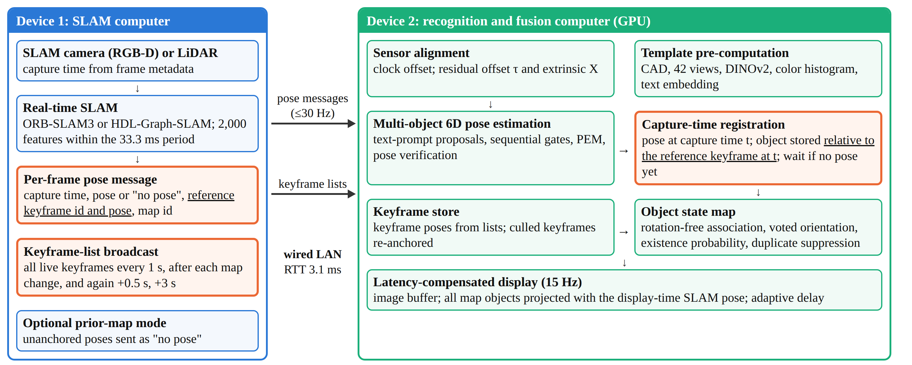
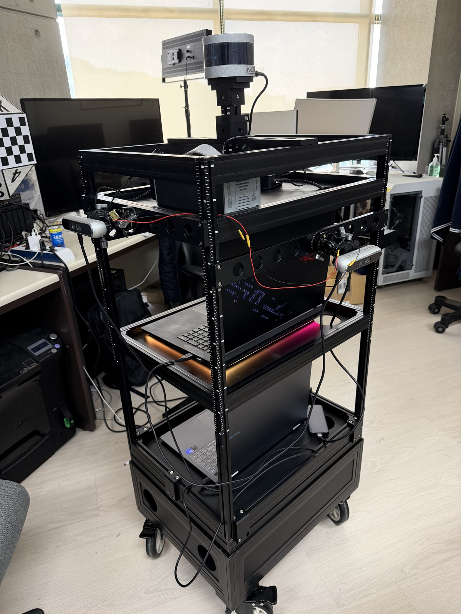
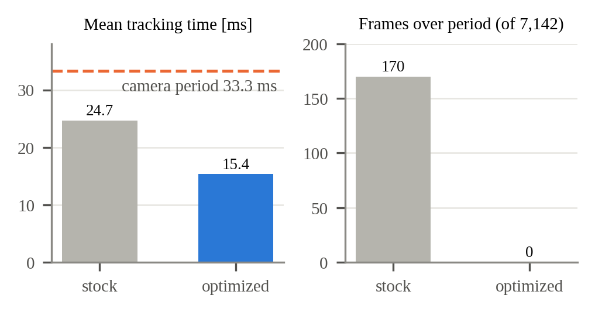
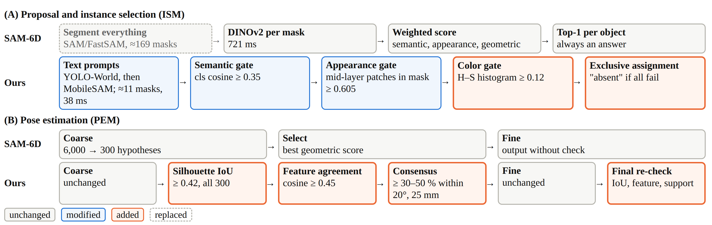
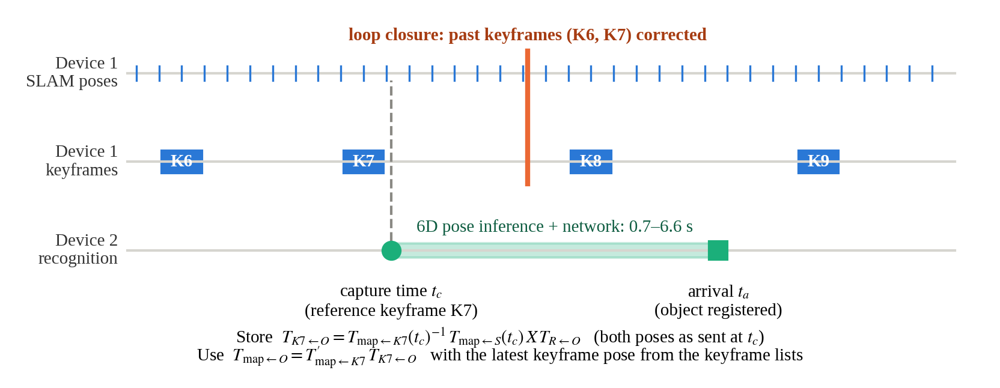
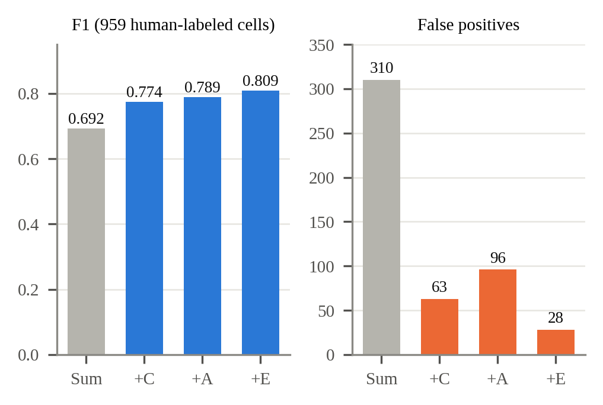
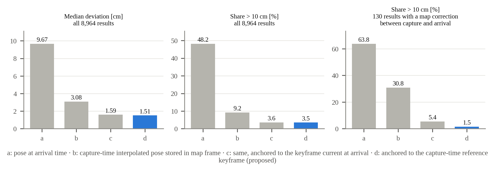
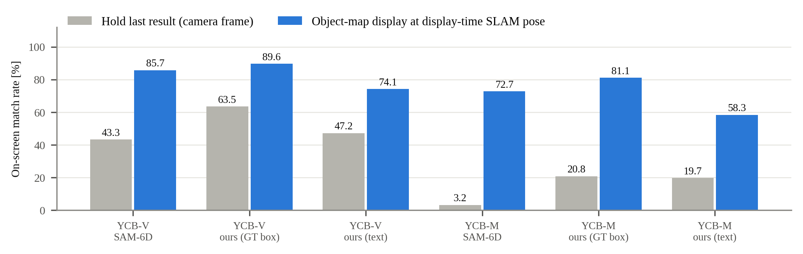

# Capture-Time Keyframe Anchoring: Building a Persistent Object State Map from Asynchronous SLAM and Zero-Shot 6D Object Pose Estimation

**Draft v0.1 (2026-10-03) — target: ETRI Journal (Regular Paper)**
*ETRI Journal uses double-anonymous review: author names, affiliation and acknowledgment go on the separate title page, not in this manuscript.*

> Drafting notes (remove before submission) are in quoted boxes like this one. Length: ETRI Journal allows 8–10 two-column pages; this draft is estimated at about 12 and needs trimming (candidates: Section 4.1 details, Table 4, parts of Section 6.3). Every number in this draft is taken from the project's measured runs and the patent specification v1.4; items marked **[verify]** still need a source check.

---

## Abstract

Zero-shot 6D pose estimators recognize objects from CAD models alone but take up to seconds per frame. Running them on a second computer keeps SLAM real-time, yet results then arrive 0.7–6.6 s late, from another camera and clock, after loop closure may have corrected the map. We present a two-computer system that turns such late results into a persistent object map. Its core, capture-time keyframe anchoring, streams the reference keyframe of every SLAM pose plus re-sent keyframe lists, and stores each object relative to the keyframe current at image capture. Metadata timestamps with joint offset–extrinsic calibration, a text-prompted, gate-verified SAM-6D, an existence-probability state manager and a latency-compensated display complete the system. On 61 replayed live runs, anchoring cut the median deviation of repeated observations from 9.67 to 1.51 cm, and, when a map correction occurred in flight, the share above 10 cm from 30.8 % to 1.5 %. Indoors, 72 of 74 reappearing objects were re-associated (34 without the map).

**Keywords:** asynchronous sensor fusion, loop closure, object-level mapping, SLAM, zero-shot 6D object pose estimation

---

## 1. Introduction

Service and logistics robots, digital twins and XR applications increasingly need *object-level* maps: a list of the objects in a space, each with a 3D position and orientation in the map frame, kept up to date while the platform moves. Two mature building blocks exist. Visual and LiDAR SLAM systems such as ORB-SLAM3 [1] and HDL-Graph-SLAM [2] estimate camera poses in real time and correct accumulated drift by loop closure and graph optimization. Zero-shot 6D object pose estimators such as SAM-6D [3], FoundPose [4] and GigaPose [5] estimate the pose of an object never seen in training, given only its CAD model.

Combining the two is less straightforward than multiplying two transforms. Zero-shot estimators are slow: SAM-6D segments the whole image into hundreds of proposals and runs about 0.9 s per frame in our setting. If the estimator and SLAM share one computer, SLAM loses its time budget; in our system the pose delivery latency of SLAM rose from 0.04 s to 2.5 s when a heavy process ran on the same computer, and a slower SLAM tracks less reliably and triggers larger map corrections, which move every object registered on the map. Fusion++ [6], which runs recognition and SLAM together, operates at 4–8 Hz overall.

Separating SLAM and recognition onto two computers keeps SLAM real-time but creates five new problems at once: (i) the two computers have different clocks; (ii) the two cameras have different poses; (iii) a recognition result arrives hundreds of milliseconds to seconds after its image was captured, so registering it with the camera pose at *arrival* displaces the object by the platform motion in between; (iv) while the result is in flight, SLAM may correct past keyframe poses by loop closure or remove (cull) keyframes; and (v) depending on network load, the SLAM pose for the capture time may itself arrive *after* the recognition result.

Problem (iv) is the least obvious. Interpolating the SLAM trajectory at the capture timestamp (as a timestamped transform buffer such as ROS tf2 [7] does) solves (iii) but stores the object in the map frame; once loop closure moves the trajectory, the stored object stays behind. Anchoring virtual content to keyframes is known in AR, and ORB-SLAM3 itself moves map points with their reference keyframes, but in both cases the anchored entity is created *now*, from the current frame. For a result that was computed seconds after its image, the question of *which keyframe, at which time,* has not been addressed.

This paper makes the following contributions:

1. **Capture-time keyframe anchoring.** A protocol in which the SLAM computer sends, with every pose, the reference keyframe used to track that frame and re-sends the full keyframe list periodically, right after each map change, and again 0.5 s and 3 s later; the recognition computer stores each late result relative to the reference keyframe *at capture time*, waits when the matching pose has not yet arrived, and re-anchors objects of culled keyframes. On 61 replayed live runs, this reduces the deviation of repeated observations from 9.67 cm (arrival-time pose) to 1.51 cm, and the share above 10 cm among map-corrected cases from 30.8 % to 1.5 % (Section 6.2).
2. **Cross-device time and extrinsic alignment.** Capture timestamps are read from per-frame camera metadata rather than recorder association stamps (which drifted by −2.1 to +3.8 s), converted between computers by a round-trip clock offset, and the remaining offset is estimated jointly with the camera–camera extrinsic in a three-stage calibration from planar motion (Section 4.1).
3. **A real-time, verifiable zero-shot recognizer.** SAM-6D is modified with text-prompted proposals and a sequence of rejection gates (semantic, appearance, colour, exclusive assignment) followed by pose verification (silhouette overlap, feature agreement, consensus), which can answer "object absent". Per-frame time drops from 1,445 ms to 377 ms and false positives from 310 to 28 (Section 4.3).
4. **A persistent object state map and latency-compensated display** that remember objects outside the view, re-associate them on return, suppress duplicates caused by misreadings, and draw all map objects at 15 Hz with the display-time SLAM pose (Sections 4.4–4.5).
5. **An evaluation** on YCB-Video [8], YCB-M [9] and indoor runs on a cart with two hardware-synchronized RGB-D cameras and a LiDAR, including the system's limitations (occlusion, wrong loop closures).

## 2. Related Work

**Zero-shot 6D object pose estimation.** CNOS [10] and SAM-6D [3] segment the image with SAM [11] or FastSAM [12], describe each proposal with DINOv2 [13] features and match it against templates rendered from the CAD model; SAM-6D then estimates the pose by two-stage point matching. FoundPose [4], GigaPose [5] and FoundationPose [14] follow related template- or model-based designs. These methods report camera-frame poses for single images; they do not maintain objects over time, and their proposal stage dominates run time. Open-vocabulary detectors such as YOLO-World [15] produce class-level boxes from text prompts in tens of milliseconds, which we use as a proposal generator in front of instance-level verification.

**Object SLAM and object maps.** SLAM++ [16], CubeSLAM [17] and QuadricSLAM [18] use objects as landmarks to improve camera localization, with pre-trained detectors or category-level shapes. CosyPose [19] aggregates multi-view object poses into a consistent scene. Fusion++ [6], POCD [20] and Khronos [21] build object-level maps with existence or change models. Our work is complementary: we do not feed objects back into SLAM; we keep SLAM unmodified in its estimation and make CAD-defined objects follow its corrections.

**Asynchronous perception.** MaskFusion [22] runs instance segmentation asynchronously to SLAM on a separate GPU of the same computer; one camera and one clock are assumed. Edge-assisted mobile AR [23] offloads detection to a server and compensates the returned boxes by tracking in the image, without a map. Timestamped transform libraries [7] interpolate poses at a requested time but do not revisit stored results after the trajectory is optimized. To our knowledge, no prior system binds late, off-device recognition results to the SLAM keyframe of their capture time so that the object map absorbs corrections made while the result was in flight.

## 3. System Overview

Figure 1 shows the system. **Device 1** runs SLAM with its own sensor: an RGB-D camera for ORB-SLAM3 or a LiDAR for HDL-Graph-SLAM. **Device 2** has a GPU and a second RGB-D camera for recognition. The two computers are connected by wired LAN. The two cameras are hardware-synchronized (master/slave exposure trigger) on a moving cart (Fig. 2).

**Fig. 1.** System overview. Highlighted blocks carry the capture-time keyframe anchoring: the per-frame pose message with the reference keyframe, the keyframe-list broadcast, and capture-time registration on Device 2.

**Fig. 2.** Data-collection cart: two Intel RealSense D455f RGB-D cameras (640×480, 30 Hz) connected by a sync cable, and a Velodyne VLP-16 LiDAR (10 Hz).

Notation: $T_{A\leftarrow B}$ maps coordinates from frame B to frame A. $X = T_{S\leftarrow R}$ is the extrinsic from the recognition camera R to the SLAM camera S. For an image captured at time $t$, the 6D estimator outputs $T_{R\leftarrow O}$ for object O.

## 4. Method

### 4.1 Time and extrinsic alignment

**Capture timestamps.** We use the timestamp each camera attaches to every frame's metadata (for RealSense, the hardware clock mapped to the host clock, or the host arrival time), read immediately on receipt in live operation and from the recording in replay. Recorder association stamps were unusable: because of frame drops (100–200 ms gaps), they deviated from the true frame times by −2.1 s to +3.8 s depending on the segment, while the metadata timestamps agreed with the frame times within 1.4 ms (SLAM camera) and 0.1 ms (recognition camera).

**Clock offset.** Device 2 sends a UDP packet at $t_0$, Device 1 replies with its clock $t_r$, and Device 2 receives it at $t_1$:

$$\Delta = t_r - \bigl(t_0 + (t_1 - t_0)/2\bigr), \tag{1}$$

taking the median over repetitions. The error from assuming symmetric delay is bounded by half the round-trip time; the measured RTT was 3.08 ms (error ≤ 1.54 ms, well below the 20 ms colour–depth pairing tolerance). All timestamps are expressed on the Device 1 clock.

**Residual offset and extrinsic.** A residual offset $\tau$ remains (different time bases, transport delay). We estimate $\tau$ together with $X$ from a calibration drive in which both cameras run their own visual odometry, in three stages chosen by observability under planar motion:
1. *Floor tilt:* the normal of the plane fitted to each camera's trajectory gives gravity (out-of-plane RMS 0.60 cm and 0.20 cm).
2. *Planar translation and yaw with $\tau$:* relative-motion pairs over 0.5–4 s windows form $A X = X B$ constraints; $X$ and $\tau$ are found by a Huber-weighted fit, scanning $\tau$ (e.g. ±60 ms in 2 ms steps). With 14,592 pairs the median residual was 0.41 cm.
3. *Height difference:* unobservable from planar motion, it is measured from the floor plane in each depth image (1.107 m and 0.998 m).

$\tau$ was 0 to +4 ms in three calibration drives, −48 ms in another recording, and 0.196 s in a recording whose recorder clock was mis-set; all were recovered by the same search. The same procedure gives the LiDAR–camera extrinsic (3,122 pairs, residual 1.18 cm / 0.11°); composing camera–camera and LiDAR–camera estimates agreed with the direct estimate within 0.46 cm / 0.04°.

### 4.2 SLAM side: real-time tracking and keyframe streaming

**Real-time budget.** Increasing ORB-SLAM3's features to 2,000 per frame raised the mean tracking time to 24.7 ms, and 170 of 7,142 frames exceeded the 33.3 ms camera period. Profiling showed the bottleneck was overhead proportional to the number of map points, not feature extraction or optimization iterations. Seven result-preserving changes (removing per-frame image copies for a disabled viewer, in-place aggregation of map-point observations, removing allocations in the feature-grid search, POPCNT-based descriptor distance, a single lock instead of four for map-point queries, a smaller distribution-tree reservation, and parallel per-pyramid-level extraction with four threads) reduced the mean to 15.4 ms and over-period frames to 0, while the loop-return error of an eight-shaped drive stayed at 26.6 → 26.5 cm (Fig. 3). When processing falls behind, the newest frame is processed and the number of skipped frames is reported.

**Fig. 3.** ORB-SLAM3 with 2,000 features before and after the result-preserving optimizations.

**Pose message.** For every frame, Device 1 sends the capture timestamp, tracking state, $T_{\mathrm{map}\leftarrow S}$ (or *no pose* when tracking failed or, in prior-map mode, when the pose is not anchored to the map), the id and pose $T_{\mathrm{map}\leftarrow K}$ of the reference keyframe used to track the frame, the map id, a map-changed flag, tracking time and skipped frames. The pose and reference keyframe are read in the tracking thread right after tracking, so they refer to the same instant. ORB-SLAM3 does not expose this information; we added read-only accessors. The median pose delivery latency was 18.1 ms.

**Keyframe lists.** Loop closure in ORB-SLAM3 is followed by a global bundle adjustment that finishes seconds later in another thread, so a single list sent right after the loop misses the final correction. Device 1 therefore sends the list of all live keyframes (id and 3×4 pose; about 14 kB per 100 keyframes) (a) every 1 s, (b) right after a frame flagged with a map change, and (c) again 0.5 s and 3 s later, merging coincident sends. A keyframe missing from the list is interpreted as culled, so no separate culling message is needed. For HDL-Graph-SLAM we added a publisher of all graph-optimized keyframe poses, so the same anchoring applies to LiDAR SLAM.

### 4.3 Text-prompted, gate-verified zero-shot 6D pose estimation

Figure 4 compares our recognizer with SAM-6D stage by stage. Templates are rendered from 42 viewpoints (subdivided icosahedron). In addition to SAM-6D's DINOv2 class token (384-D) and pose features (256-D), we precompute mid-layer DINOv2 patch features, a 16×8 hue–saturation histogram with a render-to-camera colour correction applied *on the template side* (hue shift, saturation gain, optional per-object hue offset), and one text embedding per object; a signature triggers recomputation only when templates or corrections change. Adding an object requires only its CAD model and one precomputation pass.

**Fig. 4.** Recognizer compared with SAM-6D. Proposal generation and gating replace the weighted-sum scoring of the instance segmentation model (ISM); pose verification is inserted before and after refinement in the pose estimation model (PEM).

**Proposals.** All object prompts (e.g., "milk carton", "yellow can", "brown bear doll") are given to YOLO-World [15] in a single pass; boxes above a low confidence (0.02) are kept, near-identical boxes (IoU ≥ 0.95) are merged, and a box matching several prompts is kept for all of them. MobileSAM [24] then segments the object inside each box. Proposals per frame fell from 169 to 11 and proposal feature extraction from 721 ms to 38 ms; on 193 frames without target objects, frames with false detections fell from 120 to 2 (recall on 118 frames with targets: 0.949 → 0.915).

**Sequential gates.** Instead of a weighted sum followed by top-1 per object, each proposal must pass, in order: (1) *semantic* — mean cosine of the 5 best template class tokens ≥ 0.35; (2) *appearance* — mean best-match cosine of mid-layer (blocks 2 and 9) patch features *inside the mask* ≥ 0.605; (3) *colour* — Bhattacharyya similarity of the hue–saturation histogram (value channel excluded for illumination robustness) ≥ 0.12; (4) *exclusive assignment* — a box goes to one object only; for objects whose templates are mutually similar (class-token cosine ≥ 0.60) the colour score decides, and of two accepted masks with IoU ≥ 0.9 only the higher-scoring is kept. An object with no surviving proposal is reported absent. SAM-6D's ISM geometric score is dropped; geometry is checked by pose verification instead.

**Pose verification.** PEM's coarse stage (6,000 → 300 hypotheses, 2,048 observed and 1,024 model points) and fine stage are unchanged. Before refinement we apply to all 300 hypotheses: (1) silhouette IoU between the projected CAD points and the mask ≥ 0.42; (2) mean feature cosine between observed points and the corresponding CAD points ≥ 0.45; (3) consensus — at least 30–50 % of survivors within 20° and 25 mm of one pose. The refined pose is re-checked by (1), (2) and a minimum of observed support points near the object.

### 4.4 Object state map

**Capture-time registration.** For a result whose image was captured at $t$,

$$T_{\mathrm{map}\leftarrow O} = T_{\mathrm{map}\leftarrow S}(t)\; X\; T_{R\leftarrow O}, \tag{2}$$

where $T_{\mathrm{map}\leftarrow S}(t)$ interpolates the two SLAM poses bracketing $t$ (SLERP for rotation, linear for translation); detections whose bracketing poses are more than 0.25 s apart are discarded. The object is stored relative to the reference keyframe $K$ of the bracketing pose nearest to $t$, using that keyframe's pose *as sent with the pose message*:

$$T_{K\leftarrow O} = T_{\mathrm{map}\leftarrow K}(t)^{-1}\; T_{\mathrm{map}\leftarrow O}, \tag{3}$$

and is always used through the latest keyframe pose $T'$ from the keyframe lists:

$$T'_{\mathrm{map}\leftarrow O} = T'_{\mathrm{map}\leftarrow K}\; T_{K\leftarrow O}. \tag{4}$$

Because $T_{\mathrm{map}\leftarrow S}(t)$ and $T_{\mathrm{map}\leftarrow K}(t)$ come from the same tracking state, Eq. (3) is invariant to any correction applied to $K$ after $t$, including corrections made while the result was in flight (Fig. 5). Anchoring to the keyframe current at *arrival* instead mixes a pre-correction camera pose with a post-correction keyframe pose. If the bracketing SLAM poses have not arrived, the result waits in a queue (up to 20 s) — results may arrive before their SLAM poses under network load. If $K$ is culled, the object is re-anchored to the nearest live keyframe of the previous list. Results captured within ±1 s of a loop closure are displayed but do not replace the reference pose of an already stable object. The object map can be rebuilt from all recorded observations whenever keyframe poses change (75 ms for 308 frames).

**Fig. 5.** Capture-time keyframe anchoring. The result for the image captured at $t_c$ arrives after a loop closure has corrected K7. Storing the object relative to K7 with the pose pair sent at $t_c$ keeps it consistent with the corrected map.

**Association and update.** A new detection is associated with an existing object of the same class within 0.15 m (three times wider for tentative objects), greedily nearest-first and one-to-one per frame. Rotation is deliberately excluded from association because zero-shot estimators often return 180°-flipped poses for box-like objects, which would split one object into two. Position is the running mean of observations (with a 5 % floor on the new-observation weight so that the estimate keeps following the map); orientation is the mode of observations clustered within 30° (or the medoid of the largest cluster among the last five), after aligning rotationally symmetric objects (cans, mugs) to the symmetry-equivalent rotation nearest to the reference.

**Existence probability.** Each object has an existence probability $p$ and a state: *tentative* (starts at $p=0.7$, hidden), *active* (≥ 2 observations and $p>0.6$), *lost* ($p<0.3$), *remembered* ($p<0.05$ with ≥ 5 observations) or *deleted*. A miss is counted only if the object projects inside the current view and is within the detector's range (e.g., 1.5–2.2 m for small objects); then $p$ is updated by Bayes' rule with a detection probability of 0.08–0.5 and a false-alarm rate of 0.01–0.1. An object is deleted as *removed* when the depth image shows free space at least 15 cm behind its location over 95 % of a 15 cm window in three consecutive frames. Lost and remembered objects remain association candidates, so a returning object regains its id. Finally, when two objects of the same class exist and one has at least five times the observations of the other, the smaller one is marked as a duplicate and hidden from output (but kept, so it can return if the ratio reverses). This targets high-confidence misreadings (scores 0.96–1.00) that score thresholds cannot remove.

### 4.5 Latency-compensated display

Recognition delivers a few frames per second, late. Device 2 keeps the last 120 recognition-camera images with capture timestamps. At 15 Hz, it sets the display time to the newest image time minus a display delay, picks the buffered image at that time, interpolates the SLAM pose at that time, and projects *all* objects in the map into that image (thick boxes for objects observed in that frame, thin boxes with an age label otherwise). Image and boxes are therefore consistent; only the display as a whole is delayed. The delay adapts to SLAM pose arrival: the 90th percentile of recent arrival delay plus a 0.15 s margin, bounded to 0.3–3 s, increased immediately and decreased by 2 % per step. The delay applies to the display only; the map used by a robot is updated with the newest results and keyframe poses.

## 5. Experimental Setup

**Hardware and software.** The cart (Fig. 2) carries two RealSense D455f cameras and a VLP-16. Experiments replay recorded sessions in real time (1×) on two computers connected by wired LAN, Device 1 (SLAM) and Device 2 (recognition) each replaying its own sensor stream; a common start time is agreed after both sides report ready, and a monotonic clock slewed toward system time keeps the replay rate consistent. Device 1 is an Apple M4 Pro laptop running native ORB-SLAM3; Device 2 is a laptop with an Intel i9-12900HK and an NVIDIA RTX 3080 Ti Laptop GPU **[verify per run]**. Single-image comparisons (Table 1) were run on an NVIDIA RTX 5090 **[verify]**. In all runs, SLAM builds its map from scratch during the run (no prior map).

**Data.** (i) *YCB-Video* [8]: 12 test videos; 900 BOP [25] test images for single-image evaluation and all 20,738 frames played at 30 fps for live evaluation. (ii) *YCB-M* [9]: 7,252 images from one camera over 32 static scenes recorded by a robot arm; 925 images (every 8th) for single-image evaluation; since timestamps are not provided, playback speed is set from the inter-frame camera motion (about 13 mm). (iii) *Indoor runs*: eight objects (milk carton, chocolate snack box, deodorizer spray, mug, saffron jug, rice-drink can, teddy bear, dinosaur doll) placed in indoor spaces; *dark indoor figure-eight* (284 s, dimmed lighting), *91 s indoor run* (1,883 frames, 96 map corrections), *bright indoor-hall figure-eight* (151 s) and *large figure-eight* (315 s). Indoor runs have no ground-truth object poses; we use consistency of repeated observations and pseudo ground truth built from a separately optimized SLAM trajectory of the recognition camera (objects clustered within 5 cm / 20°).

**Metrics.** A pose is *correct* if ADD-S < 10 % of the object diameter. *Found* = share of visible ground-truth objects with a correct answer; *precision of answers* = share of answers that are correct; ADD-S AUC (0–10 cm); BOP AR (VSD, MSSD, MSPD) by the official toolkit. *On-screen match rate* = share of visible ground-truth objects whose displayed box is correct in each frame. *Deviation* = distance of an observation, registered in the final map, from the median position of its object.

## 6. Results

### 6.1 Recognition

Table 1 compares SAM-6D (official code, FastSAM proposals) with our recognizer using text prompts, and with ground-truth boxes substituted for the text detector to isolate the effect of proposal recall. Our recognizer answers correctly in 94–99 % of its answers on all three datasets, produces at most one seventh of SAM-6D's wrong answers per image, and is 3.7–5.6× faster. On the indoor runs it also achieves higher BOP AR (37.9 vs 33.3). On YCB, however, the text detector misses objects, so recall and AR are lower than SAM-6D.

**Table 1.** Single-image comparison (no SLAM; one answer per object per image).

| Dataset | Method | Found | Answers correct | Wrong / image | ADD-S AUC | BOP AR | Time (median) |
|---|---|---|---|---|---|---|---|
| YCB-V (900) | SAM-6D | **90.2 %** | 90.9 % | 0.41 | **90.0** | **78.7** | 1,613 ms |
| | Ours (text) | 63.2 % | 98.6 % | 0.04 | 62.0 | 57.8 | **433 ms** |
| | Ours (GT box) | 80.9 % | **100.0 %** | **0.00** | 79.0 | 74.5 | 528 ms |
| YCB-M (925) | SAM-6D | **79.1 %** | 80.0 % | 1.01 | **81.4** | **52.3** | 2,197 ms |
| | Ours (text) | 42.6 % | 94.0 % | 0.14 | 41.9 | 29.7 | **395 ms** |
| | Ours (GT box) | 65.8 % | **95.9 %** | 0.14 | 64.2 | 46.6 | 519 ms |
| Indoor (917) | SAM-6D | **52.4 %** | 43.0 % | 3.39 | **53.6** | 33.3 | 2,884 ms |
| | Ours (text) | 51.8 % | 94.7 % | 0.14 | 50.5 | **37.9** | 557 ms |
| | Ours (GT box) | 52.2 % | **97.6 %** | **0.06** | 49.4 | 37.2 | **497 ms** |

Figure 6 isolates the gates on 959 human-labelled (frame, object) cells from an indoor run. The colour gate removes most false positives (310 → 63); the mid-layer appearance gate raises F1 but adds false positives (96), which exclusive assignment removes (28). With per-object hue correction and colour-based assignment, F1 reached 0.841. Of the remaining 28 false positives, 24 are the chocolate box assigned to a brown parcel box. Pose verification accepted 288 and rejected 103 of 391 results in one run; each rejected pose would have been output by SAM-6D's top-1 selection. In live YCB-Video playback, the share of processed frames with correct answers rose from 90.7 % to 99.2 %. End-to-end time from proposal to verified pose fell from 1,445 ms to 377 ms in real conditions.

**Fig. 6.** Effect of adding the gates one at a time (indoor run, 959 human-labelled cells).

### 6.2 Capture-time keyframe anchoring

We replayed 61 recorded live ORB-SLAM3 runs (three indoor recordings; 8,964 recognition results; capture-to-arrival latency median 1.45 s, max 6.6 s) with SLAM poses, keyframe updates and results in their actual arrival order, and registered the same results in four ways: (a) camera pose at arrival; (b) capture-time interpolated pose, stored in the map frame (tf2-style); (c) as (b), but anchored to the keyframe current at arrival; (d) proposed, anchored to the capture-time reference keyframe. Deviation is measured in the final map after all corrections.

**Table 2.** Deviation of repeated observations in the final map.

| Registration | Median | 90th pct. | > 10 cm | 90th pct. (130 map-corrected) | > 10 cm (130 map-corrected) |
|---|---|---|---|---|---|
| (a) arrival-time pose | 9.67 cm | 31.94 cm | 48.2 % | 294.0 cm | 63.8 % |
| (b) capture-time, map frame | 3.08 cm | 9.70 cm | 9.2 % | 299.8 cm | 30.8 % |
| (c) capture-time, arrival-time keyframe | 1.59 cm | 5.36 cm | 3.6 % | 7.80 cm | 5.4 % |
| (d) capture-time keyframe (proposed) | **1.51 cm** | **5.21 cm** | **3.5 %** | **5.81 cm** | **1.5 %** |

Using the capture time removes most of the error (a→b). Without corrections in flight, (c) and (d) are similar, but among the 130 results whose wait spanned a map correction larger than 2 cm, only (d) stays consistent (Fig. 7); in the 18 runs of the dark indoor figure-eight, the median for these cases was 5.02 cm for (c) and 0.58 cm for (d). Across a loop closure in the dark indoor figure-eight, the position difference of the same object before and after the loop fell from 5.4 cm (map-frame storage) to 0.8 cm. In the 91 s run, 96 map corrections of up to 35 cm occurred over 92 keyframes; with anchoring disabled, the milk carton, deodorizer and chocolate box left copies 30–32 cm away, giving 11 locations for 8 objects, whereas with anchoring the 8 objects moved with the map. The waiting queue raised the share of results placed on the map from 46 % to 100 %.

**Fig. 7.** Registration strategies (a)–(d) on 61 replayed live runs.

### 6.3 Persistent object memory

**Re-association.** In two indoor runs (bright hall figure-eight, 151 s; 91 s indoor run), 74 events occurred in which an object left the view or was occluded and reappeared (39 out of view, median absence 22 s and 7 s). 72 were re-associated with the same map object; associating in camera coordinates without the map succeeded for 34. After each run there were no same-class duplicates in the map, versus 17–19 without the map (Table 3). The two failures occurred before a loop closure, when accumulated drift displaced the object by 31–33 cm, beyond the 0.15 m association radius. On YCB-M (101 reappearances after ≥ 1 s absence), map-based association succeeded in 91.8–97.9 % of eligible cases, 3–7 points above camera-frame association, and our recognizer never re-registered a returning object as a new one.

**Table 3.** Re-association in indoor runs.

| | Bright hall figure-eight | 91 s indoor run |
|---|---|---|
| Duration | 151 s | 91 s |
| Reappearances (out of view) | 35 (18) | 39 (21) |
| Re-associated, object map | **35/35** | **37/39** |
| Re-associated, no map | 22/35 | 12/39 |
| Object ids created (8 objects), object map / no map | **8** / 51 | **10** / 68 |
| Same-class duplicates after run, object map / no map | **0** / 17 | **0** / 19 |

**Orientation and duplicates.** Majority-vote orientation reduced the share of displays off by more than 20° or 50 mm from 23.9 % (mean orientation) to 9.3 %; for the mug, 19 consistent answers outvoted 9 flipped ones. Duplicate suppression hid misreadings about 1.8 m from the true object with observation ratios 65:3, 72:3 and 68:4, without changing the display of correct objects. Range-aware miss counting raised the display ratio of the small mug and can in the large figure-eight with HDL-Graph-SLAM from 37 %/46 % to 83 %/82 %; previously they were deleted within 50 s when viewed from 2–4 m, although they are only detected within 0.5–0.6 m.

**Live YCB-Video map.** With the same SLAM and map, SAM-6D results produced 8 duplicates over 12 scenes and a maximum position error of 85.1 mm; our recognizer produced none (Table 4). Wrongly drawn boxes fell from 0.266 to 0.001 per frame.

**Table 4.** Final object maps, YCB-Video live playback (12 scenes, 55 objects).

| | SAM-6D | Ours (GT box) | Ours (text) |
|---|---|---|---|
| Registered / GT objects | 55/55 | 51/55 | 42/55 |
| Duplicates | 8 | **0** | **0** |
| Position error median / 90 % / max | 7.1 / 23.5 / 85.1 mm | **5.2 / 9.5 / 23.8 mm** | 5.4 / 9.3 / 76.6 mm |
| Wrong boxes per frame | 0.266 | **0.001** | **0.001** |

### 6.4 Latency-compensated display

Figure 8 compares holding the last result in camera coordinates with drawing the object map at the display-time SLAM pose. The match rate rises for every recognizer and dataset; the effect grows with recognizer latency: on YCB-M, where SAM-6D (2.0 s per image) processes only 8 % of frames, it rises from 3.2 % to 72.7 %. With the adaptive delay, the share of display frames without a SLAM pose to interpolate fell from 100 % to 0 % under high network delay. In the 91 s indoor run, recognition ran at 3.2 images/s with a median result latency of 0.70 s, while the display was updated at 15 Hz and SLAM tracked all 1,883 input frames (the recording averages 20.7 fps due to camera-side drops).

**Fig. 8.** On-screen match rate on YCB-Video and YCB-M.

### 6.5 Limitations

*Occlusion.* For objects 30–50 % visible, SAM-6D found 46 % on YCB-Video but our recognizer only 3%: occluders inside the box lower the appearance scores and small silhouettes fail the overlap threshold. On well-visible objects (≥ 90 %) in the indoor runs, our recognizer found 75 % vs 70 %. Text prompts also miss some objects (e.g., a black clamp, a foam block), and texture-less objects (bowl, wooden block) fail the gates even with ground-truth boxes. *Wrong loop closures.* Anchoring follows SLAM corrections, including wrong ones: in 40 runs of the large figure-eight with identical input and settings, two loop closures damaged an otherwise accurate map (17.0 and 54.4 cm median deviation against a LiDAR scan-matching reference; the latter increased displayed objects from 8 to 13), while 34 runs agreed with the reference within 2.1–2.6 cm. Replaying keyframe updates only up to the damaging correction restored 2.1–2.5 cm, indicating a SLAM-side failure, which none of five candidate indicators (correction size, interval, etc.) predicted. *Scenes with several objects of one class* were not evaluated.

## 7. Discussion

The results separate three effects that are often conflated. First, *which time* is used: replacing arrival time with capture time accounts for most of the improvement (9.67 → 3.08 cm). Second, *which frame* stores the object: keyframe-relative storage is needed when SLAM corrects its past, and the benefit concentrates in exactly the cases where a correction falls inside the recognition latency (30.8 → 1.5 % above 10 cm). Third, *which keyframe*: the arrival-time keyframe is adequate most of the time but fails when the correction happens in flight, because it pairs a pre-correction camera pose with a post-correction keyframe pose. Since zero-shot recognizers are slow and their latency is variable, this third case is not rare in practice: in our 61 runs it occurred 130 times.

The design keeps SLAM's estimation unchanged; the SLAM side only exposes information it already has (reference keyframe and keyframe poses) and schedules its transmission so that delayed global optimization is not missed. This makes the approach applicable to other keyframe- or graph-based SLAM systems — we applied it to both a visual (ORB-SLAM3) and a LiDAR (HDL-Graph-SLAM) system — and to other recognizers that output camera-frame 6D poses.

## 8. Conclusion

We presented a two-computer system that keeps SLAM real-time and nevertheless places late zero-shot 6D pose estimates correctly in the SLAM map. Capture-time keyframe anchoring, supported by keyframe streaming, metadata timestamps with joint offset/extrinsic calibration, a gate-verified recognizer, an existence-probability state manager and a latency-compensated display, produced consistent object maps under loop closure, re-associated objects after long absences, and kept on-screen boxes aligned despite seconds of recognition latency. Future work includes occlusion-aware verification, recovering objects missed by the text detector through template matching, detecting and rolling back wrong loop closures, and scenes with multiple instances per class.

---

## Acknowledgment

*[Funding: project name and grant number to be added.]*

## Conflict of Interest

*[To be confirmed; note the related Korean patent application if filed.]*

## References

> Check every entry against the publisher record before submission. ETRI Journal uses numbered references in order of citation.

[1] C. Campos, R. Elvira, J. J. G. Rodríguez, J. M. M. Montiel, and J. D. Tardós, "ORB-SLAM3: An accurate open-source library for visual, visual–inertial, and multimap SLAM," *IEEE Trans. Robot.*, vol. 37, no. 6, pp. 1874–1890, 2021.
[2] K. Koide, J. Miura, and E. Menegatti, "A portable three-dimensional LIDAR-based system for long-term and wide-area people behavior measurement," *Int. J. Adv. Robot. Syst.*, vol. 16, no. 2, 2019.
[3] J. Lin, L. Liu, D. Lu, and K. Jia, "SAM-6D: Segment anything model meets zero-shot 6D object pose estimation," in *Proc. IEEE/CVF CVPR*, 2024, pp. 27906–27916.
[4] E. P. Örnek, Y. Labbé, B. Tekin, L. Ma, C. Keskin, C. Forster, and T. Hodaň, "FoundPose: Unseen object pose estimation with foundation features," in *Proc. ECCV*, 2024.
[5] V. N. Nguyen, T. Groueix, M. Salzmann, and V. Lepetit, "GigaPose: Fast and robust novel object pose estimation via one correspondence," in *Proc. IEEE/CVF CVPR*, 2024.
[6] J. McCormac, R. Clark, M. Bloesch, A. J. Davison, and S. Leutenegger, "Fusion++: Volumetric object-level SLAM," in *Proc. Int. Conf. 3D Vision (3DV)*, 2018.
[7] T. Foote, "tf: The transform library," in *Proc. IEEE Int. Conf. Technologies for Practical Robot Applications (TePRA)*, 2013.
[8] Y. Xiang, T. Schmidt, V. Narayanan, and D. Fox, "PoseCNN: A convolutional neural network for 6D object pose estimation in cluttered scenes," in *Proc. Robotics: Science and Systems (RSS)*, 2018.
[9] T. Grenzdörffer, M. Günther, and J. Hertzberg, "YCB-M: A multi-camera RGB-D dataset for object recognition and 6DoF pose estimation," in *Proc. IEEE ICRA*, 2020.
[10] V. N. Nguyen, T. Groueix, G. Ponimatkin, V. Lepetit, and T. Hodaň, "CNOS: A strong baseline for CAD-based novel object segmentation," in *Proc. IEEE/CVF ICCV Workshops*, 2023.
[11] A. Kirillov et al., "Segment anything," in *Proc. IEEE/CVF ICCV*, 2023.
[12] X. Zhao et al., "Fast segment anything," arXiv:2306.12156, 2023.
[13] M. Oquab et al., "DINOv2: Learning robust visual features without supervision," *Trans. Mach. Learn. Res.*, 2024.
[14] B. Wen, W. Yang, J. Kautz, and S. Birchfield, "FoundationPose: Unified 6D pose estimation and tracking of novel objects," in *Proc. IEEE/CVF CVPR*, 2024.
[15] T. Cheng, L. Song, Y. Ge, W. Liu, X. Wang, and Y. Shan, "YOLO-World: Real-time open-vocabulary object detection," in *Proc. IEEE/CVF CVPR*, 2024.
[16] R. F. Salas-Moreno, R. A. Newcombe, H. Strasdat, P. H. J. Kelly, and A. J. Davison, "SLAM++: Simultaneous localisation and mapping at the level of objects," in *Proc. IEEE CVPR*, 2013.
[17] S. Yang and S. Scherer, "CubeSLAM: Monocular 3-D object SLAM," *IEEE Trans. Robot.*, vol. 35, no. 4, pp. 925–938, 2019.
[18] L. Nicholson, M. Milford, and N. Sünderhauf, "QuadricSLAM: Dual quadrics from object detections as landmarks in object-oriented SLAM," *IEEE Robot. Autom. Lett.*, vol. 4, no. 1, pp. 1–8, 2019.
[19] Y. Labbé, J. Carpentier, M. Aubry, and J. Sivic, "CosyPose: Consistent multi-view multi-object 6D pose estimation," in *Proc. ECCV*, 2020.
[20] J. Qian, V. Chatrath, J. Yang, J. Servos, A. P. Schoellig, and S. L. Waslander, "POCD: Probabilistic object-level change detection and volumetric mapping in semi-static scenes," in *Proc. Robotics: Science and Systems (RSS)*, 2022.
[21] L. Schmid, M. Abate, Y. Chang, and L. Carlone, "Khronos: A unified approach for spatio-temporal metric-semantic SLAM in dynamic environments," in *Proc. Robotics: Science and Systems (RSS)*, 2024.
[22] M. Rünz, M. Buffier, and L. Agapito, "MaskFusion: Real-time recognition, tracking and reconstruction of multiple moving objects," in *Proc. IEEE ISMAR*, 2018.
[23] L. Liu, H. Li, and M. Gruteser, "Edge assisted real-time object detection for mobile augmented reality," in *Proc. ACM MobiCom*, 2019.
[24] C. Zhang et al., "Faster segment anything: Towards lightweight SAM for mobile applications," arXiv:2306.14289, 2023.
[25] T. Hodaň et al., "BOP: Benchmark for 6D object pose estimation," in *Proc. ECCV*, 2018.
