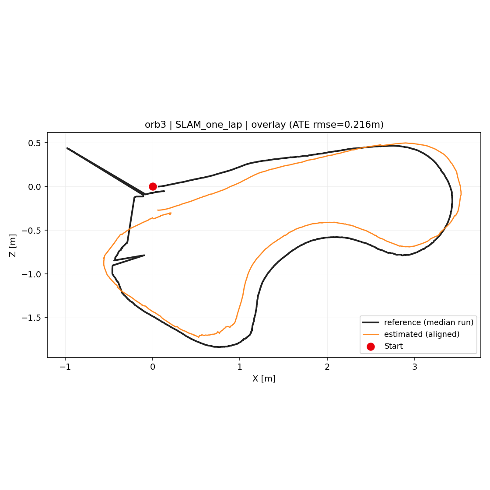
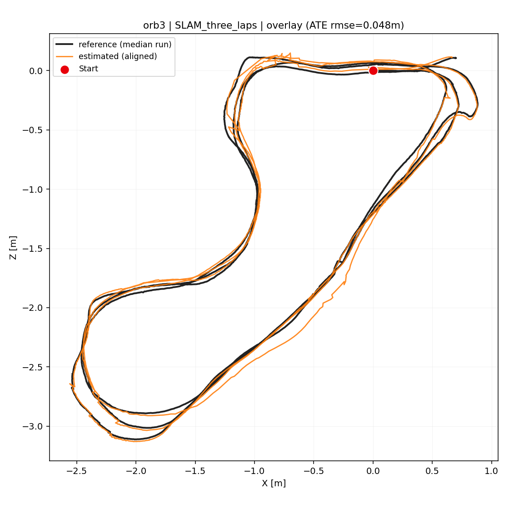
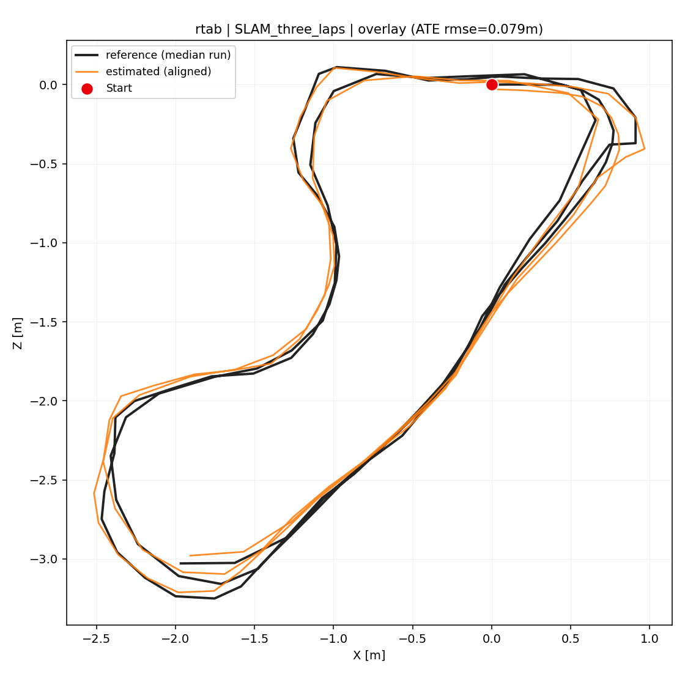

# RGB-D-only Localization 재현성 비교 보고서
**ORB-SLAM3 (easyLC) vs RTAB-Map**

생성일: 2026-06-19 · 작성: bmad-quick-dev · 작업루트: `CLI_environment/`

> ⚠️ **해석의 전제 (반드시 먼저 읽을 것)**
> 본 평가에는 **Ground Truth(GT)가 없습니다.** 기준(reference)도, 이번에 새로 만든 추정도 **모두 동일 bag의 RGB-D-only SLAM 결과**입니다.
> 따라서 아래의 ATE/RPE/회전오차는 "절대 정확도"가 아니라 **동일 파이프라인을 다시 돌렸을 때 기존 결과를 얼마나 재현하는가(run-to-run reproducibility/consistency)** 를 정량화한 값입니다.
> "기준에 가깝다" = "재현성이 높다"로 읽어야 하며, "실제 궤적에 정확하다"는 뜻이 아닙니다.

---

## 1. 실험 목적
`data_slam/`의 4개 ROS2 bag을 **RGB-D 토픽만** 입력하여 ORB-SLAM3와 RTAB-Map으로 다시 위치추정을 수행하고, 기존 저장 결과(`slam_comparison_report/orb3_easyLC/`, `slam_comparison_report/rtab/`)를 기준으로 **이번 RGB-D-only 추정이 얼마나 재현되는지** 정량·시각 평가한다. ORB3는 ORB3 기존 결과와, RTAB는 RTAB 기존 결과와만 비교한다(교차 GT 혼용 금지).

## 2. 사용한 ROS2 bag 데이터 목록

| dataset | Duration | RGB(color) 프레임 | Depth(aligned) 프레임 |
|---|---|---|---|
| SLAM_one_lap | 36.6 s | 1095 | 1047 |
| SLAM_one_lap_back_and_forth | 73.8 s | 2209 | 2140 |
| SLAM_forward_backward_repeat | 87.1 s | 2607 | 2542 |
| SLAM_three_laps | 145.6 s | 4362 | 4195 |

## 3. 사용한 기준 trajectory 파일 목록
기준은 각 dataset×system의 저장된 `run1~run5` 중 **상호 ATE 평균이 최소인 대표(중앙값) 런**을 자동 선택했다(`select_reference.py`). 상세는 [`reference_index.md`](reference_index.md).

| system | dataset | 선택된 기준 런 | 기준 pose 수 |
|---|---|---|---|
| ORB3 | one_lap | run3 | 1046 |
| ORB3 | one_lap_back_and_forth | run3 | 2138 |
| ORB3 | forward_backward_repeat | run2 | 2540 |
| ORB3 | three_laps | run3 | 4195 |
| RTAB | one_lap | run1 | **6 (희소)** |
| RTAB | one_lap_back_and_forth | run4 | 61 |
| RTAB | forward_backward_repeat | run5 | 75 |
| RTAB | three_laps | run4 | 109 |

기준 파일 포맷은 모두 TUM(`t x y z qx qy qz qw`)이며, 공통 CSV(`timestamp,x,y,z,qx,qy,qz,qw`)로 변환해 각 결과 폴더에 `reference_trajectory.csv`로 저장했다.

## 4. ORB-SLAM3 실행 방식
- 환경: `conda activate orbslam3`, 빌드는 **완화(easyLC) loop-closure** 상태(현 세션 빌드 유지).
- 실행: `ORB_OUTPUT_SUBDIR=loc_tmp_orb ORB_BAG_RATE=1.0 ORB_DISABLE_DENSE=1 python3 orbslam_ws/scripts/run_orbslam_four_bags.py <dataset>`
- 입력: RGB `/camera/camera/color/image_raw`, Depth `/camera/camera/aligned_depth_to_color/image_raw` (RGB-D 전용, odom/tf/GT 미입력).
- bag 재생 rate **1.0(실시간)**, 각 dataset 3회 반복.
- 산출: 프레임 단위 CameraTrajectory(TUM) → `estimated_trajectory.csv`.

## 5. RTAB-Map 실행 방식
- 환경: `conda activate rtabmap`.
- 실행: `RTAB_OUTPUT_SUBDIR=loc_tmp_rtab RTAB_BAG_RATE=1.0 python3 rtabmap_ws/scripts/run_rtabmap_four_bags.py <dataset>` (기본 인자 `-d`, rgbd_odometry, 외부 odom 미사용).
- 입력: RGB/Depth/CameraInfo 토픽(아래 6장), rate **1.0**, 각 dataset 3회.
- 산출: 최적화된 **그래프 노드 pose**(format 11) → `estimated_trajectory.csv`. (프레임 단위가 아니라 LinearUpdate/AngularUpdate 임계 충족 시에만 노드 추가 → 포즈 수가 적음)

모든 실행 명령은 각 조건 폴더의 `run_log.txt`에 기록했다.

## 6. RGB-D topic 매칭 결과 (`ros2 bag info` 확인)
- **RGB:** `/camera/camera/color/image_raw` (sensor_msgs/Image)
- **Depth:** `/camera/camera/aligned_depth_to_color/image_raw` (sensor_msgs/Image, color에 정렬됨)
- **CameraInfo:** `/camera/camera/color/camera_info`
- GT/odom/tf 기반 위치 토픽은 입력에서 제외. 전체 토픽 목록은 [`topics_matching.txt`](topics_matching.txt).

## 7. dataset별 ORB-SLAM3 위치추정 비교 결과
정렬: Sim3(스케일 포함, 주지표) + SE3 병기. est↔ref 연관은 **상대시간(t−t0) 선형보간**(밀도 무관).

| dataset | 신규 pose(3런) | 프레임 성공률(중앙)* | ATE rmse Sim3 (중앙±std) | SE3 ATE | 회전오차(중앙) | gaps(3런) | jumps(3런) |
|---|---|---|---|---|---|---|---|
| one_lap | 467 / 755 / 536 | **49%** | **0.216 ± 0.123 m** | 0.24 m | 4.51° | 19/28/58 | 40/30/18 |
| one_lap_back_and_forth | 1052 / 1198 / 994 | 48% | 0.026 ± 0.007 m | 0.026 m | 0.52° | 19/136/17 | 67/26/39 |
| forward_backward_repeat | 1190 / 1526 / 1681 | 59% | 0.071 ± 0.071 m | 0.071 m | 1.38° | 39/162/160 | 42/26/24 |
| three_laps | 2269 / 2146 / 2508 | 52% | 0.048 ± 0.008 m | 0.048 m | 0.82° | 267/37/229 | 71/137/48 |

\* 프레임 성공률 = 신규 pose 수 / bag color 프레임 수(중앙 런 기준).

**관찰:** `back_and_forth`·`three_laps`·`fwd_bwd`는 ATE 0.02~0.07 m로 기존 결과를 매우 잘 재현(저분산). 반면 **`one_lap`은 ATE 0.216 m·std 0.123로 가장 불안정**하다. overlay에서 신규(주황)가 루프를 따라가지만 **좌상단 벽(arm)을 끝까지 잇지 못하고** 시작점 부근에서 끊긴다 — 단일 짧은 1바퀴는 loop closure 트리거가 약해 재현성이 떨어진다는 기존 판단과 일치한다.

## 8. dataset별 RTAB-Map 위치추정 비교 결과

| dataset | 신규 노드(3런) | coverage(중앙) | ATE rmse Sim3 (중앙±std) | SE3 ATE | 회전오차(중앙) | gaps | jumps |
|---|---|---|---|---|---|---|---|
| one_lap | 26 / 11 / 19 | 1.00 | 0.068 ± 0.018 m | **0.337 m** | **26.2°** | 0 | 0 |
| one_lap_back_and_forth | 55 / 57 / 12 | 0.95 | 0.042 ± 0.165 m | 0.047 m | 3.94° | 1/1/0 | 0 |
| forward_backward_repeat | 73 / 33 / 73 | 0.99 | 0.088 ± 0.011 m | 0.090 m | 2.97° | 1 | 0 |
| three_laps | 107 / 96 / 100 | 1.00 | **0.690 ± 0.293 m** | 0.691 m | 4.84° | 1~2 | 0 |

**관찰:**
- `back_and_forth`·`fwd_bwd`는 ATE 0.04~0.09 m로 양호하고 pose jump가 전혀 없다(그래프 최적화로 매끄러움).
- **`three_laps`는 ATE 0.690 m·std 0.293로 매우 불안정** — RTAB-Map이 3바퀴 반복에서 외관 기반 LC를 과하게/다르게 닫으며 run마다 형상이 크게 달라진다(기존 관찰 재확인).
- **`one_lap`은 기준이 6 노드뿐(희소)** → Sim3는 0.068 m로 작아 보이지만 SE3 0.337 m·회전 26.2°로, **스케일 자유도가 6점 정렬을 과적합**한 결과다. 이 칸의 수치는 신뢰도가 낮으며 "기준 자체가 평가에 부적합한 희소도"임을 의미한다(보고서 11·12장 참조).

## 9. localization 성공률 비교
- **ORB3(프레임 단위 트래커):** 신규 런들이 color 프레임의 **약 48~59%**에 대해서만 pose를 출력했다. 반면 기존 기준 런(`orb3_easyLC`)은 ~95%(one_lap 1046/1095)였다. → 본 24세션을 rate=1.0으로 **연속 실행하며 CPU/GPU 부하가 높아 프레임 처리량이 절반 수준으로 떨어진** 실시간 부하 효과로 해석된다. 단, **출력된 pose의 기하 일관성(ATE)은 유지**되었다(one_lap 제외).
- **RTAB(키프레임 그래프):** pose 수는 노드 수이며 프레임-성공률 개념이 다르다. 대신 **시간 coverage 0.95~1.00**(신규가 기준 구간을 거의 전부 포괄)으로, 끊김 없는 추정 범위를 보였다. 단 일부 런(b&f run3=12 노드)은 노드가 적게 생성되었다.

## 10. trajectory drift 비교
- 재현성(=기존 결과 대비 drift) 순위(낮을수록 좋음):
  - **ORB3:** back_and_forth(0.026) < three_laps(0.048) < fwd_bwd(0.071) ≪ one_lap(0.216)
  - **RTAB:** back_and_forth(0.042) < one_lap*(0.068, 단 희소·불신) < fwd_bwd(0.088) ≪ three_laps(0.690)
- **공통:** 반복/왕복 시퀀스(back_and_forth)에서 양쪽 모두 재현성이 가장 좋다. **ORB3는 three_laps에서 매우 안정(0.048)**, **RTAB는 three_laps에서 매우 불안정(0.690)** — 다회 루프에서 두 시스템의 거동이 정반대다.

## 11. tracking lost 구간 분석
- **ORB3:** gaps(프레임 간격 > 3×중앙값)와 jumps가 다수 검출되나, 이는 대부분 **실시간 부하로 인한 프레임 드롭**(전체 pose의 ~50%만 출력)에서 비롯한 간격이며 완전한 트래킹 상실과 동일하지 않다. 다만 `three_laps`의 gaps 267/229처럼 큰 값은 구간적 처리 지연을 시사한다. 시각화는 각 조건의 [`tracking_status.png`].
- **RTAB:** jumps=0, gaps는 노드가 드물게 시작되는 초기 1개 정도 — 그래프 최적화 특성상 급점프가 억제된다. 단 노드 자체가 희소해 "lost"를 프레임 단위로 판정하기 어렵다.

## 12. 기존 결과 대비 RGB-D-only 추정의 유사도(재현성) 요약
- **높음(잘 재현):** ORB3 back_and_forth/three_laps/fwd_bwd(ATE ≤ 0.07 m), RTAB back_and_forth/fwd_bwd(≤ 0.09 m).
- **낮음(재현 불안정):** ORB3 one_lap(0.216 m, 좌상단 벽 미정합), RTAB three_laps(0.690 m, 형상 변동).
- **수치 신뢰 불가:** RTAB one_lap — 기준 6 노드로 Sim3 과적합(SE3 0.337 m·26°). 이 셀은 정성적으로만 사용.
- 핵심 메시지: **RGB-D-only 재현성은 "데이터셋×시스템" 조합에 강하게 의존**하며, 단일 짧은 루프(one_lap)와 다회 루프(three_laps)가 각각 ORB3·RTAB의 약점을 드러낸다.

## 13. RGB-D-only localization 관점: 어느 쪽이 더 안정적인가
- **ORB3 장점:** 프레임 단위 조밀 pose, 반복/다회 루프(b&f·three_laps)에서 재현성·회전 일관성 우수(회전오차 <1°). **단점:** 단일 짧은 루프(one_lap) 취약, 실시간 부하 시 프레임 드롭으로 출력 밀도 저하.
- **RTAB 장점:** 그래프 최적화로 pose jump 0·매끄러운 궤적, 왕복/전후진(b&f·fwd_bwd)에서 견고. **단점:** pose가 희소(노드 기반), 다회 루프(three_laps)에서 LC 거동이 run마다 크게 흔들려 재현성 최악, 짧은 시퀀스는 노드가 너무 적음.
- **종합:** *반복·왕복이 있는 구간*에서는 **ORB3가 더 안정적**(특히 three_laps에서 RTAB 0.690 m vs ORB3 0.048 m). *순간 점프 억제와 궤적 평활성*만 보면 RTAB가 유리하나, **재현성(일관성) 기준으로는 ORB3(easyLC)가 전반적으로 우세**하다. 단 one_lap 같은 단일 짧은 루프는 ORB3도 보강(추가 LC/더 긴 관측) 필요.

## 14. Navigation2 / 후속 3D Map 활용 관점
- **Nav2 즉시 연계:** **RTAB-Map**이 적합 — ROS2 네이티브, 2D occupancy grid·pose graph·relocalization·map serving을 기본 제공하여 Nav2 costmap/localization에 바로 물린다. pose jump 0의 평활 궤적도 제어에 유리.
- **3D Map 품질/시각화:** **ORB3(easyLC) + dense 재투영 맵**이 더 조밀·정밀한 3D 포인트클라우드를 제공(앞선 Pattern-A 결과). 단 Nav2 연계에는 occupancy 변환·localization 노드 등 추가 글루가 필요.
- **권장:** 실내 단일 방·반복 주행 자율주행(Nav2) 파이프라인은 **RTAB-Map을 localization/맵서버 백본**으로 두고, **고밀도 3D 복원·검증용으로 ORB3 dense 맵을 보조**로 쓰는 하이브리드가 현 자산 기준 가장 합리적이다. three_laps처럼 다회 루프가 핵심이라면 RTAB 단독은 재현성 리스크가 있으므로 ORB3 궤적을 교차검증에 병용할 것.

---

### 산출물 인덱스
- 기준 인덱스: `reference_index.md`, `reference_map.json`
- 토픽 매칭: `topics_matching.txt`
- 조건별(8개) 폴더: `{dataset}/{orb3_slam|rtabmap}/` —
  `reference_trajectory.csv`, `estimated_trajectory.csv`, `aligned_estimated_trajectory.csv`,
  `trajectory_metrics.json`, `framewise_error.csv`, `run_log.txt`,
  `top_view_reference.png`, `top_view_estimated.png`, `top_view_overlay.png`,
  `tracking_status.png`, `trajectory_error_plot.png`
- 평가 코드: `../loc_eval/` (`traj_io.py`, `metrics.py`, `select_reference.py`, `eval_condition.py`, `viz.py`, `run_localization_eval.sh`)

### 방법론 한계 (정직성)
1. **GT 부재** → 모든 지표는 재현성이며 절대 정확도가 아니다.
2. **RTAB one_lap 기준 6 노드** → Sim3 과적합, 해당 셀 수치 신뢰 불가.
3. **ORB3 프레임 드롭(~50%)** → 실시간 연속부하 영향. 기준 런(~95%)과 출력 밀도 차이 존재.
4. **상대시간 정렬** → RTAB는 절대 타임스탬프가 run마다 달라 t−t0 정규화 후 보간 연관(rate 1.0 가정).
5. **gaps/jumps 휴리스틱** → 프레임 드롭과 실제 트래킹 상실을 완전히 구분하지 못함(과검출 가능).
