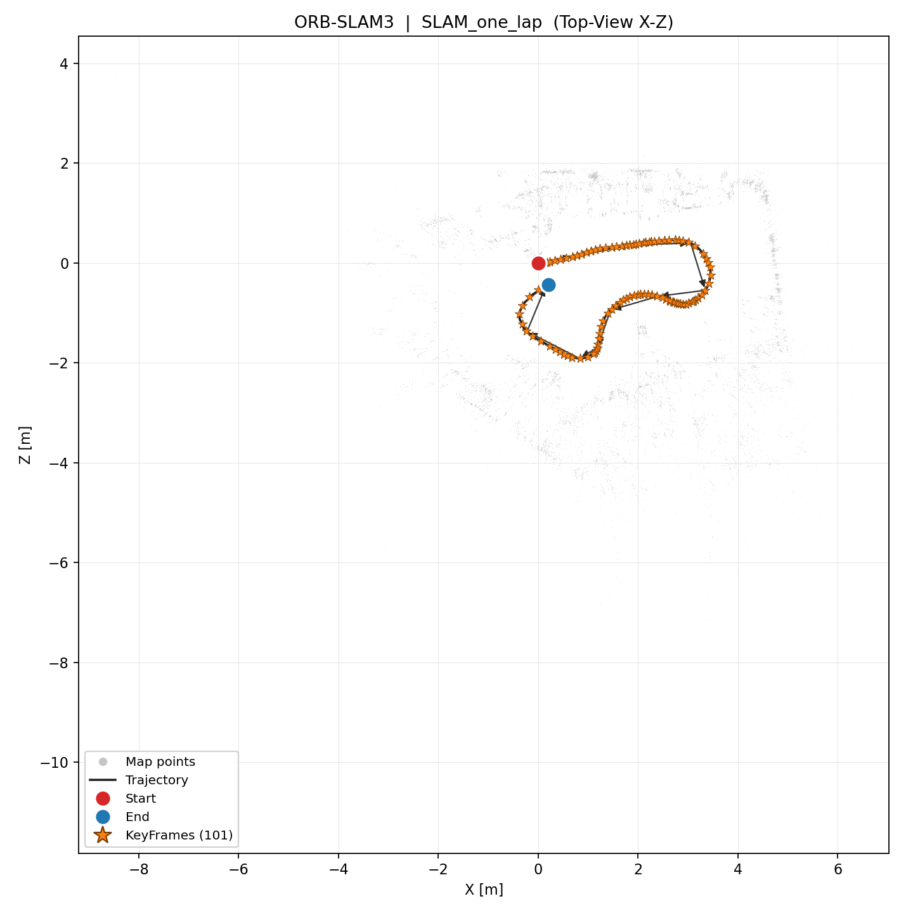
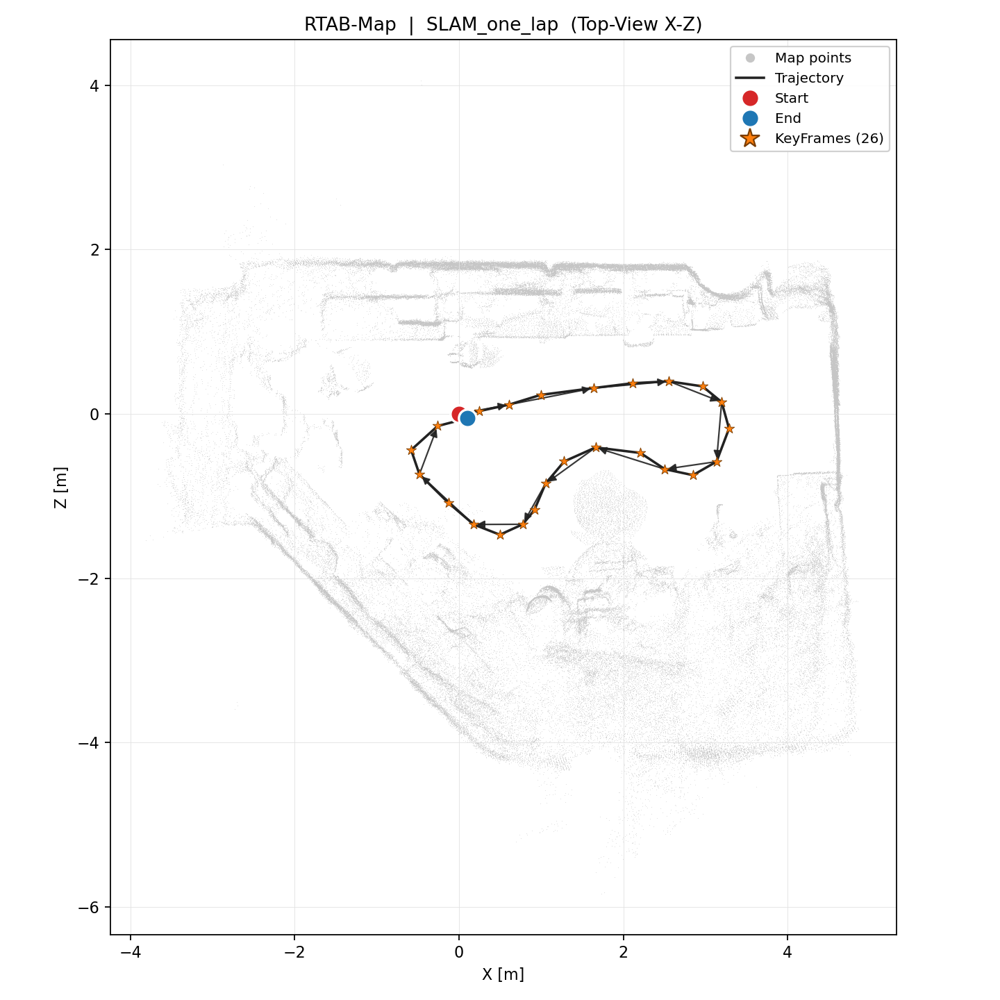
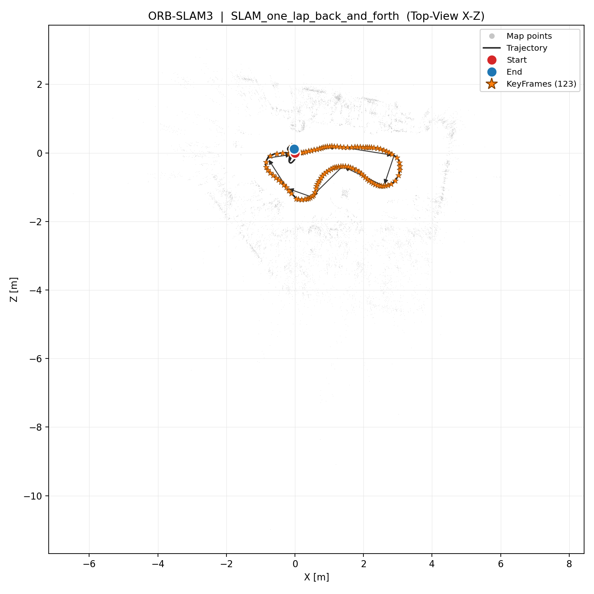
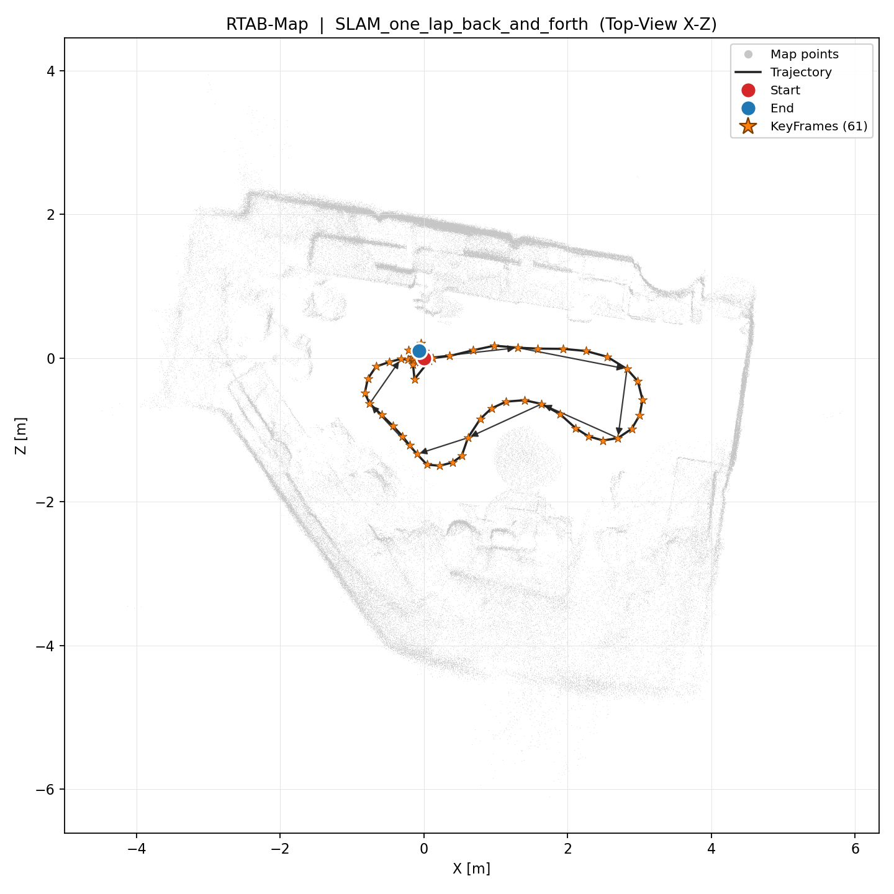
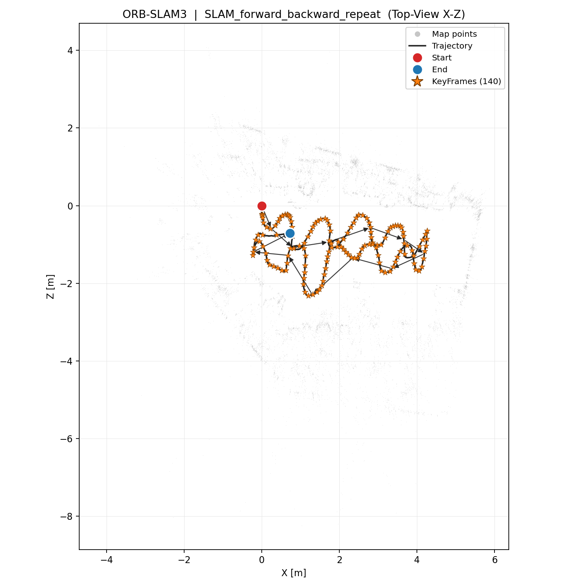
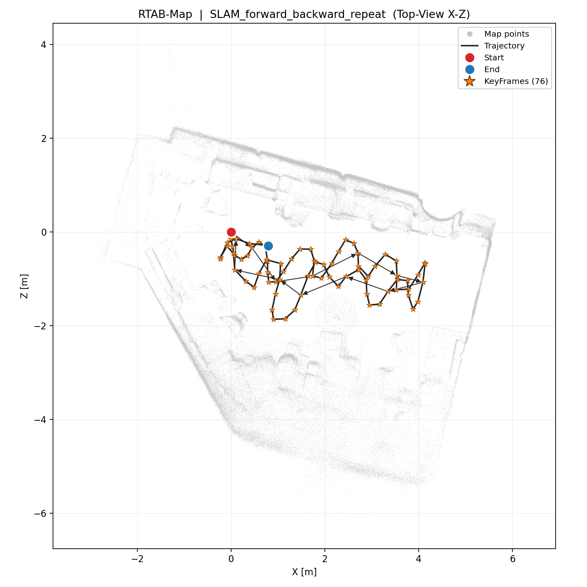
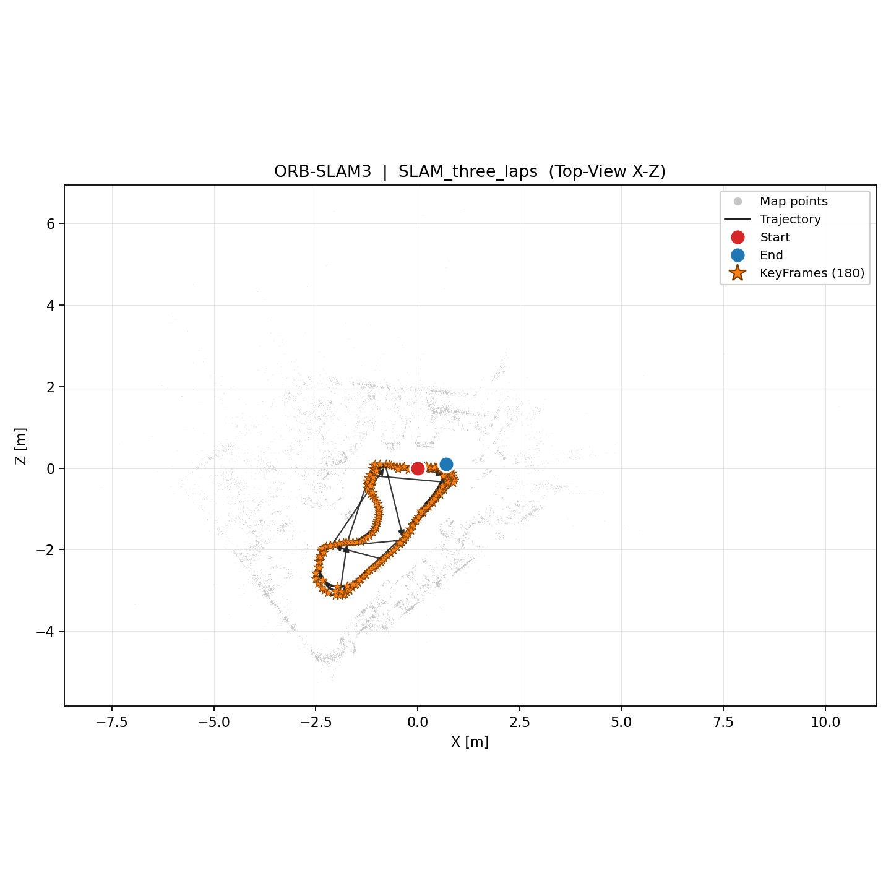
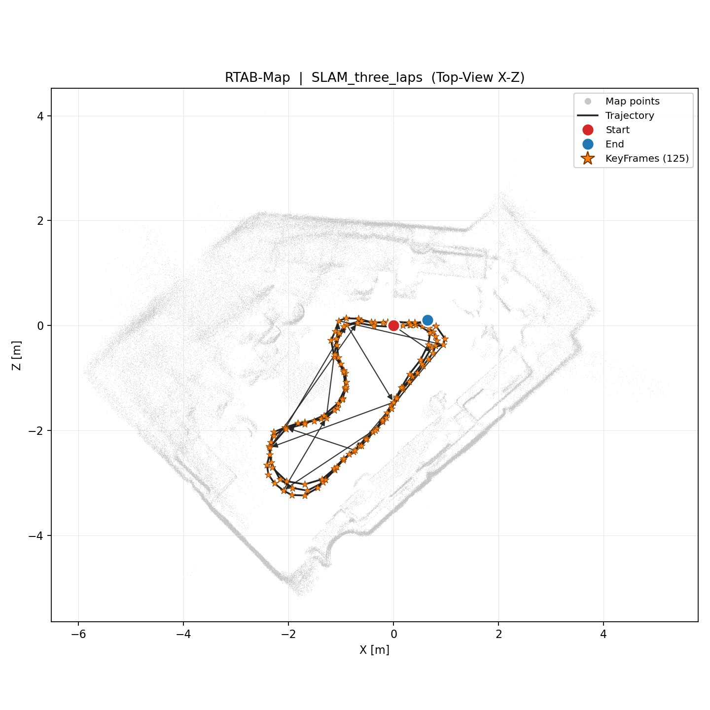

# SLAM 시각 비교 보고서 — ORB-SLAM3 vs RTAB-Map

RealSense RGB-D 4개 시퀀스를 ORB-SLAM3와 RTAB-Map으로 각각 실행한 결과의 Top-View(X–Z) 궤적·KeyFrame·맵 비교. 모든 결과는 실제 ros2 bag 재생 기반으로 새로 생성됨 (ORB=conda `orbslam3`, RTAB=conda `rtabmap`).

## 전체 요약

| 시퀀스 | 시스템 | poses | KF | map points | 길이(m) | start-end(m) | loop closure |
|---|---|---:|---:|---:|---:|---:|---|
| 1바퀴 주행 | ORB-SLAM3 | 1034 | 101 | 12,516 | 10.4 | 0.48 | 0 (Loop detected) |
| 1바퀴 주행 | RTAB-Map | 26 | 26 | 362,981 | 9.7 | 0.11 | 3 global + 0 proximity |
| 1바퀴 + 왕복 | ORB-SLAM3 | 2138 | 123 | 12,900 | 13.8 | 0.12 | 2 (Loop detected) |
| 1바퀴 + 왕복 | RTAB-Map | 61 | 61 | 765,873 | 12.4 | 0.13 | 43 global + 0 proximity |
| 전후 반복 주행 | ORB-SLAM3 | 2539 | 140 | 14,739 | 21.8 | 1.02 | 1 (Loop detected) |
| 전후 반복 주행 | RTAB-Map | 76 | 76 | 997,024 | 19.9 | 0.85 | 12 global + 4 proximity |
| 3바퀴 주행 | ORB-SLAM3 | 4080 | 180 | 14,881 | 32.4 | 0.70 | 1 (Loop detected) |
| 3바퀴 주행 | RTAB-Map | 125 | 125 | 1,336,399 | 31.9 | 0.66 | 113 global + 46 proximity |

## 1바퀴 주행 (`SLAM_one_lap`)

| ORB-SLAM3 | RTAB-Map |
|---|---|
|  |  |

- **시작-종료점 오차(start-end gap):** ORB 0.48 m vs RTAB 0.11 m. 주행이 시작점 부근으로 복귀하는 시퀀스에서 값이 작을수록 누적 drift가 작고 루프 정합이 좋다는 의미.
- **궤적 길이·범위:** ORB 길이 10.4 m (X 3.8×Z 2.4 m), RTAB 길이 9.7 m (X 3.9×Z 1.9 m). 두 시스템의 경로 범위가 유사할수록 스케일·형태 일관성이 높음.
- **Loop closure:** ORB = 0 (Loop detected); RTAB = 3 global + 0 proximity (RTAB Link type1=global, type2=local-space). 루프 폐합이 잡히면 누적오차가 보정됨.
- **KeyFrame 분포:** ORB 101개(전체 trajectory 1034프레임 대비), RTAB 26개(=그래프 노드 33). ORB는 프레임 단위 궤적+선별 KF, RTAB는 노드=KF 구조.
- **경로 형태 차이:** Top-View(X–Z)에서 두 궤적의 형태를 직접 비교. ORB는 dense per-frame 궤적이라 곡선이 매끄럽고, RTAB는 KF 그래프라 노드 단위.
- **맵 생성 품질:** ORB sparse 12,516 점 vs RTAB dense 362,981 점 (약 29배). RTAB(RGB-D dense)가 구조 시각화에 유리, ORB는 특징점 기반 sparse.

## 1바퀴 + 왕복 (`SLAM_one_lap_back_and_forth`)

| ORB-SLAM3 | RTAB-Map |
|---|---|
|  |  |

- **시작-종료점 오차(start-end gap):** ORB 0.12 m vs RTAB 0.13 m. 주행이 시작점 부근으로 복귀하는 시퀀스에서 값이 작을수록 누적 drift가 작고 루프 정합이 좋다는 의미.
- **궤적 길이·범위:** ORB 길이 13.8 m (X 3.9×Z 1.6 m), RTAB 길이 12.4 m (X 3.9×Z 1.7 m). 두 시스템의 경로 범위가 유사할수록 스케일·형태 일관성이 높음.
- **Loop closure:** ORB = 2 (Loop detected); RTAB = 43 global + 0 proximity (RTAB Link type1=global, type2=local-space). 루프 폐합이 잡히면 누적오차가 보정됨.
- **KeyFrame 분포:** ORB 123개(전체 trajectory 2138프레임 대비), RTAB 61개(=그래프 노드 68). ORB는 프레임 단위 궤적+선별 KF, RTAB는 노드=KF 구조.
- **경로 형태 차이:** Top-View(X–Z)에서 두 궤적의 형태를 직접 비교. ORB는 dense per-frame 궤적이라 곡선이 매끄럽고, RTAB는 KF 그래프라 노드 단위.
- **맵 생성 품질:** ORB sparse 12,900 점 vs RTAB dense 765,873 점 (약 59배). RTAB(RGB-D dense)가 구조 시각화에 유리, ORB는 특징점 기반 sparse.

## 전후 반복 주행 (`SLAM_forward_backward_repeat`)

| ORB-SLAM3 | RTAB-Map |
|---|---|
|  |  |

- **시작-종료점 오차(start-end gap):** ORB 1.02 m vs RTAB 0.85 m. 주행이 시작점 부근으로 복귀하는 시퀀스에서 값이 작을수록 누적 drift가 작고 루프 정합이 좋다는 의미.
- **궤적 길이·범위:** ORB 길이 21.8 m (X 4.5×Z 2.3 m), RTAB 길이 19.9 m (X 4.4×Z 1.9 m). 두 시스템의 경로 범위가 유사할수록 스케일·형태 일관성이 높음.
- **Loop closure:** ORB = 1 (Loop detected); RTAB = 12 global + 4 proximity (RTAB Link type1=global, type2=local-space). 루프 폐합이 잡히면 누적오차가 보정됨.
- **KeyFrame 분포:** ORB 140개(전체 trajectory 2539프레임 대비), RTAB 76개(=그래프 노드 78). ORB는 프레임 단위 궤적+선별 KF, RTAB는 노드=KF 구조.
- **경로 형태 차이:** Top-View(X–Z)에서 두 궤적의 형태를 직접 비교. ORB는 dense per-frame 궤적이라 곡선이 매끄럽고, RTAB는 KF 그래프라 노드 단위.
- **맵 생성 품질:** ORB sparse 14,739 점 vs RTAB dense 997,024 점 (약 68배). RTAB(RGB-D dense)가 구조 시각화에 유리, ORB는 특징점 기반 sparse.

## 3바퀴 주행 (`SLAM_three_laps`)

| ORB-SLAM3 | RTAB-Map |
|---|---|
|  |  |

- **시작-종료점 오차(start-end gap):** ORB 0.70 m vs RTAB 0.66 m. 주행이 시작점 부근으로 복귀하는 시퀀스에서 값이 작을수록 누적 drift가 작고 루프 정합이 좋다는 의미.
- **궤적 길이·범위:** ORB 길이 32.4 m (X 3.4×Z 3.2 m), RTAB 길이 31.9 m (X 3.4×Z 3.4 m). 두 시스템의 경로 범위가 유사할수록 스케일·형태 일관성이 높음.
- **Loop closure:** ORB = 1 (Loop detected); RTAB = 113 global + 46 proximity (RTAB Link type1=global, type2=local-space). 루프 폐합이 잡히면 누적오차가 보정됨.
- **KeyFrame 분포:** ORB 180개(전체 trajectory 4080프레임 대비), RTAB 125개(=그래프 노드 131). ORB는 프레임 단위 궤적+선별 KF, RTAB는 노드=KF 구조.
- **경로 형태 차이:** Top-View(X–Z)에서 두 궤적의 형태를 직접 비교. ORB는 dense per-frame 궤적이라 곡선이 매끄럽고, RTAB는 KF 그래프라 노드 단위.
- **맵 생성 품질:** ORB sparse 14,881 점 vs RTAB dense 1,336,399 점 (약 90배). RTAB(RGB-D dense)가 구조 시각화에 유리, ORB는 특징점 기반 sparse.

## 종합 결론

- **맵 품질:** RTAB-Map은 RGB-D dense 클라우드(수십만~수백만 점)로 환경 구조를 풍부하게 재구성하는 반면, ORB-SLAM3는 특징점 기반 sparse 맵(1~1.5만 점)으로 위치추정에 최적화됨.
- **궤적 특성:** ORB-SLAM3는 per-frame 궤적이라 조밀하고 매끄럽고, RTAB-Map은 KeyFrame 그래프 노드 단위 궤적임. 두 시스템 모두 4개 시퀀스에서 트래킹에 성공.
- **Loop closure / drift:** 표의 start-end gap과 loop closure 수로 누적오차 보정 정도를 비교 가능. 값이 작고 폐합이 잡힐수록 drift가 억제됨.

*생성: `slam_comparison_report/make_topviews.py` + `build_report.py` (conda `rtabmap`).*
